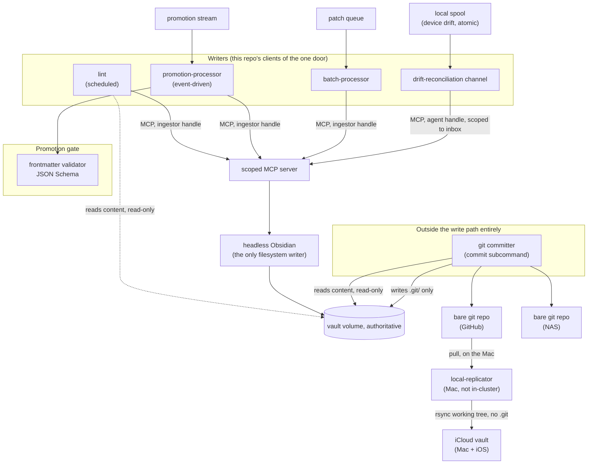

# obsidian-tools — Design

This document explains why this repository is shaped the way it is. For the full design of BRAIN — the vault
platform this repository's code implements — read [`docs/DESIGN.md`](./docs/DESIGN.md), which is the design of
record. This document is the narrower view: what belongs in *this* repository specifically, and why its pieces
relate to each other the way they do.

**Status: the `commit` subcommand (the in-cluster git committer), the `replicate` subcommand
(`local-replicator`'s replication cycle), and the `drain` subcommand (its spool drainer) are
implemented.** Git is the drift engine: `replicate` checks the parked clone out at `LAST_CHECKOUT`,
overlays the device-facing iCloud tree onto it, and reads `git diff` as the drift enumeration —
patches, not paths. Each patch is written to a local spool, atomically, before the clone is reset
and pulled forward; publish and the tag advance are gated on that spool write succeeding for the
whole cycle, not per path (docs/DESIGN.md §4 Plane B, "Why the gate moved, not disappeared"). Ships
as a stub with a real contract: the spool is real, on disk, written durably from day one; only
`drain`'s destination is a stub (`discard_sink`) — it reads each entry and throws it away rather
than publishing it onward, because there's nowhere else to send it yet. Only that destination
changes at Phase 5, not the spool's format or the cycle's ordering. Everything else this document
describes — `promotion-processor`, `batch-processor`, the drift-reconciliation channel proper, and
the frontmatter validator — is still a future ticket, landing one at a time; see the epic
[`ppat/homelab-ops-kubernetes-apps#3439`](https://github.com/ppat/homelab-ops-kubernetes-apps/issues/3439)
for sequencing.

## The write model, in one paragraph

Exactly one process ever touches the vault's markdown files: a headless, in-cluster copy of Obsidian, reached
only through a permission-scoped MCP server. Every writer — WhatsApp-triggered agent chat, scheduled jobs,
Claude Code, a bulk-import pipeline, a lint/promotion worker — is a **client of that one door, never a second
filesystem writer**. Nothing built in this repository ever opens the vault volume for writing directly. This is
the single invariant every component here has to respect; see `docs/DESIGN.md` §1 for the full reasoning
(including its one deliberate, narrow exception: a human at the headless instance's own GUI, for configuration
and repair, outside every gate).

## Why this repository is one thing, not several

Every component listed in `README.md` — lint, the git committer, `promotion-processor`, `batch-processor`, the
drift-reconciliation channel, the frontmatter validator, and the Mac-side replication script
(`local-replicator`) — is a distinct *process* with a distinct deployment target (some run in-cluster, one runs
on the user's Mac), but none of them is independent of the others' contracts: they share the same MCP client path, the same frontmatter schema, and
the same notion of what a "valid" vault write looks like. Splitting them into separate repositories would mean
duplicating that contract, or versioning it separately from the code that depends on it, for no benefit — none
of these components is reusable outside this project. One repository, one Python package, versioned as a whole.

## What each component does, and what it must never do

**A prior revision of this document had a single "vault worker" with three scheduled entrypoints
(`ingest/promote`, `lint`, `publish`). That component no longer exists.** `ingest/promote` became
`promotion-processor`, event-driven off the promotion stream rather than waiting for a nightly tick;
`publish` — the NAS mirror — was deleted outright once the git committer started pushing to the NAS
directly as a second remote, so there is no separate scheduled job populating it any more. Only `lint`
kept running as a scheduled entrypoint, on its own, under its own name.

| Component | Job | Must never |
| --- | --- | --- |
| Lint | Walk the whole vault on a schedule: orphans, dangling links, schema conformance, auto-fixes | Write vault content directly — writes go through the MCP ingestor handle only |
| Git committer (`commit` subcommand) | Turn the vault volume into git history, and push it to both remotes — GitHub and the NAS — directly | Create, edit, or delete vault content — it mounts content read-only and `.git/` write-only |
| `promotion-processor` | Real-time ingest/promote out of `00-inbox/`, driven by the promotion stream | Write vault content directly — writes go through the MCP ingestor handle only |
| `batch-processor` | Apply queued git patches through the same MCP path as ordinary writes | Apply a patch directly to the filesystem, or treat batch as a separate write mode |
| Drift-reconciliation channel | Dispatch a spooled device-side edit back into the funnel as an ordinary agent write | Overwrite a device replica in place, or treat a device edit as anything other than an ingest event |
| Frontmatter validator | Enforce the JSON-Schema contract at the promotion gate | Silently drop or "fix" a note that fails validation — quarantine it, never delete it |
| `local-replicator` (Mac, `replicate` subcommand) | Keep the iCloud-synced Obsidian vault current from the cluster's authoritative copy, one-way | Push a device-side edit back onto the authoritative volume — that's the drift channel's job, not this script's |
| `local-replicator`'s drainer (Mac, `drain` subcommand) | Send each spooled drift patch onward, decoupled from the replication cycle's own schedule | Decide whether a drift patch is intentional or accidental — that's Phase 5's server-side classifier's job, not this dumb drainer's |

## The volume mount contract

Exactly three processes ever mount the vault volume, each on a deliberately disjoint or read-only slice — see
`docs/DESIGN.md` §1.3 (path P4) and §2 (items 1, 4, 5) for the full reasoning: headless Obsidian, read-write on
content; **lint**, read-only on content; and the **git committer**, read-only on content and write-only on
`.git/`. Nothing else mounts it — this is the same "single writer" invariant from
["The write model, in one paragraph"](#the-write-model-in-one-paragraph) restated as a mount policy, not a
separate rule.

- Lint's read-only content mount exists because it needs whole-vault visibility, and routing that many reads
  through the MCP gateway into headless Obsidian's single-threaded event loop would contend with the same path
  a bulk import already saturates for hours at a time (`docs/DESIGN.md` §2 item 4, §3 "The throughput cost, and
  the escape hatch"). Reading is not writing, so this mount doesn't touch the single-writer invariant — lint
  still **writes exclusively through the MCP gateway**, never to the filesystem, exactly like every other
  writer.
- **`promotion-processor` and `batch-processor` take no volume mount at all** — their input is the inbox (via
  MCP) and the patch queue, respectively, not the filesystem, and every write either of them makes travels
  through the same MCP path as ordinary ingest, under the ingestor handle (`docs/DESIGN.md` §1.3 path P1′, §2
  items 3 and 9, §3 "The batch lane"). Giving either a mount would make it a fourth mounter and break the
  invariant above; don't add one.

## Architecture

Everything above the "Promotion gate" subgraph and everything in `committer_box` is code this repository owns.
Everything below the MCP server — the scoped MCP server itself, headless Obsidian, the vault volume — is
infrastructure deployed by `ppat/homelab-ops-kubernetes-apps`, not code that lives here.

## Trade-offs accepted, carried over from the canon

- **Throughput is not a design goal.** A full bulk import is accepted to take hours, once, because the
  processing tier is never the bottleneck — a single-threaded headless-Obsidian event loop is. This is *why*
  the language choice below is Python rather than something compiled (`docs/CANON-1-designing-brain.md` and
  `docs/DESIGN.md` §3 "The throughput cost, and the escape hatch").
- **No merge engine, anywhere.** The batch lane rejects a stale patch back to its producer rather than
  attempting a three-way merge — see `docs/DESIGN.md` §3 "Why stale patches are rejected rather than merged."
  Nothing in this repository should ever grow one.
- **Fail loud, destroy nothing.** The frontmatter validator quarantines a note that fails validation; it never
  deletes one. Every component here should default to the same posture when it encounters something it can't
  reconcile.

## Language and tooling

Python, managed with `uv`. See `CLAUDE.md` for the reasoning (iteration speed for an LLM-maintained codebase,
no performance constraint anywhere in this architecture) and for working conventions.
