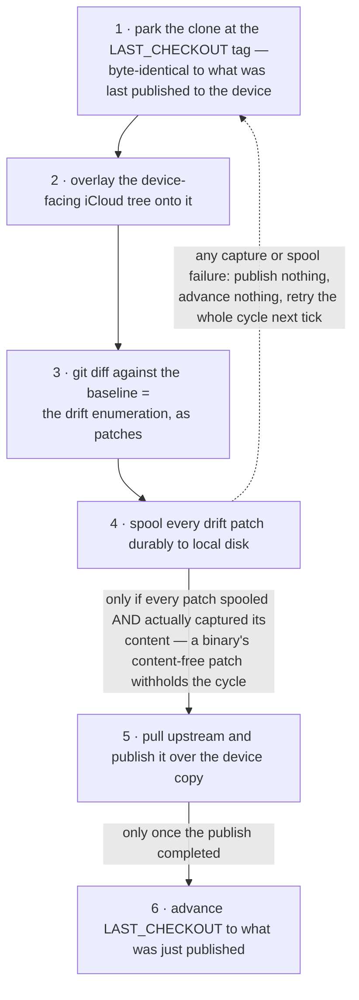
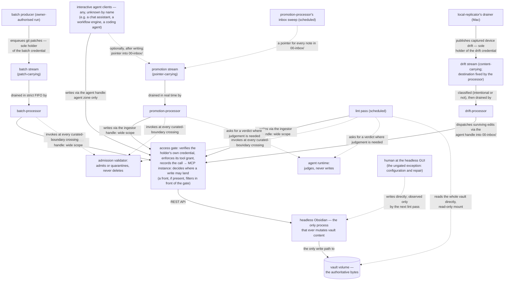
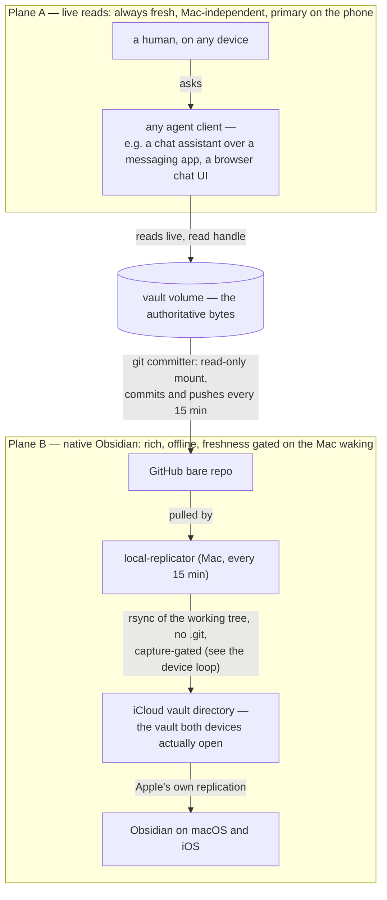

# BRAIN — Design

The high-level design of BRAIN: the pillars and invariants that hold the platform together, and the
reasoning behind them. It states what the system *is*; it deliberately does not re-argue every
decision that had alternatives. Those live as decision records, indexed at
[`docs/adr/README.md`](./docs/adr/README.md) — the split is that this document holds **what would
still be true if any individual reversible decision had gone the other way**, and an ADR holds one
such decision: its context, alternatives, and consequences. The three top-level documents link only
to that index, never to individual records: ADRs are the fluid layer and may move, split, or be
superseded, while a record's *number* is stable — so a specific decision is cited by number in
prose, resolved through the index.
Together, this document and the ADR set are the entire design — the parts already built and
running as much as the parts still to come. Build state is a roadmap fact, not a design fact: a
pillar binds identically whether its mechanisms are live or unbuilt, and the component table below
marks state only so a reader knows what exists.

Companions: [`USE_CASES.md`](./USE_CASES.md) — the outcomes this design exists to deliver, with
their acceptance criteria; [`ROADMAP.md`](./ROADMAP.md) — the work, its state, and the mapping from
work to outcomes and to this design. Terms used throughout are defined in the [Glossary](#glossary)
at the end; a cold reader should be able to resolve any term in the three documents, a ticket, or an
ADR from there without guessing.

## 1. What the system is

BRAIN is a git-backed Obsidian vault — markdown notes with YAML frontmatter — used as a shared brain
by one human and any number of AI agents, which the vault system knows only by the credentials they
present. The vault lives on a Kubernetes volume; exactly one process ever touches its files; every
writer reaches that process through narrow, permission-scoped doors;
content flows through a pipeline (admitted → sound → placed → retrievable) into curated areas; and
the content reaches the places the owner actually reads — live, through whatever agent the owner
converses with, and as native Obsidian on devices via a one-way replication chain.

### Components, one job each

| Component | One job | Runs | State |
| --- | --- | --- | --- |
| **Vault volume** (`vault-data`, mounted at `/vault`, vault at `/vault/brain`) | Be the authoritative bytes | Cluster (namespace `obsidian-vault`) | Live |
| **Headless Obsidian** + Local REST API | Be the only process that mutates vault content; its pod's entrypoint delivers the deployed release's schema bundle before Obsidian opens the vault (a declared exception) | Cluster | Live; schema delivery unbuilt |
| **MCP servers, two instances** (agent, ingestor) | Be the only scoped doors into the vault; decide *where* a write may land | Cluster | Live |
| **The access gate**, one in front of each instance | Be the only way into an instance: verify each call's credential against the credential registry, enforce its tool grant, and record the call (the access record) | Cluster | Unbuilt |
| **A front** — optional; an installation may have none | Filter calls further, in front of the access gates, passing each caller's own vault credential through unchanged | Cluster (in this installation, an LLM gateway; whether it can pass through is measured by A10 — if not, vault calls go to the gates directly) | Live |
| **Git committer** | Turn the vault volume into git history, pushed to GitHub; never author content | Cluster (CronJob, every 15 min) | Live |
| **`local-replicator`** (+ its spool and drainer) | Keep the device-facing iCloud vault current from git, one-way and non-destructively; capture device-side drift before overwriting it; upgrade itself from verified releases | The operator's Mac (launchd, every 15 min) | Live; self-upgrade unbuilt |
| **The work queue** — NATS JetStream; batch, promotion and drift streams | Carry deferred work to its processor, with one credential per holder scoping who may publish where | Cluster | Broker, accounts, credentials and the batch stream deployed; promotion and drift streams unbuilt |
| **The batch producer** | Turn staged changes in a git working tree into chunks and enqueue them in order, in a run the owner authorised; the batch stream's only producer | Where the open bulk-run decision places it | Released |
| **`batch-processor`** | Apply patch-carrying bulk work through the gated write path; enforce the raw layer's create-only rule | Cluster | Deployed, not yet observed draining a batch |
| **`promotion-processor`** (+ its inbox sweep and roll-up pass) | Relocate notes to where they belong: out of the inbox into curated homes — in real time when a writer announces a note, within one sweep interval when none does — and, through the roll-up pass, set their prominence by salience and archive what is merged or judged retired; every curated write gated by the admission validator | Cluster | Unbuilt |
| **`drift-processor`** | Classify captured device edits (intentional or not), reconcile them against upstream history, and dispatch survivors into the funnel as ordinary ingest | Cluster | Unbuilt |
| **The admission validator** | Decide whether content meets the schema and provenance bar at the curated boundary; quarantine, never delete | Library, called by `promotion-processor`, `batch-processor` and the lint pass | Built, not deployed |
| **The lint pass** | Keep the vault conformant to the deployed schema: apply each release's migration first; walk the whole vault for conformance, hygiene and normalisation; resolve what it finds — judged by the agent runtime, or recorded and retried; nothing is pushed anywhere | Cluster (CronJob) | First pass built, not deployed; migrations and resolution unbuilt |
| **The agent runtime** | Be the only place the vault system asks a model for a judgement: typed tasks in, validated verdicts out; never a writer, never a gate | Library, called by the components whose questions need judgement | Unbuilt |
| **The operations pass** | Detect each operational condition by rule from the vault system's own metrics and the access record, and resolve it through `scale` on named Deployments under a Lease the batch watchdog backs — or state it as a residue with its consequence | Cluster (CronJob) | Unbuilt |
| **The evidence fetcher** | Fetch the external sources a note cites, for the agent runtime's evidence; hold no credential and no mount; resolve-once address validation, re-validated redirects, bounded responses; callable by the lint pass alone | Cluster | Unbuilt |
| **Observability** | Make behaviour answerable from stored metrics and logs | Cluster | Groundwork only |
| **ExternalSecrets / Bitwarden** | Custody of every in-cluster credential | Cluster | Live |

The vault content itself lives in `ppat/obsidian-vault`; the components' code lives in
`ppat/obsidian-tools`; their deployment manifests live in `ppat/homelab-ops-kubernetes-apps`
(module `apps-obsidian-vault`), composed onto clusters by `ppat/homelab-ops-kubernetes-clusters`.

## 2. The pillars

Everything else in this document is a consequence of these. Each is stated with the reasoning that
holds it up; the decisions that *implement* each one, and their alternatives, are ADR material.

### One writer, one door

Outside the declared exceptions below, exactly one process ever mutates vault content: the
headless, in-cluster Obsidian instance. Every
writer — every agent, every processor, lint — is a client of that process through a
permission-scoped MCP door, never a second filesystem writer. Exactly three processes mount the volume at all,
on disjoint or read-only slices: headless Obsidian (read-write on content), lint (read-only on
content, for whole-vault visibility), and the committer (read-only on content, write-only on git's
own metadata — held on a separate volume, so the vault never even grows a `.git`).

Why: a single writer deletes entire subsystems — conflict resolution, merge engines, lock protocols,
human-vs-agent collision handling — rather than mitigating them. Most of what looks like a
multi-writer problem dissolves structurally; the three residues that survive (lost updates on
read-modify-write, device replica divergence, bulk work too large for tool-by-tool traffic) are each
individually mechanised (see "Bulk and drift are feeds into the one write path" and "The device
loop is non-destructive by ordering", below).

Known limit, stated rather than hidden: the single-writer property is enforced by the Deployment's
shape (one replica, `Recreate` strategy), not by the storage layer — the volume is ReadWriteMany
precisely so three processes can mount it. Rapid pod-template churn reopens a timing window a live
incident has already demonstrated; the recovery drill exercises it deliberately.

### Exceptions are declared, never discovered

Three paths bypass the gates, all on purpose, all named at the top rather than found later:

- **The GUI exception.** A human at the headless instance's own GUI (reached only by
  `kubectl port-forward`, dormant VNC) writes directly, with no provenance stamping and no
  validation beyond what Obsidian itself enforces: the app refuses type-invalid values in manually
  declared properties, and nothing more — enums, tag casing, and content correctness pass freely,
  and undeclared properties are not type-checked at all [measured 2026-07-30]. The path exists
  because configuring Obsidian itself requires a GUI, and there is no other sanctioned way. It is for configuration and repair; the lint pass is the only thing that ever sees such a
  write, after the fact. Rising use of this path is treated as evidence the write model is wrong,
  not as a discipline failure.
- **The recovery exception.** A restore — from a volume snapshot or from git — expressed as a change
  the owner merges and carried out by the installation's GitOps, so no standing credential that
  bypasses everything lives outside the design. It bypasses everything, rarely, as disaster
  recovery, outside the gate system and outside ordinary operation.
- **The schema delivery exception.** At pod start, before Obsidian opens the vault, the editor's
  entrypoint writes the deployed release's schema file and merges its property types into
  `.obsidian/types.json` — three files (plus a preserving copy under `_ops/schema/` of a schema file
  edited at the GUI), only then, only from the deployed release. The schema file
  and `.obsidian/` stay under no write scope, so no credential can write them.

### The volume is authoritative; git is derived history; no merge engine anywhere

The one directory on the one volume is the authoritative copy. Git records and distributes — history
outward to GitHub, content onward to devices — and never writes back: there is no
git-to-volume path anywhere in the system. Nothing anywhere merges: a stale batch patch is rejected
back to its producer to regenerate; a divergent device edit is captured and re-enters as new input.
Every mechanism that would have needed a merge engine was deleted or reshaped so it doesn't.

### Humans originate; agents act

The platform exists to store the owner's knowledge, ideas, work and research, to share it between
agents and/or the human, and to have agents *work on* the ideas captured there — the important ones
bubbling up by salience or prominence, so that work happens on the owner's behalf without the owner
driving every step. On both the write and the read axis, the human is the originator while an
agent — a client the vault system does not know by name — is almost always the actor. A voice note, a dropped document, tasked research:
human-originated, arriving as agent writes. "What do these ideas have in common", "read the prior work behind this task":
human-originated, performed as agent reads. **Direct** human writes are rare edits, almost never
creation — an owner ruling, load-bearing: any reasoning that assumes meaningful volume of *direct*
human writes is wrong. Direct human reads (the device apps) are real
and more common than direct writes, and still the minority of human-motivated reading. A device
edit is not prevented and not discarded; it is captured as drift and re-enters the funnel as an
ordinary ingest event, stamped as human-authored — `authority:` records whose claim content is,
never whose hands typed it, which is how human-originated content and agent actors coexist without
lying. Nothing is pushed to the human, and nothing waits on him to resolve it — he originates and
reads; he is not a work queue. The devices are read replicas plus a capture surface, and the GUI is a
configuration-and-repair path, not an authoring one — if direct editing becomes the draw, the
design has failed on its own terms.

### Layered content, one ownership contract

The vault is layered, and each layer has exactly one owner and one mutability rule:

| Layer | Owner | Mutability |
| --- | --- | --- |
| `05-raw/` — imported sources | ingest | Write-once, immutable; **exempt from validation** by design |
| `00-inbox/`, `40-journal/`, `_ops/agent/`, `log.md` — the agent zone | agents | Freely mutable, path-scoped |
| `10-areas/`, `20-projects/` — curated space | the admission validator | Mutable only through the gate |
| `10-areas/finance/` | validator + finance overlay | Strictest |
| `90-archive/` | the roll-up pass | Merged sources permanently; retired notes until a restoration |
| `.obsidian/` — application settings | each instance, locally | Outside the content contract |

The raw layer's exemption is load-bearing, not an oversight: validating thousands of imported
documents would either fail thousands of times or force a schema laxity that poisons the baseline
for everything else. Curated content is built *from* raw, incrementally — by writers. The vault
system itself authors no knowledge; it admits, keeps sound, places and serves it. The vault accepts markdown
only; conversion from any other format happens outside the vault boundary, in the systems that own
the capture channel.

`CLAUDE.md` at the vault root is the schema file governing all of it — the ownership contract, the
folder map, the frontmatter schema and vocabularies, the overlays, and the write discipline every
agent must follow. It has one owner: the human, who owns it by merging its changes. Its source is
this repository, and a deployed release delivers it into the vault.

### Provenance is three questions, and self-report never unlocks a gate

Every note carries three provenance fields because they answer three different questions:

- **`source:`** — which process performed the write. Stamped by the vault system's own authoring
  components, declared by outside writers; what makes a write attributable is the credential it
  arrived under, in the access record the access gate keeps.
- **`authority:`** — whose claim the content is (`human` | `agent` | `import`). Self-reported.
- **`trigger:`** — what caused the write (`human` | `schedule` | `event`). Mechanically attributable.

The split exists so trust is *checkable*: `trigger: schedule` with `authority: human` is a
mechanical contradiction the lint pass detects, and it is the check that catches a device edit landing
on a note still stamped `authority: agent`. Because `authority:` is self-reported, **no gate treats
it as sufficient by itself**: the finance overlay's hard block keys on `authority: import` plus
inline provenance plus `confidence:` — the fields that actually evidence a number — never on who
claims to have typed it. `confidence:` (how sure the claim is) and `authority:` (whose claim it is)
are orthogonal and never merged. Relocation does not rewrite provenance: `source:` records who
authored the content, not who last moved the file.

### Authority is carried by capability, not by network position

Who may do what is decided by the credential in hand, at every layer:

- **Handles and instances are separate axes.** A *handle* — a per-credential grant the access gate
  in front of each instance enforces on the caller's own credential — decides who may call and which tools they see; an MCP *instance* decides where a write may land
  (`OBSIDIAN_WRITE_PATHS`). Two instances exist — agent (narrow: the agent zone) and ingestor (wide:
  everything the processors and lint legitimately touch) — because two handles onto one instance
  would leak that instance's path scope to whoever held the other handle.
- **Queue enqueue authority follows message shape, carried by per-producer NATS credentials.** A
  *patch-carrying* message (batch stream) confers the processor's own write scope on its enqueuer,
  so its one credential is presented only by the batch producer, in runs the owner authorised — as
  ADR-0021 stands, runs a human starts; how to authorise one with no hand-run step is an open
  decision ([`ROADMAP.md`](./ROADMAP.md#open-decisions)). No unattended agent can restructure the
  vault — a property of custody and issuance, not of the broker. A *pointer-carrying* message (promotion stream)
  confers nothing, provided the processor refuses any pointer naming a path outside the inbox — so any client may announce what it wrote, and the vault system's own inbox sweep
  announces whatever nobody did. A *content-carrying, fixed-destination* message (drift stream)
  confers nothing either; its sole producer is `local-replicator`, by credential.
- **Network position is not an authority model.** The moment the queue is reachable off-cluster (it
  must be, for the Mac), a NetworkPolicy cannot distinguish producers or streams. NetworkPolicy
  remains as in-cluster defence in depth — and, in one place, as a sole control: the REST API's
  built-in second MCP endpoint cannot be disabled, so the policy admitting only the MCP pods to
  Obsidian is load-bearing, which is why whether the platform actually enforces NetworkPolicy is a
  named open verification (§5).

### Clients are known by credential, never by name

A client is anything outside this project that consumes the vault system's APIs — AI agents over MCP
today, possibly other means later. The vault system knows a client only by the credential it
presents and that credential's **kind of access**; never by who it is, what it runs, or whether it
performs batch jobs. Products named anywhere in these documents are examples.

| Kind of access (clients only) | Carried by | Reach |
| --- | --- | --- |
| Read | a read credential on the agent handle | reads only |
| Interactive write | a write credential on the agent handle | the agent zone; never delete |
| Announce | a pointer-shape queue credential | the promotion stream; confers nothing |

The vault system's own components hold **component credentials**, which are not kinds: a component
is a known part of this project, and its credential is shaped to its one job — the ingestor handle
(the processors and the lint pass), `drift-processor`'s dispatch on the agent handle, the sweep's
pointer credential, each processor's consumer identity, the patch-shape credential only the batch
producer presents, and the drift credential only `local-replicator` holds. The patch-shape
credential is presented only in runs the owner authorised; that no unattended agent holds it is
custody, not a broker property.

Every credential, a client's or a component's, has exactly one holder, and the vault's access gate
in front of each MCP instance verifies it and records which credential made each call — the **access record**, which is what makes a
write attributable. A separate front is optional and never stands in for either. Which
client holds which kind is issuance — an infrastructure-code change an agent authors and the
owner merges, outside the design's grants. No design artifact and no vault component names a
client — not a grant, not a stream's producer set, not a schema vocabulary, not an acceptance
criterion, not the access gate's registry, which maps opaque credential identifiers to grants.
Which client holds an identifier lives only in the installation's issuance code. A new client never changes the design; a new kind does.

The writer and reader outcomes are keyed by **write path** and **read surface**, not by client and
not by kind: each path or surface names the credential it rides on — a client kind, a component
credential, or none ([`USE_CASES.md`](./USE_CASES.md#axis-2--writers-connected)).

### The vault system does its own job

Every mechanism an outcome on the pipeline or operability axes depends on is a component of this
project, running on infrastructure the vault system configures and holds credentials to — a git
host, a model endpoint — and never on an outside agent. Nor does it wait on a human. The owner
originates intent and lands work. Agents author pull requests — for code, the schema, the
infrastructure that issues credentials, releases and deploys — and he merges them; he also decides
on proposed records. Everything that follows a merge runs with no manual step: issuance, schema
delivery and migration, deployment, the Mac's convergence on the deployed version, the device
seed's settings, and recovery. Only two acts stay in his hands, because only he can perform them on
his own devices, and each happens once: installing the Obsidian apps, together with the day-one
reset of the device vault that must precede them; and installing `local-replicator` the first
time. How a bulk run is authorised without a hand-run step is an open decision
([`ROADMAP.md`](./ROADMAP.md#open-decisions)). Where the vault system's own
job needs a model's judgement — a contradiction, a stale claim, a salience score, a merge, a note's
curated home — its own **agent runtime** supplies the verdict, and the component that asked acts on
it under its own authority. Where it needs work found — a note in the inbox nobody announced, a note
due to be rolled up — a component of the vault system looks for it. Where it finds a problem, it
resolves it, or records it with its reason and retries it itself; where something operational goes
wrong, the operations pass resolves it or names it as a stated residue; it never pushes the problem to a
person, never counts a parked item as done, and no finding waits
on one.

Clients may do anything with the vault their credentials permit, and the system works identically
whether any given client exists or not. A client that ignores the write discipline can do damage
inside its kind's reach — rewrite the log, create a second page for an existing subject — and that
damage is never prevented: it is detected after the fact where it can be, and otherwise accepted
as a stated residue (§5). What a client cannot do is stop a vault
mechanism from working, or reach past its kind. The claim fails the moment a pipeline or operability
mechanism stops working because some client is absent or does not cooperate, treats a write
according to which client made it rather than by its credential, or leaves a finding waiting on a
human.

### One authority per question

Every question about content has exactly one component entitled to answer it, and no component
answers two:

| Question | Authority |
| --- | --- |
| Who may call, with which tools; which credential made a call | the credential's grant — by kind of access, one credential per holder — enforced and recorded by the access gate; a front, where present, may filter further |
| Where a write may land | the MCP instance's path scope |
| Does content meet the schema and provenance bar | the admission validator — asked of *everything* entering curated space, whoever carries it |
| Did a human *mean* to make this device edit | `drift-processor`'s classifier — asked only of drift, upstream of the validator, never merged with it |
| Which schema is in force | the deployed release's schema bundle — one source, delivered at pod start, migrated by the lint pass |
| What shape frontmatter takes | the lint pass's normalisation — in the scheduled pass, never on save, so the validator's approval cannot be silently reshaped afterwards |
| Whether a promotion happens | the validator admits; clients only propose, by writing into the inbox |
| How a model's judgement is obtained and validated | the agent runtime — the asking component still owns the question and the act; a verdict is never itself a write or an admission |
| What a judged lint finding gets | the lint pass resolves it in place, or hands it to the roll-up pass for retirement or merge, or records it with its reason and retries it — never a person |
| Whether a claim is still fresh | the agent runtime's verdict, stamped by the lint pass in `verified:` — never a human's `reviewed:` |
| History | three granularities, deliberately three owners: git (the bytes), the append-only log (events), the audit trail in `_ops/audit/` (every normalisation change) |

The corollary that resolves where validation "kicks in": **the admission validator fires at the
curated boundary, on every write that crosses it, regardless of route or caller** — promotion out of
the inbox, a batch chunk targeting curated space, or a lint auto-fix. It is one shared piece of
admission logic with three callers, applied at different strengths (a hard mechanical block in the
strictest domain; flag-only where detection is judgment). Inside the agent zone the posture is
detective, not preventive — agents must capture freely, and the boundary is what is defended. The
raw layer is exempt (the ownership contract above). Edits *after* promotion cross the same boundary — only ingestor-handle
holders can make them, and all of them call the same validator.

### Fail loud, destroy nothing

A note failing validation is quarantined with a machine-readable reason, never deleted. A device
edit is spooled durably before anything overwrites it, and a cycle that cannot capture everything
publishes nothing. A stale patch is rejected, not merged. A relocation writes the new path before
deleting the old, so a crash leaves a recoverable duplicate rather than a loss. Every component
defaults to this posture when it meets something it cannot reconcile.

### Bulk and drift are feeds into the one write path, never lanes around it

Bulk work arrives as git patches on the batch stream and is applied by `batch-processor` *through
the same MCP path and controls as ordinary ingest* — "batch mode" reduces to which of the two MCP
instances is running. Captured device edits arrive on the drift stream and are dispatched by
`drift-processor` through the narrow agent-scoped path into the inbox, like any other capture. The
accepted cost is throughput (a bulk import takes hours, once); the purchased property is that there
is no second write mode, no second operating state, and no direct filesystem write anywhere. Batch
mode's safety mechanisms — a watchdog that starts the agent instance again if the processor dies, a
maximum window, a post-disable drain — must exist before the batch stream ever runs unattended,
because a processor crash with the agent instance stopped silently stops every agent write.

### The device loop is non-destructive by ordering, not by hope

`local-replicator`'s cycle is capture-then-publish against a byte-exact baseline (a parked git
checkout at the `LAST_CHECKOUT` tag): overlay the device tree onto the baseline, let `git diff`
enumerate drift as patches, spool every patch durably to local disk, and only then publish upstream
content over the device copy and advance the tag. Publish is gated on the spool write succeeding
*and* on every patch actually capturing what changed (a pasted binary produces a content-free patch
and withholds the cycle). The ordering was built on day one, with the spool's consumer stubbed,
because retrofitting a gate later would invert a working publish path rather than insert a step.
The device-side detector is deliberately dumb — it submits everything the comparison flags and
judges nothing — so it can never silently drop a real edit; judgement is server-side, where upstream
history is in hand. Device settings (`.obsidian/`) are outside the loop entirely: seeded once from a
committed baseline that is deliberately a **seed, not a mirror**, then owned by the device, with
divergence reported but never spooled as drift.

The cycle's ordering, which is the safety property:

### Prove controls by violation injection; keep claims falsifiable

A control is proven by making it fire — writing where writing is forbidden, publishing to a subject
the credential must not reach, planting the defect the linter must flag — never by observing that
nothing bad happened. Several controls that "looked correct" here were only found wrong this way.
Every control's proving injection, past and pending, lives in one place: the
[verification catalogue](./docs/VERIFICATIONS.md).
Two companion disciplines: **measured versus inferred** are always distinguished, and *authored*,
*merged*, *released*, and *deployed-and-observed* are four different states never collapsed — this
project's dominant failure mode has been unmeasured claims hardening into established fact.

### Instrument early, alert never

Emission is the irreversible half of observability: an uninstrumented window is gone and cannot be
backfilled, while dashboards and alert rules over existing metrics are cheap configuration. So
metrics and logging move to the front of the work, and alerting is excluded: nothing is ever pushed
to a person, and any triage of the vault system's own signals is its own runtime's, ending in a
resolution or a record, never a message. Two hard-won signal rules: watch the
**absence** of writes, not only errors (the editor can wedge silently); and a signal whose purpose
is to **contradict a component's own account of itself** (the pod that was Ready while unable to
open its vault) must come from an independent observer — it cannot be that component's own probe,
because a probe converts observation into restart, and the observed failure was one a restart does
not fix.

## 3. The write path, end to end

Every route to the vault's bytes, and what sits on it:

The ordered controls on a write, named as gates throughout the tickets and this document:

| Gate | Control | The question it answers | Character |
| --- | --- | --- | --- |
| 1 | The handle: each holder's own credential verified against the registry and its tool grant enforced at the access gate, every call recorded; delete withheld from the agent handle entirely; a front, where present, may filter further | who may call, with which tools | Preventive |
| 2 | MCP instance path scope (`OBSIDIAN_WRITE_PATHS`) | where may this write land | Preventive — path-granular only |
| 3 | Editing primitives: anti-clobber create; append/patch preferred wherever the writer holds a region-shaped edit; clobber self-detection on modify | does this write silently clobber a concurrent one | Preventive on create, detective on modify |
| 4 | Serialisation at the editor's single event loop | do concurrent writes tear a file | Structural side-effect, never relied on as a guarantee |
| 5 | The admission validator | does content meet the schema and provenance bar | **Preventive at the curated boundary — the decisive gate** |
| 6 | Network isolation of the REST surface | can anything reach the editor around the door | Preventive; the *sole* control on the built-in second endpoint |

Controls a client runs on its own side — a runner's pre-write hook, a system prompt — are outside
the vault system: it does not know its clients, so it neither knows of such controls nor relies on
them, and no gate is numbered for them.

Gate 2 is *path*-granular only: it does not distinguish create from overwrite, so per-operation
rules (the raw layer's create-only, the log's append-only) are enforced by the component positioned
to see both sides — `batch-processor` for raw — or held by nothing preventive: interactive write reaches the whole agent zone, so a non-append edit
to the log is possible; the prior content stays recoverable from git, but no component detects the
edit — an accepted residue.

Gate 3 is preventive on one half only, and the split matters wherever the gate is cited. The tool
surface's whole-file write refuses an existing target unless the call asks to overwrite — an
assertion of *absence*, and so a real anti-clobber control on creates. No write tool accepts a
version, hash or etag argument, so a modify cannot be made conditional on the content it was
computed from; what a write returns instead — whether it created the note, and the note's size
before and after — makes a clobber answerable after the fact. A writer holding a region-shaped edit
prefers the additive primitives and leaves a concurrent edit elsewhere in the same note standing; a
writer holding a whole-note post-image, which is what applying a git patch produces, has no
region-shaped edit to prefer, and its residual window is carried by the batch staleness measure
(ADR-0053 and ADR-0048, through the [decision-record index](./docs/adr/README.md)).

Deferred work rides the work queue: three streams, one per processor, each shipped *together with*
its consumer and its credential grant so no stream is ever reachable with no consumer and no
credential control behind it. The batch stream is FIFO, unsharded, and rejects stale patches;
`batch-processor` yields to the promotion stream's depth (fairness to the paths where a human is
waiting), not merely to health signals.

| Stream | The message carries | What enqueueing confers | May publish (by credential) | Drained by |
| --- | --- | --- | --- | --- |
| Batch | A git patch — content *and* destination | The processor's own write scope, the widest in the system — hence the tightest producer set | The batch producer, in runs the owner authorised — custody of its credential, not a broker property | `batch-processor` |
| Promotion | A pointer to something already written in `00-inbox/` | Nothing — the processor refuses any pointer outside the inbox | Any client holding the announce kind, and `promotion-processor`'s own inbox sweep | `promotion-processor` |
| Drift | Content, with the destination fixed by the processor, never the message | Nothing — the destination is not the message's to choose | `local-replicator` only | `drift-processor` |

The lint pass walks the whole vault on a schedule, from a read-only mount (whole-vault reads through
the MCP instances would contend with the write path and muddy the write-absence signal), and writes only
through the ingestor handle. It normalises mechanically (key order, dates, casing, `updated:`
stamping, filling — never overwriting — missing required fields, all logged), resolves judgment
calls (contradictions, staleness, near-duplicates, provenance inconsistencies) through the agent
runtime, and is the only thing that ever sees a GUI-exception write. Normalisation lives in the lint pass's own code — the in-app
Linter/Frontmatter-style plugins were dropped, and the community plugin set is deliberately minimal
(Tasks and Dataview only), so frontmatter shape has one owner in one place.

What it finds is resolved by the vault system itself. The agent runtime judges each finding
against a closed set of resolutions that never raise `confidence:` or `authority:` and destroy
nothing — lower a note's `confidence:` whatever `authority:` it declares, annotate, stamp the vault's
own `verified:`, repair a link or a vocabulary value, re-validate a quarantined note, hand a note to
the roll-up pass — and the owning component applies it through the gates. Resolutions are recorded
against the note's content, so a resolved finding is not re-judged until something changes. A
finding the runtime cannot resolve yet is recorded with its reason and retried by the pass itself. The report in `_ops/lint/`, the audit trail and
the metrics are the whole output: nothing is pushed to anyone.

## 4. The read path

Two planes, deliberately asymmetric:

- **Plane A — live reads.** Any agent client reading the authoritative volume live through a read
  handle — including the agents a human converses with, over a messaging app or in a browser. Always
  fresh, works anywhere, independent of any device being awake. Conversational reading this way is
  the primary phone surface; the vault system serves it as it serves every read handle and does not
  know which readers are conversational. The vault system pushes nothing to anyone; any push — a
  daily "what's due", say — is a client's own work, which the vault system neither provides nor
  relies on.
- **Plane B — native Obsidian.** One-way chain: volume → committer → GitHub → `local-replicator` →
  iCloud → the Mac and iOS apps. Rich (backlinks, graph, offline), and laggier: device freshness is
  gated on the Mac waking, because only the Mac can write its own iCloud folder. The iCloud
  directory holds the actual vault both devices open; the Mac's clone is only the replication
  source, and git's own metadata stays outside iCloud (its conflict handling corrupts refs).

What must be up for what — the availability contract the two planes buy:

| Capability | Requires |
| --- | --- |
| Any agent write; ingest, lint, promotion | Cluster only — their judgement halves (lint resolution, destinations, roll-ups) also need the model endpoint |
| Bulk restructuring | Cluster + a batch producer run the owner authorised (how, is an open decision) |
| Live read, any device, anywhere | Cluster + internet + whichever agent client the reader uses, outside a batch run's window (a run stops the agent instance, reads included) |
| Native Obsidian read on macOS or iOS | Nothing — the local iCloud copy, offline |
| *Freshness* of the native copies | The Mac awake, plus cluster and network |
| Disaster recovery | The git remote, or volume snapshots |

No capability of the cluster, and no live read, requires any device to be awake;
the one thing that does is native-copy freshness.

Because replicas are
one-way and lag, the vault must stay readable without any query engine — plain markdown, plain YAML,
and no note is ever a materialised cache of something computed elsewhere (the global todo is a
query, never copied rows; task metadata uses the Tasks plugin's bracket format, settled vault-wide).

## 5. Known limits and open verifications

Held here so they are not rediscovered; the roadmap carries their disposition, and the decision
records behind them (ADR-0006, ADR-0012, ADR-0022, ADR-0033 among others) are resolved through the
[decision-record index](./docs/adr/README.md).

- **NetworkPolicy enforcement is packet-proven at cluster level; the vault namespace's own policy
  objects rest on config-level evidence plus observed refusals** — and it is a sole control (see
  "Authority is carried by capability"). Another project on the same cluster runs a standing
  falsifiability probe for its own purposes — default-deny with positive controls, blocked and
  reachable cases both asserted, continuously — which confirms the cluster enforces NetworkPolicy
  and would surface a cluster-wide enforcement regression on its next cycle [measured 2026-09-02].
  The dedicated in-namespace two-pod test remains unrun and parked: the standing probe
  out-instruments a one-time test, and the residual — this namespace's specific policy objects
  staying correct — is carried in the verification catalogue.
- **Single-writer is guaranteed by Deployment shape, with an observed timing window** under rapid
  pod-template churn (see "One writer, one door"). The recovery drill covers it.
- **Per-file staleness cannot see a conflict that spans files** — a note renamed by one write, and
  another file's link to it rewritten by a second, are each individually current and jointly
  inconsistent, because the property violated is a relation between files rather than a property of
  any one of them. Strict FIFO covers the intra-batch half by construction; what remains is caught
  after the fact by the lint pass, not prevented.
- **No write-time precondition exists anywhere on the write path.** Every MCP write tool addresses
  a note by path and takes no version, hash or etag argument, so the window between reading content
  and writing content computed from it cannot be closed at the call — only narrowed, and only for
  the writers a batch run's stopped agent instance covers (ADR-0048, ADR-0052, ADR-0053 via the
  [decision-record index](./docs/adr/README.md)). Promotion, the lint pass and the GUI exception
  stay inside the window; what crosses it is caught after the fact by the lint pass.
- **A client can break the write discipline inside its own reach, and that is caught after the fact.**
  Interactive write reaches the whole agent zone with whole-file writes, so the log's append-only
  rule has no backstop at all (a non-append edit is recoverable from git, and nothing detects it), and the page-exists
  check is the writer's own courtesy (a second page for one subject is caught, once near-duplicate
  detection is built at its threshold, and resolved by a roll-up merge). Both are accepted residues.
- **`salience:` may prove redundant with `confidence:`** — at roughly 200 notes, their correlation
  is measured, and if they track, `salience:` is removed. The audit is a scheduled decision, not a
  hope.
- **[W2](./USE_CASES.md#axis-2--writers-connected) (unattended bulk sources — a watched NAS drop, for example) has no place in the current authority model** — its content routes to
  bulk import, whose stream is closed to all but an owner-authorised run. Connecting it is a design
  decision (see [`ROADMAP.md`'s open decisions](./ROADMAP.md#open-decisions)).
- **Search at scale and near-duplicate detection are deliberately not built.** Named techniques
  exist for the day the thresholds are hit; pre-building them would be a regression.

## Glossary

One entry per term as the three documents, the tickets, and the ADRs use it. Where sources used a
different name, the retired synonym is noted.

### System and repos

- **ADR / decision record** — one reversible decision with its context, alternatives, and
  consequences, under `docs/adr/` and resolved through
  [its index](./docs/adr/README.md). Statuses: accepted, proposed (adopted by the documents,
  awaiting owner ratification). Together with this document, the records capture the entire design.
- **BRAIN** — the project codename for the whole platform. Infrastructure is named by function, not
  codename: the namespace is `obsidian-vault`, the volume `vault-data`.
- **The vault** — the Obsidian vault itself: markdown notes with YAML frontmatter at `/vault/brain`
  on the vault volume; the authoritative copy. Its content is committed to `ppat/obsidian-vault`.
- **`ppat/obsidian-tools`** — the code repository for every BRAIN component (one Python package,
  versioned as a whole). **`ppat/homelab-ops-kubernetes-apps`** — the deployment manifests (module
  `apps-obsidian-vault`). **`ppat/homelab-ops-kubernetes-clusters`** — composes modules onto the real clusters;
  a change reaches a cluster only after a release is cut *and* that repo bumps its pinned tag.
- **Client** — anything outside this project that consumes the vault system's APIs, AI agents over
  MCP above all. Known only by the credential it presents and that credential's kind of access;
  named products in these documents are examples, never a roster. `local-replicator` is a component,
  not a client.
- **Kind of access** — what a client's credential can do, which is all the vault system knows of
  its holder: read, interactive write, announce ([Clients are known by credential](#clients-are-known-by-credential-never-by-name)).
  Which client holds which kind is **issuance**: an infrastructure-code change an agent authors and
  the owner merges.
- **Component credential** — a credential held by one of the vault system's own components, shaped
  to its job: the ingestor handle, `drift-processor`'s dispatch, the sweep's pointer credential, the
  consumer identities, the batch producer's patch-shape credential, `local-replicator`'s drift
  credential. Not a kind of access.
- **Write path / read surface** — the unit the writer and reader outcomes are keyed by: a route by
  which content enters, or is read, together with the credential it rides on (a client kind, a
  component credential, or none).
- **A front** — an optional component in front of the access gates that filters calls further; in
  this installation, an LLM gateway. An installation may have none. It passes each caller's own
  vault credential through unchanged; one that cannot is simply not in front of the vault, and
  clients call the gates' own TLS endpoint. Nothing the design requires rests on a front.
- **The access gate** — the vault component in front of each MCP instance: it verifies each call's
  credential against the **credential registry** (opaque identifier, grant, active or revoked — no
  client named), enforces the tool grant, and writes the call durably to the access record before
  forwarding it. It is Gate 1's enforcement point; revocation is per holder. It never decides where
  a write may land.
- **The access record** — the access gate's per-call record of credential, tool, target path, time
  and the instance's answer; what makes a write attributable to a holder. A call the gate cannot
  record is refused.
- **The operations pass** — the scheduled component that reads the vault system's own metrics,
  detects each operational condition by rule, and resolves it through `scale` on named Deployments —
  a restart under a Lease, whose crash window the batch watchdog covers — or names it as a residue
  with its consequence. No model is involved.
- **The evidence fetcher** — the credential-less, mount-less component that fetches the external
  sources a note cites, reaching only public destinations; its results are untrusted evidence for
  the agent runtime.
- **The schema bundle** — what each release produces from this repository's single schema source:
  the schema file's text, the property types, the validator's schema core, and the **migration**
  from the previous schema, which the lint pass applies before any check.
- **The operator** — the owner in his operating role. He originates intent and lands work by merging
  pull requests agents author; everything after a merge runs without him
  ([The vault system does its own job](#the-vault-system-does-its-own-job)). Nothing is pushed to
  him and nothing waits on him.
- **The batch producer** — this project's component (`enqueue-batch`) that turns staged changes in a
  git working tree into chunks and enqueues them in order, presenting the batch stream's one producer
  credential, presented only in runs the owner authorised. Runs only when so authorised, wherever
  he runs it; whatever authored the staged changes is not the vault system's concern.

### Vault areas and content

- **The agent zone** — the paths interactive agents may write: `00-inbox/`, `40-journal/`,
  `_ops/agent/`, `log.md`.
- **The inbox** (`00-inbox/`) — agent-writable staging; content lands here and is later promoted.
- **The raw layer** (`05-raw/`) — write-once immutable imported sources; exempt from validation;
  create-only, enforced by `batch-processor`.
- **Curated space** — `10-areas/` and `20-projects/`; mutable only through the admission gate.
- **Domain overlays** — per-domain strictness dials on two shared axes (how much provenance is
  demanded; how fast a claim goes stale, measured from the later of `verified:` and `reviewed:`),
  never different rules per domain. Distinct from the
  replication cycle's *overlay* step below. **The finance overlay** is the strictest
  (`10-areas/finance/`): a numeric claim needs `authority: import`, inline provenance, and
  `confidence:`; travel and dining require recency markers on perishable facts; homelab is
  loosest.
- **The archive** (`90-archive/`) — where merged sources (permanently) and retired notes (until a
  restoration) go, under dated paths; the roll-up pass is its only writer.
- **Promotion** — relocating a note out of the inbox into its curated home upon admission. There is
  no move primitive: promotion is write-to-new-path then delete-at-old-path, in that order. Distinct
  from a curated note rising in **prominence**, which S3's advanced half also calls promotion (and
  falling, demotion); prominence never moves a file.
- **The schema file** — `CLAUDE.md` at the vault root (with `AGENTS.md` as a one-line pointer to
  it): the ownership contract, folder map, frontmatter schema, and agent write discipline. Its source
  is this repository; the editor's entrypoint writes the deployed release's copy at pod start (the
  schema delivery exception), and no credential can write it.
- **Frontmatter provenance fields** — `source:` (which process wrote; stamped by vault components,
  declared by outside writers), `authority:`
  (whose claim: `human`/`agent`/`import`; self-reported, never sufficient alone), `trigger:` (what
  caused the write: `human`/`schedule`/`event`; mechanical).
- **`confidence:`** — how sure a claim is (`high`/`medium`/`speculation`); orthogonal to
  `authority:`.
- **`salience:`** — an integer 1–10 an automated pass scores for roll-up ranking; normalised within
  a batch, never thresholded on the absolute number. **`consolidated:`** — the date a note was last
  folded into a roll-up; compared against `updated:` to re-qualify re-edited notes.
- **The tolerance line** — the written statement, inside the linter, of what badness [S2](./USE_CASES.md#s2--sound) tolerates;
  what makes [S2](./USE_CASES.md#s2--sound)'s acceptance falsifiable.

### Write path

- **Headless Obsidian** — the single in-cluster Obsidian process; the only writer of vault content.
- **The handles** — the per-credential grants the access gate enforces, deciding who may call and
  with which tools: the **agent handle** (every client, by kind of access, and
  `drift-processor`) and the **ingestor handle** (`promotion-processor`, `batch-processor`, lint —
  never a client). Every credential on either has exactly one holder.
- **The instances** — the two MCP server deployments deciding where a write may land: the **agent
  instance** (scoped to the agent zone) and the **ingestor instance** (the wide scope). Handles and
  instances are separate axes. A batch run stops the agent instance and leaves the ingestor instance
  running, so every handle onto the agent instance — write and read alike — is unreachable for the
  run's duration.
- **The gates** — the ordered controls on a write, all of them the vault system's own: Gate 1
  (handle: tool visibility), Gate 2 (instance: path scope), Gate 3
  (editing primitives: anti-clobber create, clobber self-detection on modify), Gate 4 (event-loop
  serialisation), **Gate 5 — the admission validator, the decisive gate**, Gate 6 (network
  isolation of the REST surface).
- **The admission validator** (Gate 5) — the one shared admission check at the curated boundary;
  quarantine-never-delete. *Retired synonyms: "promotion validator", "frontmatter validator" — same
  artifact, named in older sources by one of its callers.*
- **The lint pass** — the scheduled whole-vault maintenance CronJob: conformance checks,
  additive-only normalisation, mechanical fixes, the resolution of judged findings through the agent
  runtime, and the only observer of GUI-exception writes. *Retired synonyms: "the maintenance pass", "the vault worker" (a dead component name whose
  other entrypoint became `promotion-processor`).*
- **Resolution (of a lint finding)** — what the vault system does with a judged finding: one action
  from the finding's closed set, chosen by the agent runtime and applied by the owning component, or
  *unresolved*, recorded with its reason. Never a push, never a human's task. The retired **review
  digest** (a capped push of findings to the owner) and any **daily task digest** are not part of
  the design.
- **The agent runtime** — the vault system's own agentic workflow: one library, the only code that
  calls a model, running typed tasks whose outputs are validated before use. Holds no vault
  credential and no mount; its verdicts are inputs to the component that asked, never writes and
  never admissions.
- **The inbox sweep** — `promotion-processor`'s scheduled listing of `00-inbox/`, enqueuing a pointer
  for every note found with none pending, so that placement never depends on a writer announcing.
- **The roll-up pass** — `promotion-processor`'s scheduled pass for [S3](./USE_CASES.md#s3--placed)'s
  advanced half: scores salience through the agent runtime, which sets a note's prominence
  (promotion and demotion) in the computed indexes; archives notes judged retired, and restores
  them on new evidence; merges curated notes by copying each source verbatim into the survivor and
  archiving it, writing no model text; never renames.
- **Prominence** — where a note ranks in the vault's computed indexes, ordered by `salience:`. It
  moves without the file moving.
- **`verified:`** — the date a note's claims were last confirmed against recorded evidence (the
  cited sources, fetched read-only, or the notes it depends on); stamped by the lint pass only with
  that evidence in the audit trail, never read as human review. Distinct from `reviewed:`, a human-actor
  field that is optional and never stamped by a component.
- **Quarantine** (`_ops/quarantine/`) — where a note the admission validator refuses goes, with a
  machine-readable reason; never deleted, and never used for anything but a refusal. The lint pass
  re-validates and repairs what it can, returning passing notes to the inbox.
- **The work queue** — three NATS JetStream streams, one per processor, each shipped with its
  consumer and credential grant: the **batch stream** (patch-carrying; sole producer: the batch
  producer, in runs the owner authorised) drained by `batch-processor`; the **promotion
  stream** (pointer-carrying; producers: any client holding the announce kind, and the inbox sweep)
  drained by `promotion-processor`; the **drift stream**
  (content-carrying, fixed destination; sole producer: `local-replicator`) drained by
  `drift-processor`.
- **Chunk** — one message on the batch stream: a logically-split piece of a git patch, and the
  transaction and redelivery unit — atomicity is per chunk, never per batch.
- **The batch watchdog** — the mechanism that starts the agent instance again if `batch-processor`
  dies mid-run, and leaves a stopped instance no batch run's lease covers exactly as found; with the
  maximum window and post-disable drain, it must exist before the batch stream runs unattended. It
  applies the same rule to the editor and the access gates when the operations pass restarts them:
  a Deployment at zero under an expired Lease is restored, and one at zero under no Lease is left
  as found.

### Device loop and read path

- **Plane A / Plane B** — the two read planes: live reads through a read handle by any agent client,
  conversational ones included (always fresh, primary on the phone), and native Obsidian on devices
  (rich, laggier, Mac-gated freshness).
- **The committer** — the CronJob committing the vault volume into git and pushing it to GitHub; it
  produces history and never authors content.
- **`local-replicator`** — the Mac-side launchd job running the replication cycle; the only
  component that runs unattended outside the cluster. It converges on the version the cluster runs
  (read from the committer's commit trailer), installs only attested artifacts, and proves its own
  schedule after each upgrade.
- **The overlay (replication step)** — the cycle step that copies the device-facing iCloud tree
  onto the parked baseline checkout so `git diff` can enumerate drift. Distinct from the domain
  overlays above.
- **Drift** — a change in the device-facing copy relative to the baseline. Not necessarily human:
  the stream carries the system's own re-read content after a crash between publish and tag advance,
  and anything any editor wrote into the iCloud directory.
- **The baseline / `LAST_CHECKOUT`** — the git tag naming content byte-identical to what was last
  published to the device; the clone stays parked there between cycles and is the comparison
  baseline.
- **The spool** — the local directory where drift patches are written atomically before anything
  overwrites the device copy. **The drainer** — the separate job that sends spool entries onward
  (today: discards them; at dispatch: publishes to the drift stream, removing an entry only on
  JetStream ack).
- **The capture gate** — the rule that a cycle publishes nothing (and advances no tag) unless every
  drift patch spooled *and* actually captured what changed; a content-free patch (a pasted binary)
  withholds the cycle.
- **Capture / dispatch** — [W6](./USE_CASES.md#axis-2--writers-connected)'s two halves: recording a device edit non-destructively (delivered)
  versus adjudicating it back into the vault as an ingest event (unbuilt: the drift stream,
  `drift-processor`'s classifier, and the reconcile-against-upstream obligation before stamping
  `authority: human`).
- **The settings lock** — the one-time human checklist, performed at the GUI, locking the Obsidian
  settings that are prohibitively expensive to retrofit (property types, new-note location,
  attachment and template folders, daily-note format). The settings baseline captures its results
  into git. Property types declared after day one arrive with the schema bundle, not at the GUI.
- **The settings baseline** — the one-time, allowlist-constrained commit of `.obsidian/`
  configuration from which a device is seeded; deliberately a **seed, not a mirror** — never
  re-tracked, never reconciled, divergence reported but unresolvable by any publish.
- **The seed** — the one-time copy of the settings baseline onto a device, plus one key-level write
  of the Tasks plugin's task format, gated on a completion marker; deleting the device's `.obsidian/` (with the tag) is the deliberate reset that re-runs it.
- **The app rollout** — the future act of installing Obsidian on the Mac and iPhone, which requires
  resetting the device vault to day one; the point where the settings baseline stops being inert and
  becomes real device configuration, irreversibly.

### Exceptions, operability, doctrine

- **The GUI exception (P8)** — the ungated human path at the headless instance's own GUI;
  configuration and repair only; observed only by the lint pass.
- **The recovery exception (P9)** — a snapshot or git restore expressed as a change the owner
  merges and carried out by the installation's GitOps; disaster recovery only, outside the gate
  system.
- **The schema delivery exception** — the editor's entrypoint writing the deployed schema bundle's
  three files (and a preserving copy of a GUI-edited schema file) at pod start, before Obsidian opens
  the vault.
- **Violation injection** — proving a control by deliberately creating the violation it exists to
  stop and confirming it fires; this project's acceptance standard throughout.
- **Measured / inferred** — every status claim is one or the other, tagged; and *authored*,
  *merged*, *released*, *deployed-and-observed* are four states never collapsed.
- **AI triage** — interpreting the vault system's own signals: the vault system's own work, by rule
  where a rule decides and through its runtime where judgement is needed, ending in a resolution or
  a record and never in a message to a person. Alerting
  ([O3](./USE_CASES.md#o3--alerting)) is excluded, not waiting on it.
- **Outcome identifiers** — [S1](./USE_CASES.md#s1--admitted)–[S4](./USE_CASES.md#s4--retrievable) (pipeline), [W1](./USE_CASES.md#axis-2--writers-connected)–[W3](./USE_CASES.md#axis-2--writers-connected) and [W6](./USE_CASES.md#axis-2--writers-connected) (writers, by write path; W4 and W5 retired), [R1](./USE_CASES.md#axis-3--readers-connected) and [R2](./USE_CASES.md#axis-3--readers-connected) (readers, by read surface; R3–R5 retired), [O1](./USE_CASES.md#o1--measured)–[O3](./USE_CASES.md#o3--alerting)
  (operability): defined in [`USE_CASES.md`](./USE_CASES.md) and used as the coordinate system in
  [`ROADMAP.md`](./ROADMAP.md) and the tickets.
