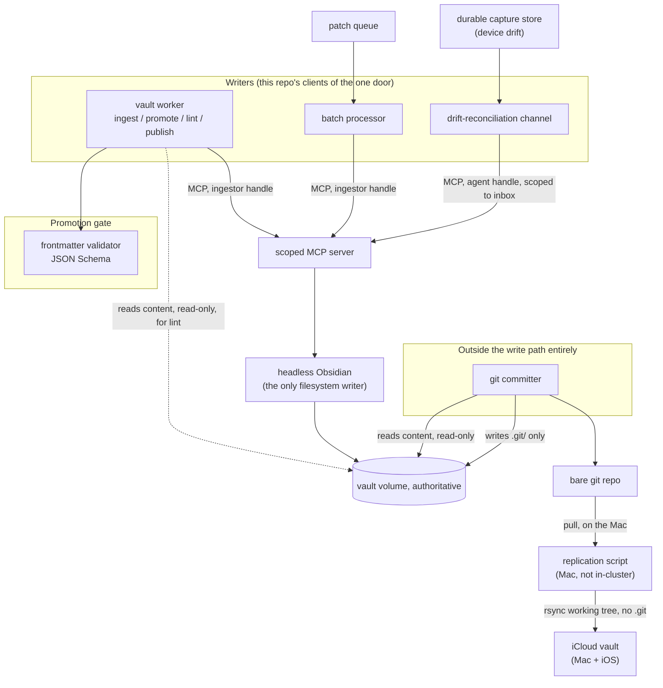

# obsidian-tools — Design

This document explains why this repository is shaped the way it is. For the full design of BRAIN — the vault
platform this repository's code implements — read [`docs/DESIGN.md`](./docs/DESIGN.md), which is the design of
record. This document is the narrower view: what belongs in *this* repository specifically, and why its pieces
relate to each other the way they do.

**Status: no application code exists yet.** This describes the target architecture that the components listed
in [`README.md`](./README.md) will implement, one ticket at a time — see the epic
[`ppat/homelab-ops-kubernetes-apps#3439`](https://github.com/ppat/homelab-ops-kubernetes-apps/issues/3439).

## The write model, in one paragraph

Exactly one process ever touches the vault's markdown files: a headless, in-cluster copy of Obsidian, reached
only through a permission-scoped MCP server. Every writer — WhatsApp-triggered agent chat, scheduled jobs,
Claude Code, a bulk-import pipeline, a lint/promotion worker — is a **client of that one door, never a second
filesystem writer**. Nothing built in this repository ever opens the vault volume for writing directly. This is
the single invariant every component here has to respect; see `docs/DESIGN.md` §1 for the full reasoning
(including its one deliberate, narrow exception: a human at the headless instance's own GUI, for configuration
and repair, outside every gate).

## Why this repository is one thing, not several

Every component listed in `README.md` — the vault worker, the git committer, the batch processor, the
drift-reconciliation channel, the frontmatter validator, and the Mac-side replication script — is a distinct
*process* with a distinct deployment target (some run in-cluster, one runs on the user's Mac), but none of them
is independent of the others' contracts: they share the same MCP client path, the same frontmatter schema, and
the same notion of what a "valid" vault write looks like. Splitting them into separate repositories would mean
duplicating that contract, or versioning it separately from the code that depends on it, for no benefit — none
of these components is reusable outside this project. One repository, one Python package, versioned as a whole.

## What each component does, and what it must never do

| Component | Job | Must never |
| --- | --- | --- |
| Vault worker | Ingest/promote, lint, and publish, as scheduled entrypoints | Write vault content directly — writes go through the MCP ingestor handle only |
| Git committer | Turn the vault volume into git history | Create, edit, or delete vault content — it mounts content read-only and `.git/` write-only |
| Batch processor | Apply queued git patches through the same MCP path as ordinary writes | Apply a patch directly to the filesystem, or treat batch as a separate write mode |
| Drift-reconciliation channel | Dispatch a captured device-side edit back into the funnel as an ordinary agent write | Overwrite a device replica in place, or treat a device edit as anything other than an ingest event |
| Frontmatter validator | Enforce the JSON-Schema contract at the promotion gate | Silently drop or "fix" a note that fails validation — quarantine it, never delete it |
| Replication script (Mac) | Keep the iCloud-synced Obsidian vault current from the cluster's authoritative copy, one-way | Push a device-side edit back onto the authoritative volume — that's the drift channel's job, not this script's |

## Architecture

Everything above the "Promotion gate" subgraph and everything in `committer_box` is code this repository owns.
Everything below the MCP server — the scoped MCP server itself, headless Obsidian, the vault volume — is
infrastructure deployed by `ppat/homelab-ops-kubernetes-apps`, not code that lives here.

## Trade-offs accepted, carried over from the canon

- **Throughput is not a design goal.** A full bulk import is accepted to take hours, once, because the
  processing tier is never the bottleneck — a single-threaded headless-Obsidian event loop is. This is *why*
  the language choice below is Python rather than something compiled (`docs/CANON-1-designing-brain.md` and
  `docs/DESIGN.md` §3 "The throughput cost, and the escape hatch").
- **No merge engine, anywhere.** The batch lane rejects a stale patch back to its producer rather than
  attempting a three-way merge — see `docs/DESIGN.md` §3 "Why stale patches are rejected rather than merged."
  Nothing in this repository should ever grow one.
- **Fail loud, destroy nothing.** The frontmatter validator quarantines a note that fails validation; it never
  deletes one. Every component here should default to the same posture when it encounters something it can't
  reconcile.

## Language and tooling

Python, managed with `uv`. See `CLAUDE.md` for the reasoning (iteration speed for an LLM-maintained codebase,
no performance constraint anywhere in this architecture) and for working conventions.
