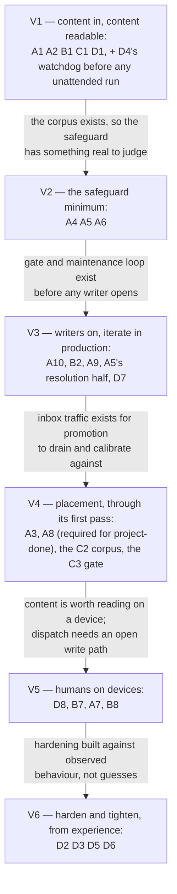

# BRAIN — Roadmap

All the work in one place: what has been delivered, what remains, and how every piece ties to the
outcomes in [`USE_CASES.md`](./USE_CASES.md) and the design in [`DESIGN.md`](./DESIGN.md). This is
the one top-level document that changes as work progresses; the other two are the stable contract it
is measured against. It is organised around a [delivery posture](#delivery-posture) — value first,
learn in production, harden later — and a [value path](#the-value-path) that sequences the work by
the value each increment ships.

**Reading rules.** Status distinguishes *authored → merged → released → deployed-and-observed* —
four different states, never collapsed (`main` is not deployed state, in either direction). Claims
are **[measured]** (read from a repo, an API, or a record that records its own measurement) or
**[inferred]**. This document supersedes the phase numbering in the older design material and in the
epic's phase table; where those disagreed with each other, the arbitration is recorded in
[Records this roadmap supersedes](#records-this-roadmap-supersedes-or-arbitrates).

**Acceptance.** Each unit's proving injections — the violation-injection test plans, past and
pending — live in the [verification catalogue](./docs/VERIFICATIONS.md), keyed to the units below.

**Identifiers.** Outcome identifiers — the [pipeline](./USE_CASES.md#axis-1--the-content-pipeline)
[S1](./USE_CASES.md#s1--admitted)–[S4](./USE_CASES.md#s4--retrievable), [writers](./USE_CASES.md#axis-2--writers-connected) [W1](./USE_CASES.md#axis-2--writers-connected)–[W3](./USE_CASES.md#axis-2--writers-connected) and [W6](./USE_CASES.md#axis-2--writers-connected),
[readers](./USE_CASES.md#axis-3--readers-connected) [R1](./USE_CASES.md#axis-3--readers-connected) and [R2](./USE_CASES.md#axis-3--readers-connected), and
[operability](./USE_CASES.md#axis-4--operability) [O1](./USE_CASES.md#o1--measured)–[O3](./USE_CASES.md#o3--alerting) — are defined in
[`USE_CASES.md`](./USE_CASES.md). Work-unit identifiers (A·B·C·D) are defined under
[Remaining work — the units](#remaining-work--the-units), and value increments [V1](#v1--content-in-content-readable)–[V6](#v6--harden-and-tighten-from-experience) under
[The value path](#the-value-path), both in this document. Every reference links to the section
defining it.

**How this document relates to tickets.** The roadmap is higher-level than tickets: it holds the
work *units*, their outcome mapping, their dependencies, and their state; tickets hold granular
execution detail. That means unit state is deliberately recorded in two places (here and on the
tickets), and the two can diverge — the same failure that let two earlier documents disagree about
the same work for weeks. The mitigations, owned by whoever updates either side: every ticket names
the unit it serves (one unit per ticket); every unit here names its tickets; and the
**Position** line below is re-dated whenever the checklists are reconciled against the tickets, so
staleness is detectable instead of silent.

**Position: 2026-09-23** — reconciled against every unit's tickets, the releases of both
repositories, the clusters repo's pins and the running cluster. Four V1 units are completed and
ticked: [A1](#group-a--pipeline-mechanisms) and [D1](#group-d--operability) are also deployed, [A2](#group-a--pipeline-mechanisms) and [B1](#group-b--connection-work) are not yet. [C1](#group-c--content-work) is
deferred by the owner, and [D4](#group-d--operability)'s window and drain are unbuilt. Of [V2](#v2--the-safeguard-minimum), [A4](#group-a--pipeline-mechanisms) and [A6](#group-a--pipeline-mechanisms) are
completed and ticked, both released in `v0.8.0` and not deployed; [A5](#group-a--pipeline-mechanisms) is in progress — its first-pass
code is released, its deployment is outstanding, and its resolution half and second pass ([ot#177](https://github.com/ppat/obsidian-tools/issues/177))
are unbuilt. The units follow the design's rules that the vault system does not know its clients and
pushes nothing to a person: writers and readers are keyed by write path and read surface, so
[B4, B5 and B6](#group-b--connection-work) are merged into [B2](#group-b--connection-work); the vault system's own agentic work is a unit of its
own, [A9](#group-a--pipeline-mechanisms); and lint findings are resolved by the vault rather than pushed. **Not yet reconciled to
this:** the tickets of the merged units; [ot#83](https://github.com/ppat/obsidian-tools/issues/83) and [ot#177](https://github.com/ppat/obsidian-tools/issues/177) (a digest push and replies, now
resolution); [ot#86](https://github.com/ppat/obsidian-tools/issues/86) (no inbox sweep); [ot#85](https://github.com/ppat/obsidian-tools/issues/85) (roll-ups through the batch stream, where
the design gives them to `promotion-processor`); [apps#4075](https://github.com/ppat/homelab-ops-kubernetes-apps/pull/4075) (a digest push); [obsidian-vault#12](https://github.com/ppat/obsidian-vault/issues/12)
(human curation, where C2's corpus is now produced through the write paths and placement);
[obsidian-vault#3](https://github.com/ppat/obsidian-vault/issues/3) (C3's checks); [ot#66](https://github.com/ppat/obsidian-tools/issues/66) (now D8, a self-upgrade); [terraform#338](https://github.com/ppat/homelab-ops-terraform/pull/338) (a per-handle gateway key, where A10 moves vault calls to per-holder credentials, passed through the gateway or sent to the gates directly); and every ticket or verification row citing W1, W3, R2 or B2, whose
meanings changed.

## Delivery posture

Three commitments govern how every remaining unit is scoped and sequenced. They are Pareto applied
to delivery, and they exist to pre-empt a known failure mode: implementation that tries to account
for every minute thing before shipping, and takes forever to put value in front of its user.

1. **Deliver value and features faster.** Each increment on the value path is cut at the smallest
   shape that ships real value to production, not at capability-complete.
2. **Learn from production; iterate on learnings.** It is accepted as impossible to account for
   everything during initial implementation — so first passes are deliberately minimal ("easy, fast
   time-to-release"), and what running in production teaches drives the next pass. Discoveries that
   do not block the value path become tickets, not scope.
3. **Harden and tighten later, once production experience exists.** Isolation hardening, broader
   drills, dashboards, and refusal-visibility instrumentation sit in a deliberate late band —
   built against observed behaviour rather than guesses, which is also what makes them cheap.

Three things are **not** deferrable under this posture, each because deferral is irreversible or
silently catastrophic rather than merely later:

- **The safety invariants the design already banks** — containment ([S1](./USE_CASES.md#s1--admitted)), fail-loud-destroy-nothing,
  capture-before-publish. These are built or structural; the posture never re-opens them.
- **[D4](#group-d--operability)'s watchdog before the batch stream runs unattended** — a processor crash with the agent
  MCP instance stopped silently stops every agent write; the failure is invisible, so it cannot be
  "learned from" in production.
- **[O1](./USE_CASES.md#o1--measured)'s metric emission** — an uninstrumented window is gone forever; emission is cheap and rides
  as acceptance criteria on units being built anyway. Dashboards and anything alert-shaped stay
  late, and alerting never: nothing is pushed to a person.

The same posture bounds *quality* scope: [S2](./USE_CASES.md#s2--sound)'s bar is the written tolerance line ([A6](#group-a--pipeline-mechanisms)) — what badness
is accepted, stated — not scenario coverage; the advanced-promotion first pass ([A8](#group-a--pipeline-mechanisms)) is explicitly an
iterate-on-it-afterwards first pass; and post-done iterations are out of scope for the project.

## Where things stand, in one table

| | State |
| --- | --- |
| Substrate (namespace, volume, headless Obsidian, both MCP instances, network isolation, secrets) | **Deployed and observed** [measured 2026-08-27]; since moved with the rest of the vault out of `apps-ai` into its own module, `apps-obsidian-vault`, which the cluster runs [measured 2026-09-22] |
| Content foundation (schema, skeleton, settings lock, property types; agents read-only) | **Deployed**, with one known defect: the daily-note `format` key was never written to the instance — satisfied only by Obsidian's default [measured 2026-08-27] |
| Read replication (committer → GitHub → `local-replicator` → iCloud), capture gate included | **Deployed and observed**: committer every 15 min in-cluster; `local-replicator` under launchd since 2026-08-28, acceptance closed at 5 of 6 criteria, no component defect found [measured 2026-08-28] |
| Work queue substrate and the vault-loaded exporter ([A1](#group-a--pipeline-mechanisms), [D1](#group-d--operability)) | **Deployed and observed**: the broker runs with its accounts and every producer credential minted, [measured 2026-09-07], and its per-stream metrics are scraped and queryable; the exporter's gauge and last-success timestamp are scraped and current [measured 2026-09-22] |
| The batch path ([A2](#group-a--pipeline-mechanisms)'s stream and `batch-processor`, [D4](#group-d--operability)'s watchdog) | **Deployed, not yet observed doing its job**: both streams exist, and the processor and watchdog run on schedule, but no batch has ever been drained and the watchdog has never restored an instance [measured 2026-09-22]. The deployed processor's MCP write semantics were found wrong against the live tool surface and are corrected in `obsidian-tools` [`v0.7.0`](https://github.com/ppat/obsidian-tools/releases/tag/v0.7.0) (ADR-0053); that correction is not yet on the cluster — see the delivery-gap row |
| The batch producer ([B1](#group-b--connection-work)) | **Code released**; issuing its credential to an operator's run is an operator act performed at the import run ([C1](#group-c--content-work)), not a manifest |
| The safeguard minimum ([A4](#group-a--pipeline-mechanisms)'s admission validator, [A5](#group-a--pipeline-mechanisms)'s lint pass, [A6](#group-a--pipeline-mechanisms)'s tolerance line) | **Released in `v0.8.0` (2026-09-23), not deployed** [measured 2026-09-23]: the validator and the shared frontmatter schema core ([ot#172](https://github.com/ppat/obsidian-tools/pull/172)), the validator wired into `batch-processor` so a chunk with any note refused admission to curated space writes nothing and is dead-lettered ([ot#173](https://github.com/ppat/obsidian-tools/pull/173)), the lint pass with the tolerance line as a table in its code ([ot#174](https://github.com/ppat/obsidian-tools/pull/174)). The lint pass's deployment is open: its gateway key ([terraform#338](https://github.com/ppat/homelab-ops-terraform/pull/338)) and its CronJob ([apps#4075](https://github.com/ppat/homelab-ops-kubernetes-apps/pull/4075), a draft awaiting the release's image) [measured 2026-09-23]. The released first pass pushes a digest to an outside agent's hook [measured 2026-09-23], which the design does not admit (ADR-0055: nothing is pushed to anyone): the push is removed, in the code and the CronJob, before the pass deploys; the gateway key carries no push and is unaffected |
| Everything else (promotion and drift streams, `promotion-processor` and its inbox sweep, `drift-processor`, the agent runtime, the roll-up pass, the remaining connections, content, the rest of operability) | **Unbuilt** — no manifest and no module exists for any of them [measured 2026-09-23] |
| **The delivery gap** | The cluster runs `obsidian-tools` `v0.6.0`, through its pin of `apps-obsidian-vault-v0.1.1`. The module release that moves every vault workload to `v0.7.0`, `apps-obsidian-vault-v0.1.3`, is cut, and the clusters-repo change that would pin it ([clusters#1091](https://github.com/ppat/homelab-ops-kubernetes-clusters/pull/1091)) is a draft held by the owner. `v0.8.0` (2026-09-23, [ot#175](https://github.com/ppat/obsidian-tools/pull/175)) is the latest release, carrying the safeguard minimum above and a fix aligning `batch-processor`'s and the lint pass's reading of MCP responses with the pinned server's real forms ([ot#176](https://github.com/ppat/obsidian-tools/pull/176)); no module release is known to pin it [measured 2026-09-23]. On the Mac, the `.obsidian/` overlay fix ([ot#71](https://github.com/ppat/obsidian-tools/pull/71)) shipped in `v0.5.0`; whether the Mac has been upgraded to it or later is **unmeasured** — the Mac is upgraded by hand until [D8](#group-d--operability) exists, so for `local-replicator` "fixed" still means "released", nothing stronger |

Why the gaps are tolerable today [inferred]: nothing enqueues onto the batch stream until the import
runs, so the uncorrected write path on the cluster has nothing to apply; and the Mac's drainer
discards by design until [B7](#group-b--connection-work), so its version gates nothing downstream.

## Delivered, mapped to outcomes

- [x] **Substrate** ([apps#3441](https://github.com/ppat/homelab-ops-kubernetes-apps/issues/3441), [apps#3442](https://github.com/ppat/homelab-ops-kubernetes-apps/issues/3442) — closed) → **[S1](./USE_CASES.md#s1--admitted)**: the containment floor. Two differently
  scoped MCP write surfaces exist; *whether* a write is permitted stays closed — the write keys are
  read-only.
- [x] **Content foundation** ([obsidian-vault#2](https://github.com/ppat/obsidian-vault/issues/2) — closed) → **[S1](./USE_CASES.md#s1--admitted), [S2](./USE_CASES.md#s2--sound) groundwork, [R2](./USE_CASES.md#axis-3--readers-connected)**: the
  skeleton, the schema file, the retrofit-expensive settings locked, 16 property types declared, and
  the read handles issued — which is why agent readers have no build work at all. The write-path
  gate is proven **in both directions** by violation injection [measured 2026-07-30].
- [x] **Read replication** ([ot#3](https://github.com/ppat/obsidian-tools/issues/3), [apps#3443](https://github.com/ppat/homelab-ops-kubernetes-apps/issues/3443) — closed) → **[S4](./USE_CASES.md#s4--retrievable), [W6](./USE_CASES.md#axis-2--writers-connected) capture half**: one-way,
  non-destructive publication with capture-before-publish real and proven by injection from day one.
  The sixth acceptance criterion (Obsidian-on-iOS reads rsync-written files) was **relocated, not
  waived**, to [ot#69](https://github.com/ppat/obsidian-tools/issues/69) — testable only at the app rollout.

What the delivered work did **not** deliver, so a cold reader does not assume it did: agents cannot
write yet ([S1](./USE_CASES.md#s1--admitted)'s queue admission path is deployed but has never applied a write; the write keys are read-only); nothing yet
checks whether written content is any good ([S2](./USE_CASES.md#s2--sound) has property types and nothing else); [W6](./USE_CASES.md#axis-2--writers-connected)'s dispatch
half does not exist (the drainer discards); and the Obsidian apps are installed nowhere,
deliberately.

## The value path

The order below is by **value shipped to production per increment**, respecting the structural
dependencies (tabled later) and nothing else. Increments overlap freely where dependencies allow;
each names the smallest shape that ships.

### V1 — Content in, content readable

**Units:** [A1](#group-a--pipeline-mechanisms) · [A2](#group-a--pipeline-mechanisms) (+ [D4](#group-d--operability)'s watchdog before any unattended run) · [B1](#group-b--connection-work) · [C1](#group-c--content-work) · [D1](#group-d--operability).
**Value shipped:** the scattered pile becomes vault content, immediately queryable through every
read surface that already exists ([R2](./USE_CASES.md#axis-3--readers-connected)) — the first moment the vault is *useful*.
**Why it is first:** the import needs **no validator at all** — raw is immutable and exempt by
design — so nothing [S2](./USE_CASES.md#s2--sound)-shaped blocks it. The corpus it lands is also the instrument every later
acceptance depends on.
**The import run is deferred by the owner's decision.** [C1](#group-c--content-work) waits until the system is more
complete, so that features built after it cannot damage real notes. The rest of V1 is deployed,
or for the producer released; the increment's value — the corpus — does not ship until the run
happens, so [V2](#v2--the-safeguard-minimum)'s units proceed ahead of it.

### V2 — The safeguard minimum

**Units:** [A4](#group-a--pipeline-mechanisms) · [A5](#group-a--pipeline-mechanisms) (first pass) · [A6](#group-a--pipeline-mechanisms).
**Value shipped:** curated space can start filling safely; the lint pass fixes mechanical breakage
and records every finding in its report — pushing nothing to anyone. The bar is deliberately minimal: the mechanical checks and the finance hard block, with the
tolerance line ([A6](#group-a--pipeline-mechanisms)) written into the linter as *the* statement of what is accepted — minimum
confidence, not scenario coverage. Everything the first weeks of linting teaches becomes the second
pass.

### V3 — Writers on; iterate in production

**Units:** [A10](#group-a--pipeline-mechanisms) (ahead of [B2](#group-b--connection-work): the access gate, per-holder credentials and the access record) · [B2](#group-b--connection-work) · [A9](#group-a--pipeline-mechanisms) and [A5](#group-a--pipeline-mechanisms)'s resolution half · [D7](#group-d--operability) (the operations pass, so operational conditions have resolvers before traffic arrives), then the safeguard ↔ writers loop.
**Value shipped:** agent clients capture into the vault daily — conversational captures, automation
notes, a coding agent's incremental writes, whatever the operator issues interactive-write
credentials to — every write attributable to its holder, and the lint pass resolving what it finds
rather than piling it up. This is where the learn-in-prod loop actually runs: real traffic
calibrates the linter and the tolerance line, and discoveries that can wait become out-of-scope
tickets. The definition-of-done gate's own text makes passing it the condition for open agent
writing *at volume*; the delivery posture reads that as gating the firehose, not the first
connected writer — if the owner wants the stricter reading (gate fully passed before any agent write
key opens), writers wait for [V4](#v4--placement-through-its-first-pass)'s gate and V3 splits.

### V4 — Placement, through its first pass

**Units:** [A3](#group-a--pipeline-mechanisms) · [A8](#group-a--pipeline-mechanisms) (first pass) · then [C2](#group-c--content-work) and the definition-of-done gate [C3](#group-c--content-work).
**Value shipped:** notes reach their curated homes unattended (the inbox empties without a human,
and without any writer having to announce what it wrote), and the advanced half — prominence set by
salience, merges that copy their sources verbatim, retirement to the archive (reversible) — ships as an easy, fast
first pass to iterate on afterwards. [A8](#group-a--pipeline-mechanisms)'s first pass is required for project-done; its refinement is
explicitly post-project. Both lean on [A9](#group-a--pipeline-mechanisms), which lands in V3. The gate ([C3](#group-c--content-work), against [C2](#group-c--content-work)'s
100–200 curated notes) closes the increment, because its checks exercise placement, merging and the
lint loop together — the checkpoint that the schema and ownership contract survived contact with
volume.

### V5 — Humans on devices

**Units:** [D8](#group-d--operability) (the replicator upgrades itself; its first install on the Mac is the owner's one hand act there) · [B7](#group-b--connection-work) · [A7](#group-a--pipeline-mechanisms) · [B8](#group-b--connection-work) (with [ot#47](https://github.com/ppat/obsidian-tools/issues/47),
[ot#72](https://github.com/ppat/obsidian-tools/issues/72) closed and [ot#69](https://github.com/ppat/obsidian-tools/issues/69) verified at the reset).
**Value shipped:** native reading on Mac and iPhone, and the device-edit loop closed end to end.
Deliberately last on the owner's own ruling: live reads through agent clients already serve the phone,
and direct human device edits are very rare.

### V6 — Harden and tighten, from experience

**Units:** [D2](#group-d--operability) · [D5](#group-d--operability) · [D6](#group-d--operability) · [D3](#group-d--operability) · the remaining drill items.
**Value shipped:** the platform's failure modes are exercised and its blind spots instrumented —
now built against months of observed behaviour instead of guesses.
**One disposition inside this band, stated honestly:**

- **[D3](#group-d--operability) (the recovery drill) gets dearer the longer it waits** — its cost scales with the content at
  risk, and the vault will never hold less than now. Deferring it to this band is the posture's
  knowing trade, not an oversight; pulling it forward is cheap any time.

## Remaining work — the units

Each unit serves exactly one outcome — a unit that served two could not move without dragging an
outcome nobody was thinking about. Units with no ticket are real gaps, listed again in
[Outcomes with no work behind them](#outcomes-with-no-work-behind-them). Pending injections per
unit: the [verification catalogue](./docs/VERIFICATIONS.md).

### Group A — pipeline mechanisms

A box ticks when its unit is completed — the work it asks for is done. Deployed is the state after
completed: the completed work running on the cluster. A1 is completed and deployed; it still owes the
decisive credential-refusal injection in the [verification catalogue](./docs/VERIFICATIONS.md). A2 is
completed — its corrected write path is released and its manifest merged — but not yet deployed: the
cluster still runs the earlier release, so no batch has drained. A4 and A6 are completed — released
in `v0.8.0` — and not yet deployed. A5's first-pass code is released, its deployment is outstanding,
and its resolution half and second pass ([ot#177](https://github.com/ppat/obsidian-tools/issues/177)) are unbuilt, so A5 is not completed. A3, A7,
A8, A9 and A10 are unimplemented [measured 2026-09-23].

- [x] **A1 — NATS substrate and credential machinery** → [S1](./USE_CASES.md#s1--admitted) · [apps#3444](https://github.com/ppat/homelab-ops-kubernetes-apps/issues/3444) · [V1](#v1--content-in-content-readable)
  JetStream as a single-replica Deployment; the off-cluster ingress; one NATS account per producer
  population, subject-scoped. **No streams** — each stream ships with its processor (A2/A3/A7), so
  no stream is ever reachable with no consumer and no credential control behind it. The credential
  half alone unlocks the decisive authority injections (a legitimately held credential refused at a
  subject outside its grant) before any processor exists.
  *[O1](./USE_CASES.md#o1--measured) criteria ride on it:* per-stream depth, ack, nack, dead-letter metrics collected and
  queryable.
- [x] **A2 — the batch stream and `batch-processor`** → [S1](./USE_CASES.md#s1--admitted) · [ot#5](https://github.com/ppat/obsidian-tools/issues/5) (code) + [apps#3875](https://github.com/ppat/homelab-ops-kubernetes-apps/issues/3875) (deploy) · [V1](#v1--content-in-content-readable)
  Strict FIFO; stale patches rejected to the producer; the raw layer's create-only enforcement;
  backpressure keyed on promotion-stream depth; dead-letter path. *Criteria:* raw-refusals and
  backpressure engagements countable.
- [ ] **A3 — the promotion stream and `promotion-processor`** → [S3](./USE_CASES.md#s3--placed) · [ot#86](https://github.com/ppat/obsidian-tools/issues/86) (code) + [apps#3876](https://github.com/ppat/homelab-ops-kubernetes-apps/issues/3876) (deploy) · [V4](#v4--placement-through-its-first-pass)
  Real-time pointer draining, plus the inbox sweep — a scheduled listing of `00-inbox/` that
  enqueues a pointer for every note with none pending, so placement never waits on a writer
  announcing (ADR-0056); refuses any pointer outside `00-inbox/`; calls the admission validator on
  every relocation. Every inbox note leaves by promotion (keeping its file name, or beside the note
  already there, under a disambiguated path, when its path is taken), or by the validator's
  quarantine; quarantined notes the lint pass re-admits are relocated by this unit too. Where a note's
  frontmatter does not settle its destination, the agent runtime ([A9](#group-a--pipeline-mechanisms)) proposes one; without a
  verdict the note stays in the inbox, counted, and is swept again — never quarantined for lack of
  one. The announce kind's grant ships with this unit's stream
  (ADR-0023). *Criteria:* refused pointers counted — a rising count is exactly the prompt-injection
  attempt the check exists to catch; swept pointers counted per note, apart from announced ones — a
  note the sweep keeps finding is one whose promotion keeps failing.
- [x] **A4 — the admission validator** → [S2](./USE_CASES.md#s2--sound) · [ot#6](https://github.com/ppat/obsidian-tools/issues/6) · [V2](#v2--the-safeguard-minimum)
  One shared admission check, three callers (promotion, batch, lint), two enforcement strengths;
  quarantine-never-delete with machine-readable reasons, counted. First pass: the mechanical checks
  and the finance hard block, nothing speculative. See [Open decisions](#open-decisions) for the
  ratification this unit needs.
- [ ] **A5 — the lint pass** → [S2](./USE_CASES.md#s2--sound) · [ot#83](https://github.com/ppat/obsidian-tools/issues/83) (code, first pass) + [apps#3445](https://github.com/ppat/homelab-ops-kubernetes-apps/issues/3445) (CronJob manifests) · [V2](#v2--the-safeguard-minimum) · [ot#177](https://github.com/ppat/obsidian-tools/issues/177) (code, second pass — outside V2)
  Whole-vault conformance and hygiene; the `trigger:`/`authority:` consistency check; additive-only
  normalisation in the pass's own code; the report and metrics, with nothing pushed to anyone. Its
  **resolution half** (ADR-0055) judges each finding through the agent runtime ([A9](#group-a--pipeline-mechanisms)) and applies a
  resolution that never raises `confidence:` or `authority:` and destroys nothing — including
  freshness verdicts stamped in the vault's own `verified:` (ADR-0061), re-validation and repair of
  quarantined notes, and vocabulary repair — recorded so that nothing resolved is re-judged until it
  changes; what it cannot resolve yet it records with its reason and retries itself. It lands in
  [V3](#v3--writers-on-iterate-in-production). It also carries the schema bundle (ADR-0063): the release's
  single schema source, delivered by the editor's entrypoint at pod start — `verified:` arrives that
  way, with no manual edit — and each release's migration, which the pass applies before any check.
  And it builds the evidence fetcher, the credential-less component whose fetches back every
  `verified:` stamp (ADR-0061), with its containment and its injections: a citation that resolves or
  redirects to a private address is refused, and a broken fetcher decays nothing. The schema
  bundle's delivery is a ConfigMap rendered by the deployment module and copied by the editor's own
  entrypoint, with a migration job at deploy and a schema-version marker (ADR-0063). The rest of the second pass ([ot#177](https://github.com/ppat/obsidian-tools/issues/177)) is unscheduled. Runs
  against whatever content exists — it does not depend on agent writes being open. *Criteria:* inbox depth, quarantine depth,
  rejection counts, unstamped-note counts, and unresolved-finding count and age emitted from the pass
  itself.
- [x] **A6 — the [S2](./USE_CASES.md#s2--sound) tolerance line** → [S2](./USE_CASES.md#s2--sound) · [ot#84](https://github.com/ppat/obsidian-tools/issues/84) · [V2](#v2--the-safeguard-minimum)
  A written statement of tolerated badness, placed inside the linter — the instrument that makes
  "minimum confidence" falsifiable and keeps [V2](#v2--the-safeguard-minimum) from creeping toward scenario coverage. Written
  before A5 it is a specification; after, a retrofit onto behaviour that already became the
  de-facto answer.
- [ ] **A7 — the drift stream and `drift-processor`** → [W6](./USE_CASES.md#axis-2--writers-connected) · [ot#4](https://github.com/ppat/obsidian-tools/issues/4) (code) + [apps#3877](https://github.com/ppat/homelab-ops-kubernetes-apps/issues/3877) (deploy) · [V5](#v5--humans-on-devices)
  The intentionality classifier (server-side; the device stays dumb); reconciliation against
  upstream history **before** stamping `authority: human`; `matches_upstream` treated as evidence,
  never as a rule — the plausible reading discards genuine human deletions; dispatch through the
  narrow inbox-scoped handle, under `drift-processor`'s own component credential — so it waits on
  no client-connection unit.
- [ ] **A8 — salience-driven prominence, merging and retirement: the roll-up pass** → [S3](./USE_CASES.md#s3--placed) · [ot#85](https://github.com/ppat/obsidian-tools/issues/85) · [V4](#v4--placement-through-its-first-pass)
  [S3](./USE_CASES.md#s3--placed)'s advanced half, and where the platform's purpose lands: the mechanism by which important
  ideas bubble up for agents to work on. Its *first pass* is inside the definition of project done,
  so this is in-scope scope with zero coverage — the largest gap on this map. Scoped by the
  posture: easy, fast time-to-release, iterated on afterwards. Its owner is `promotion-processor`'s
  **roll-up pass** (ADR-0060): salience scores, merge proposals and retirement verdicts from the
  agent runtime ([A9](#group-a--pipeline-mechanisms)), applied through the ingestor handle and the validator. Salience sets a
  note's prominence in the computed indexes; a curated note leaves curated space only when merged —
  its body copied verbatim into the survivor, which the validator judges, then archived; no model
  text written — or judged retired, which the pass reverses on new evidence; nothing is renamed.
- [ ] **A10 — the access gate: per-holder credentials, tool grants and the access record** → [S1](./USE_CASES.md#s1--admitted) · no ticket yet · [V3](#v3--writers-on-iterate-in-production)
  The access gate in front of each MCP instance, with its credential registry (ADR-0059): verify
  each holder's own credential against a registry of opaque identifiers that names no client,
  enforce its tool grant — delete withheld on the agent instance — and write every call durably to
  the access record before forwarding it. Issuance and revocation as infrastructure code,
  agent-authored and landed by merge, with no manual step. For this installation's gateway, measured
  here: whether it can pass a per-request vault credential through. If it cannot, vault calls go to
  the gates' own TLS endpoint directly, a second endpoint beside the gateway. Also builds that
  endpoint: TLS from the cluster issuer, and a network policy admitting client namespaces and the
  ingress, as defence in depth. *Criteria:* the access record names the
  credential of any admitted write in O1's window; a revoked holder is refused while every other
  holder is not; each minted queue credential has one holder; an unrecordable call is refused.
- [ ] **A9 — the agent runtime** → [S2](./USE_CASES.md#s2--sound) · no ticket yet · [V3](#v3--writers-on-iterate-in-production)
  The vault system's own agentic workflow (ADR-0054): one library, the only code that calls a model,
  typed tasks whose outputs are validated before use; no vault credential, no mount, never a writer,
  never a gate. Its framework is chosen and recorded here, against ADR-0054's requirements. Callers:
  [A5](#group-a--pipeline-mechanisms)'s resolution half, [A8](#group-a--pipeline-mechanisms)'s roll-up pass, and [A3](#group-a--pipeline-mechanisms) where a destination needs judgement. *Criteria:* per-task
  calls, latency, token use and schema failures emitted.

### Group B — connection work

Each unit opens one write path or read surface, never one client: the vault system does not know
its clients, and connecting a particular client to an open kind of access is issuance — an operator
act, not a unit. B1's code is released; its credential is presented from the operator's custody at
the import run. B2, B3, B7 and
B8 are unbuilt [measured 2026-09-22]; B4, B5 and B6 are retired into B2.

- [x] **B1 — [W1](./USE_CASES.md#axis-2--writers-connected): the batch producer onto the batch stream** → [W1](./USE_CASES.md#axis-2--writers-connected) · [ot#125](https://github.com/ppat/obsidian-tools/issues/125) (code) + [apps#3878](https://github.com/ppat/homelab-ops-kubernetes-apps/issues/3878) (credential/deploy) · [V1](#v1--content-in-content-readable)
  The only credential in the system permitted to enqueue patch-carrying work — a component
  credential, kept in the operator's custody and presented only in runs he starts; the producer
  that turns staged changes into chunks and enqueues them.
- [ ] **B2 — [W3](./USE_CASES.md#axis-2--writers-connected): the interactive write kind opens** → [W3](./USE_CASES.md#axis-2--writers-connected) · [apps#3879](https://github.com/ppat/homelab-ops-kubernetes-apps/issues/3879), with [apps#3880](https://github.com/ppat/homelab-ops-kubernetes-apps/issues/3880), [apps#3881](https://github.com/ppat/homelab-ops-kubernetes-apps/issues/3881) and [ot#120](https://github.com/ppat/obsidian-tools/issues/120) (written per named client) · [V3](#v3--writers-on-iterate-in-production)
  Write-capable credentials of the interactive kind on the agent handle (ADR-0057), one per holder
  (ADR-0059); the (already-set, inert) path scope carrying client writes. The announce kind is not
  this unit's: its grant ships with [A3](#group-a--pipeline-mechanisms)'s stream. The unit is proven per kind, never per client. Controls a client runs on its own side — a runner's
  pre-write hook — are the client's, and nothing here installs or relies on one.
- [ ] **B3 — [W2](./USE_CASES.md#axis-2--writers-connected): unattended bulk sources (a watched NAS drop, for example)** → [W2](./USE_CASES.md#axis-2--writers-connected) · [ot#119](https://github.com/ppat/obsidian-tools/issues/119) · unscheduled
  Blocked on a design decision, not just a credential: see [Open decisions](#open-decisions).
- **B4, B5, B6 — retired.** Each opened [B2](#group-b--connection-work)'s kind of access for one named client, or one class of client (B6: ad-hoc scripts); merged into
  B2 and never reused.
- [ ] **B7 — [W6](./USE_CASES.md#axis-2--writers-connected): the drainer's real destination** → [W6](./USE_CASES.md#axis-2--writers-connected) · [ot#87](https://github.com/ppat/obsidian-tools/issues/87) · [V5](#v5--humans-on-devices)
  Spool entries published to the drift stream, removed **only on JetStream ack**; the drift
  credential issued; ingress reachability (LAN, Tailscale).
- [ ] **B8 — [R1](./USE_CASES.md#axis-3--readers-connected): the app rollout** → [R1](./USE_CASES.md#axis-3--readers-connected) · [ot#88](https://github.com/ppat/obsidian-tools/issues/88) · [V5](#v5--humans-on-devices)
  Installing Obsidian on macOS and iOS, which requires resetting the device vault (iCloud copy
  *and* baseline tag) to day one. The install and the reset before it are the owner's one sitting
  at his devices; the seed then sets the Tasks plugin's task format by key, so no per-device setting
  is done by hand (ADR-0066). The one irreversible step on this map: at the reset, the settings
  baseline stops being inert and becomes real device configuration. Preconditions: [ot#47](https://github.com/ppat/obsidian-tools/issues/47) (baseline
  values verified three-way), [ot#72](https://github.com/ppat/obsidian-tools/issues/72) (seed symlink hazard) — and [ot#69](https://github.com/ppat/obsidian-tools/issues/69) becomes testable only here.

[R2](./USE_CASES.md#axis-3--readers-connected) has **no build work** — read access was delivered with the content foundation, conversational
readers included, and its remaining value is entirely [S2](./USE_CASES.md#s2--sound)'s and [S3](./USE_CASES.md#s3--placed)'s to supply. That is the system
working, not a hole.

### Group C — content work

Content is the **instrument** by which [S2](./USE_CASES.md#s2--sound)'s and [S3](./USE_CASES.md#s3--placed)'s acceptance criteria become answerable, not a
capability — a lint pass over a near-empty vault reports nothing, and reports nothing whether it
works or not. The one-unit-one-outcome rule is deliberately not forced here.

- [ ] **C1 — the bulk import run** → [W1](./USE_CASES.md#axis-2--writers-connected) (its only demonstration) · [obsidian-vault#11](https://github.com/ppat/obsidian-vault/issues/11) · [V1](#v1--content-in-content-readable)
  Executing the one-time import of the scattered pile into the raw layer, through [B1](#group-b--connection-work) + [A2](#group-a--pipeline-mechanisms), in a run
  authorised as the [open decision](#open-decisions) on bulk runs settles — with no hand-run step. The run
  proves [W1](./USE_CASES.md#axis-2--writers-connected); the corpus it produces is the instrument for [S2](./USE_CASES.md#s2--sound)/[S3](./USE_CASES.md#s3--placed) — and the first shipped value.
- [ ] **C2 — curation to 100–200 notes** → *(instrument)* · [obsidian-vault#12](https://github.com/ppat/obsidian-vault/issues/12) · [V4](#v4--placement-through-its-first-pass)
  Enough curated content for promotion decisions to be judgeable and every view to render non-empty.
  Produced by writers, never by hand and never by the vault system, which authors no knowledge:
  agent clients distilling the raw corpus and new captures into inbox notes through [W3](./USE_CASES.md#axis-2--writers-connected), placed
  by [A3](#group-a--pipeline-mechanisms) and consolidated by [A8](#group-a--pipeline-mechanisms). C2 therefore depends on client traffic — the platform being used,
  which is its purpose — and not on any vault mechanism beyond placement.
- [ ] **C3 — the definition-of-done gate** · [obsidian-vault#3](https://github.com/ppat/obsidian-vault/issues/3) · [V4](#v4--placement-through-its-first-pass)
  Six checks against the 100–200-note vault: zero schema errors; views render non-empty; the inbox
  empties end-to-end once; across two consecutive lint passes with the model endpoint reachable and
  no new content, the unresolved-finding and quarantine counts do not grow, and every unresolved
  finding names what the runtime lacked; a factual-grounding sample, judged by the agent runtime on
  evidence fetched from each sampled claim's cited source and recorded, so each verdict is
  checkable; the round-trip test (a human-marked passage in a merged source survives byte for byte in
  the survivor's copy — the violation injection for this stage, failing on any mangled copy). A gate is *supposed* to test several outcomes at once; it is not a braid to untangle.

### Group D — operability

The bulk of [O1](./USE_CASES.md#o1--measured) is **acceptance criteria on other units** (noted on [A1](#group-a--pipeline-mechanisms)/[A2](#group-a--pipeline-mechanisms)/[A4](#group-a--pipeline-mechanisms)/[A5](#group-a--pipeline-mechanisms) above), because a
signal that is a byproduct of a unit's own work belongs to that unit — a standalone observability
ticket is how [O1](./USE_CASES.md#o1--measured) got deferred to the end originally, and emission is the one cheap thing that cannot
be recovered later. The units below are the remainder: signals needing an independent observer, and
shared mechanisms nothing else owns. *Criteria distribute; shared mechanisms do not.*

D1 is completed and deployed. D4's watchdog is deployed and runs its scheduled passes but has never
restored an instance, and its window and drain are unbuilt, so D4 is not completed. D2,
D3, D5, D6, D7 and D8 are unbuilt [measured 2026-09-22].

- [x] **D1 — the vault-loaded exporter** → [O1](./USE_CASES.md#o1--measured) · [ot#121](https://github.com/ppat/obsidian-tools/issues/121) (code) + [apps#3946](https://github.com/ppat/homelab-ops-kubernetes-apps/issues/3946) (deploy) · [V1](#v1--content-in-content-readable)
  An authenticated call that enumerates vault content and exposes a gauge + last-success timestamp.
  Exists to **contradict the component's own account of itself** — the pod has already been Ready
  and serving while unable to open the vault at all [measured 2026-07-30]. Not foldable into a
  probe: a probe converts observation into restart, and that failure was one a restart does not fix.
  Depends on nothing unbuilt.
- [ ] **D2 — direct-write-path refusal visibility** → [O1](./USE_CASES.md#o1--measured) · [ot#124](https://github.com/ppat/obsidian-tools/issues/124) collects requirements; builds
  nothing · [V6](#v6--harden-and-tighten-from-experience)
  Gate refusals return HTTP 200 with the error inside the envelope, so no HTTP-level metric sees the
  write gate at all; queue metrics see it only for stream-borne traffic. The interactive writers'
  refusals need their own instrument — one mechanism serving every client of the interactive kind,
  owned by no connection unit. Deferred to the hardening band deliberately: it instruments a control that is already
  proven, and prod experience will say which of [ot#124](https://github.com/ppat/obsidian-tools/issues/124)'s collected requirements are real.
- [ ] **D3 — the recovery drill** → [O2](./USE_CASES.md#o2--survives-its-failure-modes) · [ot#122](https://github.com/ppat/obsidian-tools/issues/122) · [V6](#v6--harden-and-tighten-from-experience), cheaper the earlier it runs
  Snapshot restore, independent git restore, probe-recovers-a-wedged-editor, and the
  pod-template-churn test of the single-writer window. Every subject is deployed today.
- [ ] **D4 — batch-mode safety mechanisms** → [O2](./USE_CASES.md#o2--survives-its-failure-modes) · [ot#5](https://github.com/ppat/obsidian-tools/issues/5) (watchdog) + [ot#89](https://github.com/ppat/obsidian-tools/issues/89) (window + drain) · [V1](#v1--content-in-content-readable) (the watchdog); window +
  drain may follow in [V6](#v6--harden-and-tighten-from-experience)
  The watchdog starting the agent MCP instance again if `batch-processor` dies is **not
  deferrable**: it must exist before the batch stream runs unattended, because the failure it closes
  is silent and indefinite. The smallest shape that ships is enough — a dumb restore, not a
  framework. The
  maximum-window and post-disable drain are hardening-band refinements.
- [ ] **D5 — stronger container isolation** → [S1](./USE_CASES.md#s1--admitted) (a containment claim; arguable, flagged) ·
  [apps#3884](https://github.com/ppat/homelab-ops-kubernetes-apps/issues/3884) · [V6](#v6--harden-and-tighten-from-experience)
  The named attempt: user-namespace isolation (`hostUsers: false`) over the vault volume; if the
  storage layer's mounts cannot support it, the current accepted posture stays, deliberately.
- [ ] **D6 — dashboards** → [O1](./USE_CASES.md#o1--measured) · [apps#3885](https://github.com/ppat/homelab-ops-kubernetes-apps/issues/3885) · [V6](#v6--harden-and-tighten-from-experience)
  Views over what [O1](./USE_CASES.md#o1--measured) collects, built when the questions are real — a dashboard built before the
  questions are known displays the wrong things and is cheap to rebuild later. The one assigned
  slice: lint's own three numbers (drift rate, quarantine depth, inbox depth) belong to [A5](#group-a--pipeline-mechanisms).
- [ ] **D7 — the operations pass** → [O2](./USE_CASES.md#o2--survives-its-failure-modes) · no ticket yet · [V3](#v3--writers-on-iterate-in-production)
  Every operational condition the vault system observes resolved inside it or named as a stated
  residue (ADR-0064), detected by rule with no model: the editor or a gate restarted once per
  episode through `scale` on named Deployments under a Lease, with D4's watchdog extended to restore
  any of them left at zero under an expired Lease; every other condition resolved by its owner or
  stated as a residue with its consequence. *Criteria:* each condition's resolution or residue is
  emitted; nothing is pushed; the pass killed between its two scale calls leaves nothing at zero
  beyond one watchdog period after the Lease expires.
- [ ] **D8 — `local-replicator` converges on the deployed version by itself** → [O2](./USE_CASES.md#o2--survives-its-failure-modes) · [ot#66](https://github.com/ppat/obsidian-tools/issues/66) · [V5](#v5--humans-on-devices)
  The Mac follows the version the cluster runs, read from a version trailer the committer adds to
  its own sync commits (part of this unit), so it
  moves with the owner's merge of the pin and never ahead of the cluster. It installs to a
  version-independent path, then proves that launchd's next run executed the new version, with
  rollback on failure (ADR-0065). Adds what it relies on, none of which exists today: an attested
  release artifact, the committer signing its commits with its own key, and a commit carrying the
  new trailer whenever the committer's version changes, and a trust list of committer keys and
  revocations inside each attested release, read by the Mac from the newest release on every cycle.
  That makes rotation and revocation, emergency included, a merged change with no hand act. The
  first install on the Mac is the owner's one hand act there; every later version and key arrives
  by itself.

Not units, deliberately: **[ot#123](https://github.com/ppat/obsidian-tools/issues/123)** (the pre-mortem tripwires — a standing register of
design-revisit signals, revisited on a cadence, never "done") and **[ot#124](https://github.com/ppat/obsidian-tools/issues/124)** (requirements
collection that builds nothing by design).

### The mapping at a glance

Outcomes down, work across — consolidated from the groups above. "Gap" marks work with no
ticket; the reconciliation of 2026-08-29 left none, and [A9](#group-a--pipeline-mechanisms), [A10](#group-a--pipeline-mechanisms) and [D7](#group-d--operability), added since, have none yet.

| Outcome | Delivered already by | Remaining units | Gaps |
| --- | --- | --- | --- |
| [S1](./USE_CASES.md#s1--admitted) Admitted | Substrate; content foundation (gate proven both directions); [A1](#group-a--pipeline-mechanisms) | [A2](#group-a--pipeline-mechanisms) · [A10](#group-a--pipeline-mechanisms) · [D5](#group-d--operability) (assignment arguable) | [A10](#group-a--pipeline-mechanisms) has no ticket |
| [S2](./USE_CASES.md#s2--sound) Sound | Property types only | [A4](#group-a--pipeline-mechanisms) · [A5](#group-a--pipeline-mechanisms) · [A6](#group-a--pipeline-mechanisms) · [A9](#group-a--pipeline-mechanisms) | [A9](#group-a--pipeline-mechanisms) has no ticket |
| [S3](./USE_CASES.md#s3--placed) Placed | — | [A3](#group-a--pipeline-mechanisms) · [A8](#group-a--pipeline-mechanisms) | — |
| [S4](./USE_CASES.md#s4--retrievable) Retrievable | Read handles; the whole replication chain | — (its human-device remainder is [R1](./USE_CASES.md#axis-3--readers-connected)'s) | — |
| [W1](./USE_CASES.md#axis-2--writers-connected) bulk, owner-authorised | — | [B1](#group-b--connection-work) · [C1](#group-c--content-work) (the run is [W1](./USE_CASES.md#axis-2--writers-connected)'s only demonstration) | — |
| [W2](./USE_CASES.md#axis-2--writers-connected) unattended bulk sources | — | [B3](#group-b--connection-work) (blocked on a design decision) | — |
| [W3](./USE_CASES.md#axis-2--writers-connected) interactive agent writes | Read-only keys | [B2](#group-b--connection-work) | — |
| [W6](./USE_CASES.md#axis-2--writers-connected) humans / device | Capture half, proven by injection | [A7](#group-a--pipeline-mechanisms) · [B7](#group-b--connection-work) | — |
| [R1](./USE_CASES.md#axis-3--readers-connected) humans, native on device | Content reaches the device | [B8](#group-b--connection-work) | — |
| [R2](./USE_CASES.md#axis-3--readers-connected) agent readers, conversational ones included | Delivered — no build work exists, correctly | — | — |
| [O1](./USE_CASES.md#o1--measured) Measured | This installation's LLM gateway's scrape groundwork (coverage unverified); [D1](#group-d--operability); [A1](#group-a--pipeline-mechanisms)'s per-stream metrics | [D2](#group-d--operability) · [D6](#group-d--operability), plus criteria riding on [A2](#group-a--pipeline-mechanisms)/[A4](#group-a--pipeline-mechanisms)/[A5](#group-a--pipeline-mechanisms) | — |
| [O2](./USE_CASES.md#o2--survives-its-failure-modes) Survives failure | — | [D3](#group-d--operability) · [D4](#group-d--operability) · [D7](#group-d--operability) · [D8](#group-d--operability) | [D7](#group-d--operability) has no ticket |
| [O3](./USE_CASES.md#o3--alerting) Alerting | Non-outcome by standing ruling | — | — |

## Outcomes with no work behind them

No outcome lacks work. Three units lack a ticket: [A9](#group-a--pipeline-mechanisms), the agent runtime; [A10](#group-a--pipeline-mechanisms), the access gate; and [D7](#group-d--operability), the operations pass. Every other unit names
its tickets (reconciled 2026-08-29). What remains open is decision-shaped rather than ticket-shaped, and lives in [Open decisions](#open-decisions):
[B3](#group-b--connection-work)'s authority conflict ([ot#119](https://github.com/ppat/obsidian-tools/issues/119) is blocked on choosing among the three candidate
shapes) and [B8](#group-b--connection-work)'s timing ([ot#88](https://github.com/ppat/obsidian-tools/issues/88) carries the preconditions; the owner's stated criterion
is "enough content to read").

## Dependencies

Three kinds, kept apart because the old phase numbering conflated them.

### Structural — the capability cannot exist without it

| Edge | What only the dependency supplies |
| --- | --- |
| [A2](#group-a--pipeline-mechanisms), [A3](#group-a--pipeline-mechanisms), [A7](#group-a--pipeline-mechanisms) → [A1](#group-a--pipeline-mechanisms) | A broker to declare a stream on; the account machinery a subject grant is expressed against |
| [B1](#group-b--connection-work), [B3](#group-b--connection-work), [B7](#group-b--connection-work) → [A1](#group-a--pipeline-mechanisms) | A credential to be issued — once NATS has an ingress, the credential *is* the authority |
| [B1](#group-b--connection-work) → [A2](#group-a--pipeline-mechanisms) · [B7](#group-b--connection-work) → [A7](#group-a--pipeline-mechanisms) | A subject to publish to; a credential naming a subject no stream serves is nothing |
| [A3](#group-a--pipeline-mechanisms) → [A4](#group-a--pipeline-mechanisms), [A2](#group-a--pipeline-mechanisms) → [A4](#group-a--pipeline-mechanisms), [A5](#group-a--pipeline-mechanisms)'s auto-fixes → [A4](#group-a--pipeline-mechanisms) | The admission decision; without it promotion is a move with no gate, and a batch chunk enters curated space through no gate at all |
| [A5](#group-a--pipeline-mechanisms)'s resolution half, [A8](#group-a--pipeline-mechanisms) → [A9](#group-a--pipeline-mechanisms) | Model judgement from the vault system's own runtime — contradictions, staleness, salience, merge proposals |
| [C3](#group-c--content-work) → [A5](#group-a--pipeline-mechanisms)'s resolution half, [A3](#group-a--pipeline-mechanisms), [A8](#group-a--pipeline-mechanisms) | The gate checks the lint loop's resolution, the inbox emptying and a merge's round trip; none can be checked before its unit exists |
| [C2](#group-c--content-work) → [A8](#group-a--pipeline-mechanisms) | C2's content is consolidated by the roll-up pass |
| [A5](#group-a--pipeline-mechanisms)'s resolution half → [A9](#group-a--pipeline-mechanisms) | Judgement from the vault's own runtime |
| [D7](#group-d--operability) → [D4](#group-d--operability)'s watchdog | The observer that covers a restart's crash window |
| [C2](#group-c--content-work) → [A3](#group-a--pipeline-mechanisms) | Curated notes arrive only by placement; no one curates by hand |
| [B2](#group-b--connection-work) → [A10](#group-a--pipeline-mechanisms) | A client write key opens only where the access gate enforces its grant and records its calls |
| [A7](#group-a--pipeline-mechanisms) → [B7](#group-b--connection-work) | Messages to consume — the drainer discards today |
| [D4](#group-d--operability)'s watchdog → [A2](#group-a--pipeline-mechanisms) | Something to watch; and [A2](#group-a--pipeline-mechanisms) must not run unattended without it |
| [B8](#group-b--connection-work) → [ot#47](https://github.com/ppat/obsidian-tools/issues/47) + [ot#72](https://github.com/ppat/obsidian-tools/issues/72) | Both land at the reset, where the baseline becomes real configuration irreversibly |
| [C1](#group-c--content-work) → the bulk-run decision | A way to authorise the run with no hand-run step ([Open decisions](#open-decisions)) |
| [C1](#group-c--content-work) → [B1](#group-b--connection-work) + [A2](#group-a--pipeline-mechanisms) | A credential to enqueue with and a processor to apply patches |
| [C3](#group-c--content-work) → [C2](#group-c--content-work) | The gate does not produce its own subject |
| [A2](#group-a--pipeline-mechanisms)'s raw enforcement → [A2](#group-a--pipeline-mechanisms) itself | Path scope cannot express "create yes, modify no"; the validator sees the wrong side of the boundary; `batch-processor` is the only component on both sides |

One subtlety inside [V1](#v1--content-in-content-readable): a batch chunk targeting **curated** space needs [A4](#group-a--pipeline-mechanisms) (row four), but the
import itself lands in the exempt raw layer — so [C1](#group-c--content-work) can run before [A4](#group-a--pipeline-mechanisms) exists, and only
curated-targeting batch work waits for [V2](#v2--the-safeguard-minimum).

### Conventional — real reasons, but the capability would function

| Edge | Reason | Standing |
| --- | --- | --- |
| [B2](#group-b--connection-work) → [A4](#group-a--pipeline-mechanisms) + [A5](#group-a--pipeline-mechanisms) | Opening writes before a gate and a maintenance loop exist means the first thing the vault accumulates is unvalidated slop | Half satisfiable today: [A5](#group-a--pipeline-mechanisms) is buildable now; "content to validate against" is not, absent [W1](./USE_CASES.md#axis-2--writers-connected)/[C1](#group-c--content-work) |
| [A3](#group-a--pipeline-mechanisms) → [A9](#group-a--pipeline-mechanisms) | Destinations a note's frontmatter does not settle | Conventional only: without A9 such notes stay in the inbox, counted against S3, while A3 places every note whose frontmatter settles its home |
| [A3](#group-a--pipeline-mechanisms)'s value → any client holding interactive write | The promotion path has no traffic before something writes into the inbox (bulk lands in raw) | "No traffic", not "cannot function" — but its pointer-target check should not ship never exercised against real traffic |
| [A7](#group-a--pipeline-mechanisms)'s calibration → v0.5.0 reaching the Mac | Until the overlay fix ships, a diverged device-settings path re-drifts every cycle (~96 identical patches/day/path, multi-MB entries) [measured 2026-08-28]; a classifier calibrated on that distribution is calibrated on an artifact | The fix shipped in `v0.5.0`; whether the Mac has been upgraded to it is unmeasured |
| [R2](./USE_CASES.md#axis-3--readers-connected)'s value → [S2](./USE_CASES.md#s2--sound) + [S3](./USE_CASES.md#s3--placed) | Reader effort, the owner's own reason for sequencing readers late | Not a capability block |

### Operational — bookkeeping, not design

- **The Mac's version.** The overlay fix first shipped in `v0.5.0` (2026-09-05). Until
  [D8](#group-d--operability) exists, the Mac's version is whatever was last installed, and a `local-replicator` upgrade
  **fails indistinguishably from healthy** ([ot#66](https://github.com/ppat/obsidian-tools/issues/66)); D8 makes every later version arrive, and
  prove itself, with no hand step.
- **The two-repo round trip**: a module change reaches a cluster only after a release is cut *and*
  the clusters repo bumps its pinned tag. Recurs on essentially every unit here; it has already cost
  one 26-day stale-image window.

## Orderings that would guarantee waste

The inverse of the value path — each is an anti-constraint the posture must not be read as
licensing:

- Building [A7](#group-a--pipeline-mechanisms)'s classifier before v0.5.0 reaches the Mac (calibrated on artifact).
- The app rollout ([B8](#group-b--connection-work)) before [ot#47](https://github.com/ppat/obsidian-tools/issues/47) and [ot#72](https://github.com/ppat/obsidian-tools/issues/72) close — fails silently and permanently, this project's
  characteristic failure shape.
- Judging [S2](./USE_CASES.md#s2--sound)/[S3](./USE_CASES.md#s3--placed) against a near-empty vault — a zero from an instrument that cannot produce a
  non-zero is information about the instrument.
- [A2](#group-a--pipeline-mechanisms) running unattended before [D4](#group-d--operability)'s watchdog exists.
- Deploying the lint pass with any push to a person or an outside agent — the design pushes nothing,
  and a push nobody acts on only hides that findings are going unresolved.
- Standing up the batch stream without minting all the producer credentials — the one injection that
  distinguishes real subject permissions from a network-policy-only implementation needs a second,
  legitimately held credential, and credential-minting is separable from stream-standing.
- Skipping [O1](./USE_CASES.md#o1--measured)'s emission criteria while building the units they ride on — the first weeks of open
  writes become unmeasurable after the fact.
- Gold-plating any first pass: scope beyond the increment's stated value is the failure the delivery
  posture exists to prevent.

## Open decisions

Where a decision is recorded, the row cites its ADR number; records are resolved through the
[decision-record index](./docs/adr/README.md), never deep-linked — ADRs are the fluid layer.

| Decision | Gates | Standing |
| --- | --- | --- |
| **Ratify the admission validator's placement** ([A4](#group-a--pipeline-mechanisms)): one shared check with three callers, fired at every crossing of the curated boundary; staging detective-only; raw exempt | [A4](#group-a--pipeline-mechanisms)'s unit shape; the answer to "where do validate/lint/digest kick in" | Adopted by these documents from [ot#6](https://github.com/ppat/obsidian-tools/issues/6) (the newer, explicit text) over older prose describing a scheduled-validator shape; recorded as ADR-0007, status proposed — the owner has not ratified it |
| **Resolve [W2](./USE_CASES.md#axis-2--writers-connected)'s authority conflict** ([B3](#group-b--connection-work)) | [W2](./USE_CASES.md#axis-2--writers-connected) | Three candidate shapes: the drop imported in batch producer runs the operator starts — which makes it attended bulk, W1, rather than an unattended source; a fourth stream, for an unattended bulk kind; or whatever watches the drop taking the interactive-write kind, writing into the inbox to be promoted like any capture — which is also the shape of any client that already converts capture-channel content taking it on. None chosen |
| **The agent runtime's framework** ([A9](#group-a--pipeline-mechanisms)) | [A9](#group-a--pipeline-mechanisms) | Scheduled for A9's build, against ADR-0054's requirements; PydanticAI is the owner's named example and is evaluated first |
| **How a bulk run is authorised** ([C1](#group-c--content-work), [W1](./USE_CASES.md#axis-2--writers-connected)) | V1's value (the corpus), and every structural refactor | Open, and genuinely the owner's: it trades the one guarantee that no unattended agent restructures the vault against the ruling that he runs nothing by hand. Options: **(a)** a batch proposal — the staged patch, authored by an agent in a working tree — lands as a pull request the owner merges, and a vault component in the cluster holding the batch credential enqueues each merged proposal. The owner's merge is the human signal, and nothing is hand-run; **(b)** any agent acting on his instruction holds the batch credential and runs the producer — no hand step, but the credential lives wherever agents run, and "no unattended agent restructures the vault" is lost; **(c)** keep a human-started run — the guarantee holds, but it is a manual step. **Recommended: (a)**, with three things stated. The proposal lands in a repository or branch of its own, never the vault repository's main branch, which the committer writes and nothing may flow back from. A proposal that goes stale before it is merged is regenerated and merged again, so a busy vault turns structural work into a recurring merge queue for the owner, and that cost is real. And the guarantee changes form: from "a human started it" to "nothing is enqueued without a merged proposal", which rests on that repository's branch protection. Both superseding ADR-0021 |
| **Ratify the client-agnostic records** — ADR-0054 (the agent runtime), ADR-0055 (lint findings resolved by the vault), ADR-0056 (the inbox sweep), ADR-0057 (grants by kind of access), ADR-0058 (`source:` stamped or declared), ADR-0059 (one holder per credential; the access gate enforces and records), ADR-0060 (the roll-up pass), ADR-0061 (`verified:`, evidenced), ADR-0062 (nothing pushed to a person), ADR-0063 (the schema published from this repository), ADR-0064 (operational resolvers), ADR-0065 (the replicator converges on the deployed version), ADR-0066 (the seed sets the Tasks format) | [A3](#group-a--pipeline-mechanisms), [A5](#group-a--pipeline-mechanisms), [A8](#group-a--pipeline-mechanisms), [A9](#group-a--pipeline-mechanisms), [B2](#group-b--connection-work) | Adopted by these documents to the owner's rulings that the vault system does not know its clients and pushes nothing to him; status proposed. Until ratified, the parts of ADR-0001, ADR-0003, ADR-0004, ADR-0005, ADR-0009, ADR-0018, ADR-0021, ADR-0023, ADR-0036, ADR-0039, ADR-0040, ADR-0041, ADR-0042, ADR-0045 and ADR-0047 they supersede stand, marked inline, in those records |
| **When the apps go on** ([B8](#group-b--connection-work)) | [R1](./USE_CASES.md#axis-3--readers-connected), [ot#69](https://github.com/ppat/obsidian-tools/issues/69) | Owner's want; the stated criterion is "enough content to read". Preconditions [ot#47](https://github.com/ppat/obsidian-tools/issues/47), [ot#72](https://github.com/ppat/obsidian-tools/issues/72) |
| **Batch staleness measurement** | [A2](#group-a--pipeline-mechanisms) | **Decided** — ADR-0048, accepted: per file, by content hash, never against repo head |
| **Batch write semantics** | [A2](#group-a--pipeline-mechanisms) | Recorded as ADR-0053 — a chunk applies as whole-note writes, create and modify told apart by the anti-clobber flag; status proposed, the owner has not ratified it |
| **The `salience:`/`confidence:` correlation audit at ~200 notes** | [A8](#group-a--pipeline-mechanisms)'s fields | Scheduled decision: if they track, `salience:` is removed; the audit and its grounds are recorded in ADR-0012 |
| **CI strategy for the vault workloads** ([apps#3440](https://github.com/ppat/homelab-ops-kubernetes-apps/issues/3440)) | Every Group A unit's validation | **Execution gap resolved, network isolation still open.** A position posted on the ticket on 2026-09-04 and adopted in V1 planning splits the two suites by role: component behaviour is proven in `obsidian-tools`' own CI, including integration tests against a real NATS JetStream rather than mocks standing in for its consume/acknowledge/redeliver/dead-letter semantics; this repo's chainsaw suite asserts only what it alone can — that the workload objects exist, are shaped correctly and become Ready — with no component-behaviour tests duplicated across the repository boundary. Every Group A workload PR of the V1 increment ([apps#3947](https://github.com/ppat/homelab-ops-kubernetes-apps/pull/3947), [apps#3953](https://github.com/ppat/homelab-ops-kubernetes-apps/pull/3953), [apps#3956](https://github.com/ppat/homelab-ops-kubernetes-apps/pull/3956)) was validated under it. [ot#25](https://github.com/ppat/obsidian-tools/issues/25) stays deferred: the position adopts its two-suite role split, not its consolidation proposals. Standing measurement [2026-09-02]: the suite has booted the real Obsidian image in kind and asserted it Ready since [apps#3462](https://github.com/ppat/homelab-ops-kubernetes-apps/pull/3462) (2026-07-29; the feared cost basis was a stale estimate inherited from the abandoned base image — the real one is 282 MB, ~9 s pull), and the MCP tier proves out with no Obsidian behind it. **Still open:** the sole-control NetworkPolicy kind cannot exercise — untouched by the position and still parked |
| **The NetworkPolicy packet test** | Confidence in a sole control | Reopened on new evidence and re-parked on a smaller residual [measured 2026-09-02]: cluster-level enforcement is packet-proven by another project's standing probe on the same cluster; what remains config-level is the vault namespace's own policy objects — see the [verification catalogue](./docs/VERIFICATIONS.md) |
| **[D5](#group-d--operability)'s outcome assignment** ([S1](./USE_CASES.md#s1--admitted) vs [O2](./USE_CASES.md#o2--survives-its-failure-modes)) | Bookkeeping only | Flagged as arguable, held at [S1](./USE_CASES.md#s1--admitted) |

## Records this roadmap supersedes or arbitrates

| Record | Disposition |
| --- | --- |
| The older design's §7 phase numbering and the epic's phase table | Superseded by this document for sequencing. Their one real disagreement — lint at phase 5 vs 6 — dissolves on the axes: lint is [S2](./USE_CASES.md#s2--sound) work ([A4](#group-a--pipeline-mechanisms)/[A5](#group-a--pipeline-mechanisms)), opening writers is [W3](./USE_CASES.md#axis-2--writers-connected) ([B2](#group-b--connection-work)), with one conventional edge between them |
| The watchdog's placement (hardening-phase text vs "build it before the batch stream runs unattended") | Arbitrated: the risk-register/ticket reading wins — [D4](#group-d--operability)'s watchdog ships with [A2](#group-a--pipeline-mechanisms), structurally. The hardening-phase text was stale, never amended |
| "Move agent writes later" | Not a reordering — a later point on the writers axis; the pipeline does not move |
| Observability "depends on agent writes" ([ot#121](https://github.com/ppat/obsidian-tools/issues/121) → [apps#3445](https://github.com/ppat/homelab-ops-kubernetes-apps/issues/3445)) | False for everything that remains after the recut; queue metrics depend on [A1](#group-a--pipeline-mechanisms), vault metrics on [A5](#group-a--pipeline-mechanisms), [D1](#group-d--operability) on nothing unbuilt |
