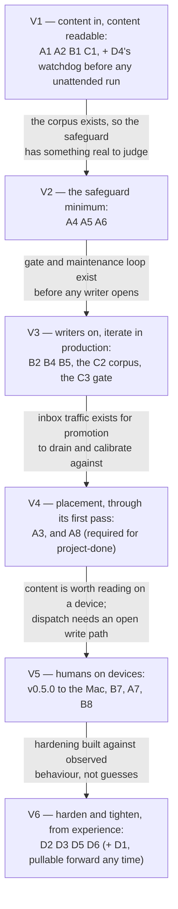

# BRAIN — Roadmap

All the work in one place: what has been delivered, what remains, and how every piece ties to the
outcomes in [`USE_CASES.md`](./USE_CASES.md) and the design in [`DESIGN2.md`](./DESIGN2.md). This is
the one top-level document that changes as work progresses; the other two are the stable contract it
is measured against. It is organised around a [delivery posture](#delivery-posture) — value first,
learn in production, harden later — and a [value path](#the-value-path) that sequences the work by
the value each increment ships.

**Reading rules.** Status distinguishes *authored → merged → released → deployed-and-observed* —
four different states, never collapsed (`main` is not deployed state, in either direction). Claims
are **[measured]** (read from a repo, an API, or a record that records its own measurement) or
**[inferred]**. This document supersedes the phase numbering in the older design material and in the
epic's phase table; where those disagreed with each other, the arbitration is recorded in
[Records this roadmap supersedes](#records-this-roadmap-supersedes-or-arbitrates).

**Acceptance.** Each unit's proving injections — the violation-injection test plans, past and
pending — live in the [verification catalogue](./docs/VERIFICATIONS.md), keyed to the units below.

**Identifiers.** Outcome identifiers — the [pipeline](./USE_CASES.md#axis-1--the-content-pipeline)
[S1](./USE_CASES.md#s1--admitted)–[S4](./USE_CASES.md#s4--retrievable), [writers](./USE_CASES.md#axis-2--writers-connected) [W1](./USE_CASES.md#axis-2--writers-connected)–[W6](./USE_CASES.md#axis-2--writers-connected),
[readers](./USE_CASES.md#axis-3--readers-connected) [R1](./USE_CASES.md#axis-3--readers-connected)–[R5](./USE_CASES.md#axis-3--readers-connected), and
[operability](./USE_CASES.md#axis-4--operability) [O1](./USE_CASES.md#o1--measured)–[O3](./USE_CASES.md#o3--alerting) — are defined in
[`USE_CASES.md`](./USE_CASES.md). Work-unit identifiers (A·B·C·D) are defined under
[Remaining work — the units](#remaining-work--the-units), and value increments [V1](#v1--content-in-content-readable)–[V6](#v6--harden-and-tighten-from-experience) under
[The value path](#the-value-path), both in this document. Every reference links to the section
defining it.

**How this document relates to tickets.** The roadmap is higher-level than tickets: it holds the
work *units*, their outcome mapping, their dependencies, and their state; tickets hold granular
execution detail. That means unit state is deliberately recorded in two places (here and on the
tickets), and the two can diverge — the same failure that let two earlier documents disagree about
the same work for weeks. The mitigations, owned by whoever updates either side: every ticket names
the unit it serves (one unit per ticket, going forward); every unit here names its tickets; and the
**Position** line below is re-dated whenever the checklists are reconciled against the tickets, so
staleness is detectable instead of silent.

**Position: 2026-08-28.**

## Delivery posture

Three commitments govern how every remaining unit is scoped and sequenced. They are Pareto applied
to delivery, and they exist to pre-empt a known failure mode: implementation that tries to account
for every minute thing before shipping, and takes forever to put value in front of its user.

1. **Deliver value and features faster.** Each increment on the value path is cut at the smallest
   shape that ships real value to production, not at capability-complete.
2. **Learn from production; iterate on learnings.** It is accepted as impossible to account for
   everything during initial implementation — so first passes are deliberately minimal ("easy, fast
   time-to-release"), and what running in production teaches drives the next pass. Discoveries that
   do not block the value path become tickets, not scope.
3. **Harden and tighten later, once production experience exists.** Isolation hardening, broader
   drills, dashboards, and refusal-visibility instrumentation sit in a deliberate late band —
   built against observed behaviour rather than guesses, which is also what makes them cheap.

Three things are **not** deferrable under this posture, each because deferral is irreversible or
silently catastrophic rather than merely later:

- **The safety invariants the design already banks** — containment ([S1](./USE_CASES.md#s1--admitted)), fail-loud-destroy-nothing,
  capture-before-publish. These are built or structural; the posture never re-opens them.
- **[D4](#group-d--operability)'s watchdog before the batch stream runs unattended** — a processor crash with the agent
  handle disabled silently stops every agent write; the failure is invisible, so it cannot be
  "learned from" in production.
- **[O1](./USE_CASES.md#o1--measured)'s metric emission** — an uninstrumented window is gone forever; emission is cheap and rides
  as acceptance criteria on units being built anyway. Dashboards and anything alert-shaped stay
  late (or never, for alerting, until AI triage exists).

The same posture bounds *quality* scope: [S2](./USE_CASES.md#s2--sound)'s bar is the written tolerance line ([A6](#group-a--pipeline-mechanisms)) — what badness
is accepted, stated — not scenario coverage; the advanced-promotion first pass ([A8](#group-a--pipeline-mechanisms)) is explicitly an
iterate-on-it-afterwards first pass; and post-done iterations are out of scope for the project.

## Where things stand, in one table

| | State |
| --- | --- |
| Substrate (namespace, volume, headless Obsidian, both MCP instances, network isolation, secrets) | **Deployed and observed** (`apps-ai-v0.8.0`) [measured 2026-08-27] |
| Content foundation (schema, skeleton, settings lock, property types; agents read-only) | **Deployed**, with one known defect: the daily-note `format` key was never written to the instance — satisfied only by Obsidian's default [measured 2026-08-27] |
| Read replication (committer → GitHub + NAS → `local-replicator` → iCloud), capture gate included | **Deployed and observed**: committer every 15 min in-cluster; `local-replicator` under launchd since 2026-08-28, acceptance closed at 5 of 6 criteria, no component defect found [measured 2026-08-28] |
| Everything else (work queue, all three processors, validator, lint, connections, content, operability) | **Unbuilt** — zero NATS manifests, zero processor modules exist [measured 2026-08-28 by grep over both repos] |
| **The delivery gap** | `v0.4.0` (2026-08-01) is the latest release and what runs everywhere; `main` is 15 commits ahead, including the `.obsidian/` overlay fix ([ot#71](https://github.com/ppat/obsidian-tools/pull/71)); release PR [`ot#54`](https://github.com/ppat/obsidian-tools/pull/54) (v0.5.0) open since 2026-08-08. Until it ships and the Mac is upgraded, "fixed" means "merged", nothing stronger |

Ruled harmless deliberately: nothing merged since 2026-08-28 is deployed, the Mac has no downstream
consumer while NATS does not exist, and the committer bump rides the next production deployment.

## Delivered, mapped to outcomes

- [x] **Substrate** ([apps#3441](https://github.com/ppat/homelab-ops-kubernetes-apps/issues/3441), [apps#3442](https://github.com/ppat/homelab-ops-kubernetes-apps/issues/3442) — closed) → **[S1](./USE_CASES.md#s1--admitted)**: the containment floor. Two differently
  scoped MCP write surfaces exist; *whether* a write is permitted stays closed — the write keys are
  read-only.
- [x] **Content foundation** ([obsidian-vault#2](https://github.com/ppat/obsidian-vault/issues/2) — closed) → **[S1](./USE_CASES.md#s1--admitted), [S2](./USE_CASES.md#s2--sound) groundwork, [R2](./USE_CASES.md#axis-3--readers-connected)–[R4](./USE_CASES.md#axis-3--readers-connected)**: the
  skeleton, the schema file, the retrofit-expensive settings locked, 16 property types declared, and
  the read handles issued — which is why the agent readers have no build work at all. The write-path
  gate is proven **in both directions** by violation injection [measured 2026-07-30].
- [x] **Read replication** ([ot#3](https://github.com/ppat/obsidian-tools/issues/3), [apps#3443](https://github.com/ppat/homelab-ops-kubernetes-apps/issues/3443) — closed) → **[S4](./USE_CASES.md#s4--retrievable), [W6](./USE_CASES.md#axis-2--writers-connected) capture half**: one-way,
  non-destructive publication with capture-before-publish real and proven by injection from day one.
  The sixth acceptance criterion (Obsidian-on-iOS reads rsync-written files) was **relocated, not
  waived**, to [ot#69](https://github.com/ppat/obsidian-tools/issues/69) — testable only at the app rollout.

What the delivered work did **not** deliver, so a cold reader does not assume it did: agents cannot
write yet ([S1](./USE_CASES.md#s1--admitted)'s queue admission path does not exist; the write keys are read-only); nothing yet
checks whether written content is any good ([S2](./USE_CASES.md#s2--sound) has property types and nothing else); [W6](./USE_CASES.md#axis-2--writers-connected)'s dispatch
half does not exist (the drainer discards); and the Obsidian apps are installed nowhere,
deliberately.

## The value path

The order below is by **value shipped to production per increment**, respecting the structural
dependencies (tabled later) and nothing else. Increments overlap freely where dependencies allow;
each names the smallest shape that ships.

### V1 — Content in, content readable

**Units:** [A1](#group-a--pipeline-mechanisms) · [A2](#group-a--pipeline-mechanisms) (+ [D4](#group-d--operability)'s watchdog before any unattended run) · [B1](#group-b--connection-work) · [C1](#group-c--content-work).
**Value shipped:** the scattered pile becomes vault content, immediately queryable through every
read surface that already exists ([R2](./USE_CASES.md#axis-3--readers-connected)–[R5](./USE_CASES.md#axis-3--readers-connected)) — the first moment the vault is *useful*.
**Why it is first:** the import needs **no validator at all** — raw is immutable and exempt by
design — so nothing [S2](./USE_CASES.md#s2--sound)-shaped blocks it. The corpus it lands is also the instrument every later
acceptance depends on.

### V2 — The safeguard minimum

**Units:** [A4](#group-a--pipeline-mechanisms) · [A5](#group-a--pipeline-mechanisms) (first pass) · [A6](#group-a--pipeline-mechanisms).
**Value shipped:** curated space can start filling safely; the review digest starts reaching the
phone. The bar is deliberately minimal: the mechanical checks and the finance hard block, with the
tolerance line ([A6](#group-a--pipeline-mechanisms)) written into the linter as *the* statement of what is accepted — minimum
confidence, not scenario coverage. Everything the first weeks of linting teaches becomes the second
pass.

### V3 — Writers on; iterate in production

**Units:** [B2](#group-b--connection-work) · [B4](#group-b--connection-work) · [B5](#group-b--connection-work), then the safeguard ↔ writers loop.
**Value shipped:** agents capture into the vault daily — conversational captures, automation notes,
incremental Claude Code writes. This is where the learn-in-prod loop actually runs: real traffic
calibrates the linter and the tolerance line, and discoveries that can wait become out-of-scope
tickets. The definition-of-done gate ([C3](#group-c--content-work), against [C2](#group-c--content-work)'s 100–200 curated notes) sits inside this
increment as the checkpoint that the schema and ownership contract survived contact with volume.
Its own text makes passing it the condition for open agent writing *at volume*; the delivery
posture reads that as gating the firehose, not the first connected writer — if the owner wants the
stricter reading (gate fully passed before any agent write key opens), [C3](#group-c--content-work) moves ahead of [B2](#group-b--connection-work)/[B4](#group-b--connection-work)/[B5](#group-b--connection-work)
and V3 splits.

### V4 — Placement, through its first pass

**Units:** [A3](#group-a--pipeline-mechanisms) · [A8](#group-a--pipeline-mechanisms) (first pass).
**Value shipped:** notes reach their curated homes unattended (the inbox empties without a human),
and the advanced half — salience/confidence movement and note merging — ships as an easy, fast
first pass to iterate on afterwards. [A8](#group-a--pipeline-mechanisms)'s first pass is required for project-done; its refinement is
explicitly post-project.

### V5 — Humans on devices

**Units:** v0.5.0 released + the Mac upgraded (operational, not design) · [B7](#group-b--connection-work) · [A7](#group-a--pipeline-mechanisms) · [B8](#group-b--connection-work) (with [ot#47](https://github.com/ppat/obsidian-tools/issues/47),
[ot#72](https://github.com/ppat/obsidian-tools/issues/72) closed and [ot#69](https://github.com/ppat/obsidian-tools/issues/69) verified at the reset).
**Value shipped:** native reading on Mac and iPhone, and the device-edit loop closed end to end.
Deliberately last on the owner's own ruling: the conversational surface already serves the phone,
and direct human device edits are very rare.

### V6 — Harden and tighten, from experience

**Units:** [D2](#group-d--operability) · [D5](#group-d--operability) · [D6](#group-d--operability) · [D3](#group-d--operability) · the remaining drill items.
**Value shipped:** the platform's failure modes are exercised and its blind spots instrumented —
now built against months of observed behaviour instead of guesses.
**Two dispositions inside this band, stated honestly:**

- **[D1](#group-d--operability) (the vault-loaded exporter) may be pulled forward at will** — it is small, depends on nothing
  unbuilt, and its signal was *observed*, not guessed (the pod that stayed Ready while unable to
  open its vault). It is the one observability build item that is not a guess to defer.
- **[D3](#group-d--operability) (the recovery drill) gets dearer the longer it waits** — its cost scales with the content at
  risk, and the vault will never hold less than now. Deferring it to this band is the posture's
  knowing trade, not an oversight; pulling it forward is cheap any time.

## Remaining work — the units

Each unit serves exactly one outcome — a unit that served two could not move without dragging an
outcome nobody was thinking about. Units with no ticket are real gaps, listed again in
[Outcomes with no work behind them](#outcomes-with-no-work-behind-them). Pending injections per
unit: the [verification catalogue](./docs/VERIFICATIONS.md).

### Group A — pipeline mechanisms

Zero of Group A is implemented [measured 2026-08-28].

- [ ] **A1 — NATS substrate and credential machinery** → [S1](./USE_CASES.md#s1--admitted) · [apps#3444](https://github.com/ppat/homelab-ops-kubernetes-apps/issues/3444) · [V1](#v1--content-in-content-readable)
  JetStream as a single-replica Deployment; the off-cluster ingress; one NATS account per producer
  population, subject-scoped. **No streams** — each stream ships with its processor (A2/A3/A7), so
  no stream is ever reachable with no consumer and no credential control behind it. The credential
  half alone unlocks the decisive authority injections (a legitimately held credential refused at a
  subject outside its grant) before any processor exists.
  *[O1](./USE_CASES.md#o1--measured) criteria ride on it:* per-stream depth, ack, nack, dead-letter metrics collected and
  queryable.
- [ ] **A2 — the batch stream and `batch-processor`** → [S1](./USE_CASES.md#s1--admitted) · [ot#5](https://github.com/ppat/obsidian-tools/issues/5) (code) + [apps#3444](https://github.com/ppat/homelab-ops-kubernetes-apps/issues/3444) (manifests) · [V1](#v1--content-in-content-readable)
  Strict FIFO; stale patches rejected to the producer; the raw layer's create-only enforcement;
  backpressure keyed on promotion-stream depth; dead-letter path. *Criteria:* raw-refusals and
  backpressure engagements countable.
- [ ] **A3 — the promotion stream and `promotion-processor`** → [S3](./USE_CASES.md#s3--placed) · [apps#3444](https://github.com/ppat/homelab-ops-kubernetes-apps/issues/3444) · [V4](#v4--placement-through-its-first-pass)
  Real-time pointer draining; refuses any pointer outside `00-inbox/`; calls the admission validator
  on every relocation. *Criteria:* refused pointers counted — a rising count is exactly the
  prompt-injection attempt the check exists to catch.
- [ ] **A4 — the admission validator** → [S2](./USE_CASES.md#s2--sound) · [ot#6](https://github.com/ppat/obsidian-tools/issues/6) · [V2](#v2--the-safeguard-minimum)
  One shared admission check, three callers (promotion, batch, lint), two enforcement strengths;
  quarantine-never-delete with machine-readable reasons, counted. First pass: the mechanical checks
  and the finance hard block, nothing speculative. See [Open decisions](#open-decisions) for the
  ratification this unit needs.
- [ ] **A5 — the lint pass** → [S2](./USE_CASES.md#s2--sound) · [ot#6](https://github.com/ppat/obsidian-tools/issues/6) (code) + [apps#3445](https://github.com/ppat/homelab-ops-kubernetes-apps/issues/3445) (CronJob manifests) · [V2](#v2--the-safeguard-minimum)
  Whole-vault conformance and hygiene; the `trigger:`/`authority:` consistency check; additive-only
  normalisation in the pass's own code; the review digest. Runs against whatever content exists —
  it does not depend on agent writes being open. *Criteria:* inbox depth, quarantine depth,
  rejection counts, unstamped-note counts emitted from the pass itself.
- [ ] **A6 — the [S2](./USE_CASES.md#s2--sound) tolerance line** → [S2](./USE_CASES.md#s2--sound) · **no ticket** · [V2](#v2--the-safeguard-minimum)
  A written statement of tolerated badness, placed inside the linter — the instrument that makes
  "minimum confidence" falsifiable and keeps [V2](#v2--the-safeguard-minimum) from creeping toward scenario coverage. Written
  before A5 it is a specification; after, a retrofit onto behaviour that already became the
  de-facto answer.
- [ ] **A7 — the drift stream and `drift-processor`** → [W6](./USE_CASES.md#axis-2--writers-connected) · [ot#4](https://github.com/ppat/obsidian-tools/issues/4) (code) + [apps#3444](https://github.com/ppat/homelab-ops-kubernetes-apps/issues/3444) (manifests) · [V5](#v5--humans-on-devices)
  The intentionality classifier (server-side; the device stays dumb); reconciliation against
  upstream history **before** stamping `authority: human`; `matches_upstream` treated as evidence,
  never as a rule — the plausible reading discards genuine human deletions; dispatch through the
  narrow inbox-scoped handle.
- [ ] **A8 — salience/confidence promotion, demotion, and note merging** → [S3](./USE_CASES.md#s3--placed) · **no ticket** · [V4](#v4--placement-through-its-first-pass)
  [S3](./USE_CASES.md#s3--placed)'s advanced half, and where the platform's purpose lands: the mechanism by which important
  ideas bubble up for agents to work on. Its *first pass* is inside the definition of project done,
  so this is in-scope scope with zero coverage — the largest gap on this map. Scoped by the
  posture: easy, fast time-to-release, iterated on afterwards.

### Group B — connection work

Largely the same shape each time — a credential, a handle, agreement on the message form — which is
why each lands independently. [W1](./USE_CASES.md#axis-2--writers-connected) is two connections through two mechanisms at two different gates.

- [ ] **B1 — [W1](./USE_CASES.md#axis-2--writers-connected)-bulk: the Coder workspace onto the batch stream** → [W1](./USE_CASES.md#axis-2--writers-connected) · [apps#3444](https://github.com/ppat/homelab-ops-kubernetes-apps/issues/3444) · [V1](#v1--content-in-content-readable)
  The only credential in the system permitted to enqueue patch-carrying work; the producer side that
  generates and enqueues patches.
- [ ] **B2 — [W1](./USE_CASES.md#axis-2--writers-connected)-interactive: Claude Code's direct writes** → [W1](./USE_CASES.md#axis-2--writers-connected) · [apps#3445](https://github.com/ppat/homelab-ops-kubernetes-apps/issues/3445) · [V3](#v3--writers-on-iterate-in-production)
  Write keys on the agent handle; the (already-set, inert) path scope going live; optimistic-
  concurrency wiring; the runner's write hook installed as a detective control (this runner only —
  the available hook fires after the write; whether the runner's blocking pre-write variant
  replaces it is a recorded revisit); its promotion-stream credential.
- [ ] **B3 — [W2](./USE_CASES.md#axis-2--writers-connected): the NAS NFS drop watcher** → [W2](./USE_CASES.md#axis-2--writers-connected) · **no ticket** · unscheduled
  Blocked on a design decision, not just a credential: see [Open decisions](#open-decisions).
- [ ] **B4 — [W3](./USE_CASES.md#axis-2--writers-connected): OpenClaw write** → [W3](./USE_CASES.md#axis-2--writers-connected) · [apps#3445](https://github.com/ppat/homelab-ops-kubernetes-apps/issues/3445) · [V3](#v3--writers-on-iterate-in-production)
  Write keys, live path scope, promotion-stream credential. No pre-write hook exists for this writer
  — same shape as B2, less assurance, a property of the writer rather than a gap.
- [ ] **B5 — [W4](./USE_CASES.md#axis-2--writers-connected): n8n write** → [W4](./USE_CASES.md#axis-2--writers-connected) · [apps#3445](https://github.com/ppat/homelab-ops-kubernetes-apps/issues/3445) · [V3](#v3--writers-on-iterate-in-production) — the identical shape, for n8n.
- [ ] **B6 — [W5](./USE_CASES.md#axis-2--writers-connected): ad-hoc scripts** → [W5](./USE_CASES.md#axis-2--writers-connected) · **no ticket** · unscheduled
  Plausibly free once B1/B2's credential shapes exist — but no record says so; the missing artifact
  is the judgement, not necessarily the work.
- [ ] **B7 — [W6](./USE_CASES.md#axis-2--writers-connected): the drainer's real destination** → [W6](./USE_CASES.md#axis-2--writers-connected) · [ot#4](https://github.com/ppat/obsidian-tools/issues/4) · [V5](#v5--humans-on-devices)
  Spool entries published to the drift stream, removed **only on JetStream ack**; the drift
  credential issued; ingress reachability (LAN, Tailscale).
- [ ] **B8 — [R1](./USE_CASES.md#axis-3--readers-connected): the app rollout** → [R1](./USE_CASES.md#axis-3--readers-connected) · **no ticket** · [V5](#v5--humans-on-devices)
  Installing Obsidian on macOS and iOS, which requires resetting the device vault (iCloud copy
  *and* baseline tag) to day one. The one irreversible step on this map: at the reset, the settings
  baseline stops being inert and becomes real device configuration. Preconditions: [ot#47](https://github.com/ppat/obsidian-tools/issues/47) (baseline
  values verified three-way), [ot#72](https://github.com/ppat/obsidian-tools/issues/72) (seed symlink hazard) — and [ot#69](https://github.com/ppat/obsidian-tools/issues/69) becomes testable only here.

[R2](./USE_CASES.md#axis-3--readers-connected)/[R3](./USE_CASES.md#axis-3--readers-connected)/[R4](./USE_CASES.md#axis-3--readers-connected) have **no build work** — read access was delivered with the content foundation, and their
remaining value is entirely [S2](./USE_CASES.md#s2--sound)'s and [S3](./USE_CASES.md#s3--placed)'s to supply. That is the system working, not a hole. [R5](./USE_CASES.md#axis-3--readers-connected) is
delivered.

### Group C — content work

Content is the **instrument** by which [S2](./USE_CASES.md#s2--sound)'s and [S3](./USE_CASES.md#s3--placed)'s acceptance criteria become answerable, not a
capability — a lint pass over a near-empty vault reports nothing, and reports nothing whether it
works or not. The one-unit-one-outcome rule is deliberately not forced here.

- [ ] **C1 — the bulk import run** → [W1](./USE_CASES.md#axis-2--writers-connected) (its only demonstration) · **no ticket owns the run** · [V1](#v1--content-in-content-readable)
  Executing the one-time import of the scattered pile into the raw layer, through [B1](#group-b--connection-work) + [A2](#group-a--pipeline-mechanisms). The run
  proves [W1](./USE_CASES.md#axis-2--writers-connected); the corpus it produces is the instrument for [S2](./USE_CASES.md#s2--sound)/[S3](./USE_CASES.md#s3--placed) — and the first shipped value.
- [ ] **C2 — curation to 100–200 notes** → *(instrument)* · **no ticket** · [V3](#v3--writers-on-iterate-in-production)
  Enough curated content for promotion decisions to be judgeable and every view to render non-empty.
- [ ] **C3 — the definition-of-done gate** · [obsidian-vault#3](https://github.com/ppat/obsidian-vault/issues/3) · [V3](#v3--writers-on-iterate-in-production)
  Six checks against the 100–200-note vault: zero schema errors; views render non-empty; the inbox
  empties end-to-end once; a lint report is genuinely acted on; a factual-grounding sample; the
  round-trip test (a human-edited passage survives agent regeneration — the violation injection for
  this stage). A gate is *supposed* to test several outcomes at once; it is not a braid to untangle.

### Group D — operability

The bulk of [O1](./USE_CASES.md#o1--measured) is **acceptance criteria on other units** (noted on [A1](#group-a--pipeline-mechanisms)/[A2](#group-a--pipeline-mechanisms)/[A4](#group-a--pipeline-mechanisms)/[A5](#group-a--pipeline-mechanisms) above), because a
signal that is a byproduct of a unit's own work belongs to that unit — a standalone observability
ticket is how [O1](./USE_CASES.md#o1--measured) got deferred to the end originally, and emission is the one cheap thing that cannot
be recovered later. The units below are the remainder: signals needing an independent observer, and
shared mechanisms nothing else owns. *Criteria distribute; shared mechanisms do not.*

- [ ] **D1 — the vault-loaded exporter** → [O1](./USE_CASES.md#o1--measured) · [apps#3446](https://github.com/ppat/homelab-ops-kubernetes-apps/issues/3446) · [V6](#v6--harden-and-tighten-from-experience), pullable forward at will
  An authenticated call that enumerates vault content and exposes a gauge + last-success timestamp.
  Exists to **contradict the component's own account of itself** — the pod has already been Ready
  and serving while unable to open the vault at all [measured 2026-07-30]. Not foldable into a
  probe: a probe converts observation into restart, and that failure was one a restart does not fix.
  Depends on nothing unbuilt.
- [ ] **D2 — direct-write-path refusal visibility** → [O1](./USE_CASES.md#o1--measured) · [apps#3484](https://github.com/ppat/homelab-ops-kubernetes-apps/issues/3484) collects requirements; builds
  nothing · [V6](#v6--harden-and-tighten-from-experience)
  Gate refusals return HTTP 200 with the error inside the envelope, so no HTTP-level metric sees the
  write gate at all; queue metrics see it only for stream-borne traffic. The interactive writers'
  refusals need their own instrument — one mechanism serving six connection units, owned by none of
  them. Deferred to the hardening band deliberately: it instruments a control that is already
  proven, and prod experience will say which of [apps#3484](https://github.com/ppat/homelab-ops-kubernetes-apps/issues/3484)'s collected requirements are real.
- [ ] **D3 — the recovery drill** → [O2](./USE_CASES.md#o2--survives-its-failure-modes) · [apps#3447](https://github.com/ppat/homelab-ops-kubernetes-apps/issues/3447) · [V6](#v6--harden-and-tighten-from-experience), cheaper the earlier it runs
  Snapshot restore, independent git restore, probe-recovers-a-wedged-editor, and the
  pod-template-churn test of the single-writer window. Every subject is deployed today.
- [ ] **D4 — batch-mode safety mechanisms** → [O2](./USE_CASES.md#o2--survives-its-failure-modes) · [ot#5](https://github.com/ppat/obsidian-tools/issues/5) + [apps#3447](https://github.com/ppat/homelab-ops-kubernetes-apps/issues/3447) · [V1](#v1--content-in-content-readable) (the watchdog); window +
  drain may follow in [V6](#v6--harden-and-tighten-from-experience)
  The watchdog re-enabling the agent handle if `batch-processor` dies is **not deferrable**: it must
  exist before the batch stream runs unattended, because the failure it closes is silent and
  indefinite. The smallest shape that ships is enough — a dumb re-enable, not a framework. The
  maximum-window and post-disable drain are hardening-band refinements.
- [ ] **D5 — stronger container isolation** → [S1](./USE_CASES.md#s1--admitted) (a containment claim; arguable, flagged) ·
  [apps#3447](https://github.com/ppat/homelab-ops-kubernetes-apps/issues/3447) · [V6](#v6--harden-and-tighten-from-experience)
  The named attempt: user-namespace isolation (`hostUsers: false`) over the vault volume; if the
  storage layer's mounts cannot support it, the current accepted posture stays, deliberately.
- [ ] **D6 — dashboards** → [O1](./USE_CASES.md#o1--measured) · **no ticket** · [V6](#v6--harden-and-tighten-from-experience)
  Views over what [O1](./USE_CASES.md#o1--measured) collects, built when the questions are real — a dashboard built before the
  questions are known displays the wrong things and is cheap to rebuild later. The one assigned
  slice: lint's own three numbers (drift rate, quarantine depth, inbox depth) belong to [A5](#group-a--pipeline-mechanisms).

Not units, deliberately: **[apps#3448](https://github.com/ppat/homelab-ops-kubernetes-apps/issues/3448)** (the pre-mortem tripwires — a standing register of
design-revisit signals, revisited on a cadence, never "done") and **[apps#3484](https://github.com/ppat/homelab-ops-kubernetes-apps/issues/3484)** (requirements
collection that builds nothing by design).

### The mapping at a glance

Outcomes down, work across — consolidated from the groups above. "Gap" marks work with no ticket.

| Outcome | Delivered already by | Remaining units | Gaps |
| --- | --- | --- | --- |
| [S1](./USE_CASES.md#s1--admitted) Admitted | Substrate; content foundation (gate proven both directions) | [A1](#group-a--pipeline-mechanisms) · [A2](#group-a--pipeline-mechanisms) · [D5](#group-d--operability) (assignment arguable) | — |
| [S2](./USE_CASES.md#s2--sound) Sound | Property types only | [A4](#group-a--pipeline-mechanisms) · [A5](#group-a--pipeline-mechanisms) · [A6](#group-a--pipeline-mechanisms) | [A6](#group-a--pipeline-mechanisms) |
| [S3](./USE_CASES.md#s3--placed) Placed | — | [A3](#group-a--pipeline-mechanisms) · [A8](#group-a--pipeline-mechanisms) | [A8](#group-a--pipeline-mechanisms) |
| [S4](./USE_CASES.md#s4--retrievable) Retrievable | Read handles; the whole replication chain | — (its human-device remainder is [R1](./USE_CASES.md#axis-3--readers-connected)'s) | — |
| [W1](./USE_CASES.md#axis-2--writers-connected) Claude Code / workspace | — | [B1](#group-b--connection-work) · [B2](#group-b--connection-work) · [C1](#group-c--content-work) (the run is [W1](./USE_CASES.md#axis-2--writers-connected)'s only demonstration) | [C1](#group-c--content-work) |
| [W2](./USE_CASES.md#axis-2--writers-connected) NAS drop | — | [B3](#group-b--connection-work) (blocked on a design decision) | [B3](#group-b--connection-work) |
| [W3](./USE_CASES.md#axis-2--writers-connected) OpenClaw | Read-only key | [B4](#group-b--connection-work) | — |
| [W4](./USE_CASES.md#axis-2--writers-connected) n8n | Read-only key | [B5](#group-b--connection-work) | — |
| [W5](./USE_CASES.md#axis-2--writers-connected) ad-hoc scripts | — | [B6](#group-b--connection-work) (possibly nothing — the judgement is unrecorded) | [B6](#group-b--connection-work) |
| [W6](./USE_CASES.md#axis-2--writers-connected) humans / device | Capture half, proven by injection | [A7](#group-a--pipeline-mechanisms) · [B7](#group-b--connection-work) | — |
| [R1](./USE_CASES.md#axis-3--readers-connected) humans, native on device | Content reaches the device | [B8](#group-b--connection-work) | [B8](#group-b--connection-work) |
| [R2](./USE_CASES.md#axis-3--readers-connected)–[R4](./USE_CASES.md#axis-3--readers-connected) agent readers | Delivered — no build work exists, correctly | — | — |
| [R5](./USE_CASES.md#axis-3--readers-connected) humans, conversational | Delivered | — | — |
| [O1](./USE_CASES.md#o1--measured) Measured | LiteLLM scrape groundwork (coverage unverified) | [D1](#group-d--operability) · [D2](#group-d--operability) · [D6](#group-d--operability), plus criteria riding on [A1](#group-a--pipeline-mechanisms)/[A2](#group-a--pipeline-mechanisms)/[A4](#group-a--pipeline-mechanisms)/[A5](#group-a--pipeline-mechanisms) | [D6](#group-d--operability) |
| [O2](./USE_CASES.md#o2--survives-its-failure-modes) Survives failure | — | [D3](#group-d--operability) · [D4](#group-d--operability) | — |
| [O3](./USE_CASES.md#o3--alerting) Alerting | Non-outcome by standing ruling | — | — |

## Outcomes with no work behind them

Findings, not a backlog — nothing here schedules anything. In descending order of consequence:

1. **[A8](#group-a--pipeline-mechanisms)** — [S3](./USE_CASES.md#s3--placed)'s advanced half: first pass inside the definition of done, zero coverage in any repo.
2. **[B8](#group-b--connection-work)** — the app rollout: the one delivery unit with no ticket and no assigned position anywhere,
   and the sharpest because it is irreversible at the reset.
3. **[B3](#group-b--connection-work)** — [W2](./USE_CASES.md#axis-2--writers-connected), the NAS drop: named by the owner in their own words; no work item, and no place in
   the current authority model.
4. **[B6](#group-b--connection-work)** — [W5](./USE_CASES.md#axis-2--writers-connected), ad-hoc scripts: possibly free, but no record of that judgement exists.
5. **[A6](#group-a--pipeline-mechanisms)** — the [S2](./USE_CASES.md#s2--sound) tolerance line: accepted in principle, unrecorded; until it exists [S2](./USE_CASES.md#s2--sound)'s criterion
   has no threshold.
6. **[D6](#group-d--operability)** — dashboards: unassigned rather than deliberately dropped.
7. **[C1](#group-c--content-work) and [C2](#group-c--content-work)** — the import *run* and the corpus: mechanisms have tickets; nobody owns performing
   either.

## Dependencies

Three kinds, kept apart because the old phase numbering conflated them.

### Structural — the capability cannot exist without it

| Edge | What only the dependency supplies |
| --- | --- |
| [A2](#group-a--pipeline-mechanisms), [A3](#group-a--pipeline-mechanisms), [A7](#group-a--pipeline-mechanisms) → [A1](#group-a--pipeline-mechanisms) | A broker to declare a stream on; the account machinery a subject grant is expressed against |
| [B1](#group-b--connection-work)–[B7](#group-b--connection-work) → [A1](#group-a--pipeline-mechanisms) | A credential to be issued — once NATS has an ingress, the credential *is* the authority |
| [B1](#group-b--connection-work) → [A2](#group-a--pipeline-mechanisms) · [B4](#group-b--connection-work)/[B5](#group-b--connection-work) announce-half → [A3](#group-a--pipeline-mechanisms) · [B7](#group-b--connection-work) → [A7](#group-a--pipeline-mechanisms) | A subject to publish to; a credential naming a subject no stream serves is nothing |
| [A3](#group-a--pipeline-mechanisms) → [A4](#group-a--pipeline-mechanisms), [A2](#group-a--pipeline-mechanisms) → [A4](#group-a--pipeline-mechanisms), [A5](#group-a--pipeline-mechanisms)'s auto-fixes → [A4](#group-a--pipeline-mechanisms) | The admission decision; without it promotion is a move with no gate, and a batch chunk enters curated space through no gate at all |
| [A7](#group-a--pipeline-mechanisms) → [B2](#group-b--connection-work)/[B4](#group-b--connection-work)/[B5](#group-b--connection-work)-class write access | Dispatch **is** a write, through the narrow handle |
| [A7](#group-a--pipeline-mechanisms) → [B7](#group-b--connection-work) | Messages to consume — the drainer discards today |
| [D4](#group-d--operability)'s watchdog → [A2](#group-a--pipeline-mechanisms) | Something to watch; and [A2](#group-a--pipeline-mechanisms) must not run unattended without it |
| [B8](#group-b--connection-work) → [ot#47](https://github.com/ppat/obsidian-tools/issues/47) + [ot#72](https://github.com/ppat/obsidian-tools/issues/72) | Both land at the reset, where the baseline becomes real configuration irreversibly |
| [C1](#group-c--content-work) → [B1](#group-b--connection-work) + [A2](#group-a--pipeline-mechanisms) | A credential to enqueue with and a processor to apply patches |
| [C3](#group-c--content-work) → [C2](#group-c--content-work) | The gate does not produce its own subject |
| [A2](#group-a--pipeline-mechanisms)'s raw enforcement → [A2](#group-a--pipeline-mechanisms) itself | Path scope cannot express "create yes, modify no"; the validator sees the wrong side of the boundary; `batch-processor` is the only component on both sides |

One subtlety inside [V1](#v1--content-in-content-readable): a batch chunk targeting **curated** space needs [A4](#group-a--pipeline-mechanisms) (row four), but the
import itself lands in the exempt raw layer — so [C1](#group-c--content-work) can run before [A4](#group-a--pipeline-mechanisms) exists, and only
curated-targeting batch work waits for [V2](#v2--the-safeguard-minimum).

### Conventional — real reasons, but the capability would function

| Edge | Reason | Standing |
| --- | --- | --- |
| [B4](#group-b--connection-work)/[B5](#group-b--connection-work) → [A4](#group-a--pipeline-mechanisms) + [A5](#group-a--pipeline-mechanisms) | Opening writes before a gate and a maintenance loop exist means the first thing the vault accumulates is unvalidated slop | Half satisfiable today: [A5](#group-a--pipeline-mechanisms) is buildable now; "content to validate against" is not, absent [W1](./USE_CASES.md#axis-2--writers-connected)/[C1](#group-c--content-work) |
| [A3](#group-a--pipeline-mechanisms)'s value → any writer connected | The promotion path has no traffic before a producer writes into the inbox (bulk lands in raw) | "No traffic", not "cannot function" — but its pointer-target check should not ship never exercised against real traffic |
| [A7](#group-a--pipeline-mechanisms)'s calibration → v0.5.0 reaching the Mac | Until the overlay fix ships, a diverged device-settings path re-drifts every cycle (~96 identical patches/day/path, multi-MB entries) [measured 2026-08-28]; a classifier calibrated on that distribution is calibrated on an artifact | The fix is merged and unreleased |
| [R2](./USE_CASES.md#axis-3--readers-connected)–[R4](./USE_CASES.md#axis-3--readers-connected)'s value → [S2](./USE_CASES.md#s2--sound) + [S3](./USE_CASES.md#s3--placed) | Reader effort, the owner's own reason for sequencing readers late | Not a capability block |

### Operational — bookkeeping, not design

- **Cut v0.5.0 and upgrade the Mac** (release PR [ot#54](https://github.com/ppat/obsidian-tools/pull/54)). Everything downstream on the [W6](./USE_CASES.md#axis-2--writers-connected) axis waits
  on a merge, not a decision. A `local-replicator` upgrade currently **fails indistinguishably from
  healthy** ([ot#66](https://github.com/ppat/obsidian-tools/issues/66)) — verify after upgrading, not just after installing.
- **The two-repo round trip**: a module change reaches a cluster only after a release is cut *and*
  the clusters repo bumps its pinned tag. Recurs on essentially every unit here; it has already cost
  one 26-day stale-image window.

## Orderings that would guarantee waste

The inverse of the value path — each is an anti-constraint the posture must not be read as
licensing:

- Building [A7](#group-a--pipeline-mechanisms)'s classifier before v0.5.0 reaches the Mac (calibrated on artifact).
- The app rollout ([B8](#group-b--connection-work)) before [ot#47](https://github.com/ppat/obsidian-tools/issues/47) and [ot#72](https://github.com/ppat/obsidian-tools/issues/72) close — fails silently and permanently, this project's
  characteristic failure shape.
- Judging [S2](./USE_CASES.md#s2--sound)/[S3](./USE_CASES.md#s3--placed) against a near-empty vault — a zero from an instrument that cannot produce a
  non-zero is information about the instrument.
- [A2](#group-a--pipeline-mechanisms) running unattended before [D4](#group-d--operability)'s watchdog exists.
- Standing up the batch stream without minting all the producer credentials — the one injection that
  distinguishes real subject permissions from a network-policy-only implementation needs a second,
  legitimately held credential, and credential-minting is separable from stream-standing.
- Skipping [O1](./USE_CASES.md#o1--measured)'s emission criteria while building the units they ride on — the first weeks of open
  writes become unmeasurable after the fact.
- Gold-plating any first pass: scope beyond the increment's stated value is the failure the delivery
  posture exists to prevent.

## Open decisions

Where a decision is recorded, the row cites its ADR number; records are resolved through the
[decision-record index](./docs/adr/README.md), never deep-linked — ADRs are the fluid layer.

| Decision | Gates | Standing |
| --- | --- | --- |
| **Ratify the admission validator's placement** ([A4](#group-a--pipeline-mechanisms)): one shared check with three callers, fired at every crossing of the curated boundary; staging detective-only; raw exempt | [A4](#group-a--pipeline-mechanisms)'s unit shape; the answer to "where do validate/lint/digest kick in" | Adopted by these documents from [ot#6](https://github.com/ppat/obsidian-tools/issues/6) (the newer, explicit text) over older prose describing a scheduled-validator shape; recorded as ADR-0007, status proposed — the owner has not ratified it |
| **Recut the three straddling tickets** ([ot#6](https://github.com/ppat/obsidian-tools/issues/6) → [A4](#group-a--pipeline-mechanisms) + [A5](#group-a--pipeline-mechanisms) + [A6](#group-a--pipeline-mechanisms) · [apps#3445](https://github.com/ppat/homelab-ops-kubernetes-apps/issues/3445) → [A5](#group-a--pipeline-mechanisms)'s deploy half + [B2](#group-b--connection-work) + [B4](#group-b--connection-work) + [B5](#group-b--connection-work) · [apps#3446](https://github.com/ppat/homelab-ops-kubernetes-apps/issues/3446) → criteria on [A1](#group-a--pipeline-mechanisms)/[A5](#group-a--pipeline-mechanisms) + [D1](#group-d--operability) + [D6](#group-d--operability)) and fix the false [apps#3446](https://github.com/ppat/homelab-ops-kubernetes-apps/issues/3446) → [apps#3445](https://github.com/ppat/homelab-ops-kubernetes-apps/issues/3445) edge — the single mechanism by which [O1](./USE_CASES.md#o1--measured) sat behind agent writes | Ticket hygiene; [O1](./USE_CASES.md#o1--measured)'s position | Cheap while nothing references the tickets from code — all three are at zero implementation |
| **Fix [ot#6](https://github.com/ppat/obsidian-tools/issues/6)'s bare `Depends on #1 and #5` line** | The only unexplained ordering in either repo's ticket set | Under the shared-validator reading it runs backwards ([A2](#group-a--pipeline-mechanisms) calls [A4](#group-a--pipeline-mechanisms)); either invert it or record its reason |
| **Resolve [W2](./USE_CASES.md#axis-2--writers-connected)'s authority conflict** ([B3](#group-b--connection-work)) | [W2](./USE_CASES.md#axis-2--writers-connected) | Four candidate shapes: the watcher inside the Coder workspace's trust boundary; a fourth stream; a narrow-handle writer announcing via promotion; or an n8n workflow (conversion already lives in n8n/OpenClaw). None chosen |
| **When the apps go on** ([B8](#group-b--connection-work)) | [R1](./USE_CASES.md#axis-3--readers-connected), [ot#69](https://github.com/ppat/obsidian-tools/issues/69) | Owner's want; the stated criterion is "enough content to read". Preconditions [ot#47](https://github.com/ppat/obsidian-tools/issues/47), [ot#72](https://github.com/ppat/obsidian-tools/issues/72) |
| **Batch staleness measurement** | [A2](#group-a--pipeline-mechanisms) | Deferred until real commit cadence and batch sizes are visible — a learn-from-prod decision by design; the flagged question is carried in ADR-0022 |
| **The `salience:`/`confidence:` correlation audit at ~200 notes** | [A8](#group-a--pipeline-mechanisms)'s fields | Scheduled decision: if they track, `salience:` is removed; the audit and its grounds are recorded in ADR-0012 |
| **CI strategy for the vault workloads** ([apps#3440](https://github.com/ppat/homelab-ops-kubernetes-apps/issues/3440)) | Every Group A unit's validation | A gate that was passed without being resolved — vault PRs landed with no recorded decision; its substance (zero CI visibility into the highest-runtime-risk container; the sole-control NetworkPolicy that kind cannot exercise) is unchanged |
| **The NetworkPolicy packet test** | Confidence in a sole control | Deliberately parked; reopen only on new evidence |
| **[D5](#group-d--operability)'s outcome assignment** ([S1](./USE_CASES.md#s1--admitted) vs [O2](./USE_CASES.md#o2--survives-its-failure-modes)) | Bookkeeping only | Flagged as arguable, held at [S1](./USE_CASES.md#s1--admitted) |

## Records this roadmap supersedes or arbitrates

| Record | Disposition |
| --- | --- |
| The older design's §7 phase numbering and the epic's phase table | Superseded by this document for sequencing. Their one real disagreement — lint at phase 5 vs 6 — dissolves on the axes: lint is [S2](./USE_CASES.md#s2--sound) work ([A4](#group-a--pipeline-mechanisms)/[A5](#group-a--pipeline-mechanisms)), opening writers is [W3](./USE_CASES.md#axis-2--writers-connected)/[W4](./USE_CASES.md#axis-2--writers-connected) ([B4](#group-b--connection-work)/[B5](#group-b--connection-work)), with one conventional edge between them |
| The watchdog's placement (hardening-phase text vs "build it before the batch stream runs unattended") | Arbitrated: the risk-register/ticket reading wins — [D4](#group-d--operability)'s watchdog ships with [A2](#group-a--pipeline-mechanisms), structurally. The hardening-phase text was stale, never amended |
| "Move agent writes later" | Not a reordering — a later point on the writers axis; the pipeline does not move |
| Observability "depends on agent writes" ([apps#3446](https://github.com/ppat/homelab-ops-kubernetes-apps/issues/3446) → [apps#3445](https://github.com/ppat/homelab-ops-kubernetes-apps/issues/3445)) | False for everything that remains after the recut; queue metrics depend on [A1](#group-a--pipeline-mechanisms), vault metrics on [A5](#group-a--pipeline-mechanisms), [D1](#group-d--operability) on nothing unbuilt |
