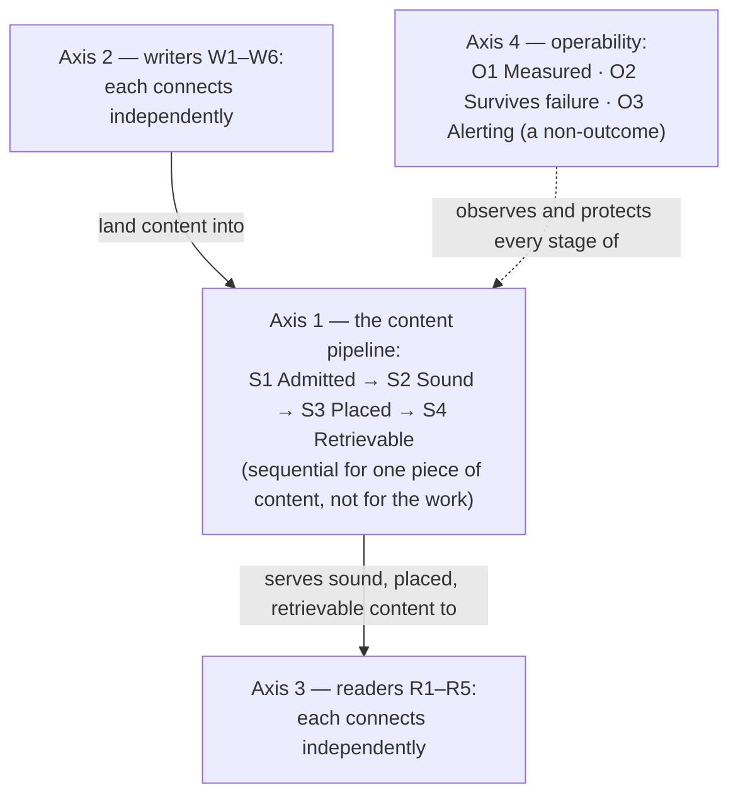

# BRAIN — Use cases

What this platform is *for*: the outcomes it exists to deliver, each with an acceptance criterion
that could fail. This is the stable contract of the three top-level documents — it changes only when
the understanding of what the platform is for changes. [`DESIGN2.md`](./DESIGN2.md) holds the pillars
and invariants that deliver these outcomes; [`ROADMAP.md`](./ROADMAP.md) holds the work, its state,
and the mapping from every work unit back to exactly one outcome here.

Vocabulary used without introduction here (the vault's areas, the handles, provenance fields) is
defined in [`DESIGN2.md`](./DESIGN2.md)'s Glossary.

## The system, in one paragraph

BRAIN is a git-backed Obsidian vault used as a shared brain: the store of the owner's knowledge,
ideas, work, thoughts and research, and the medium for sharing it between agents and/or the human.
It exists to capture the owner's ideas however fleeting, and to have agents work on them — at least
the important ones, which bubble up by salience or some other form of prominence. The end state is
automation: agents doing work on the owner's ideas, on the owner's behalf. Content enters through
controlled paths, is checked for soundness, is routed to where it belongs, and is readable
everywhere the owner actually is — a chat window on a phone, an agent's context window, or the
native Obsidian app on a device that works offline. On both axes the human originates and agents act: a voice note, a dropped document, or
tasked research arrives as an agent write; "find what relates to this note" comes back as an agent
read. Direct human writes are extremely rare, deliberately; direct human reads are more common than
direct human writes, though most human-motivated reading is still performed by agents.

## Governing constraints

These are not outcomes; they bound every outcome and every design choice.

- **Durability and independence over convenience.** The canonical copy is plain markdown in git,
  readable with `grep`/`sed`/`vim` in fifty years, never hostage to a paid or proprietary service.
  This constraint — more than cost — eliminated the leading off-the-shelf alternatives.
- **Humans originate; agents act — on both axes.** Writes and reads are both agent-heavy: human
  involvement on either side is overwhelmingly mediated by agents. A voice note or message becomes
  an agent write; tasked work and research become agent reads and writes; a dropped PDF or video
  link arrives extracted to markdown by an agent. Direct human writes are extremely rare but never
  impossible; direct human reads are more common than direct human writes, and still less common
  than agent reads. The dominant risks follow: agent-vs-agent drift, staleness, and content that
  reads cleanly while being wrong — not human-vs-agent edit collisions, which are rare by
  construction.
- **One operator, no team.** Anything that produces noise a single person cannot triage is negative
  value. This is why alerting is an explicit non-outcome ([O3](#o3--alerting)) and why review surfaces are ranked and
  hard-capped.
- **Acceptance criteria must be falsifiable.** A criterion that cannot fail is not one. Every
  outcome below states what would falsify it, and a control is proven by making it fire (violation
  injection), never by observing that nothing bad happened.

## Why four axes, not one numbered sequence

An earlier roadmap braided three different kinds of thing — capabilities, adoption, and qualities —
into one numbered phase line, and the braid produced real contradictions (two documents silently
disagreeing about where the lint work sat; observability competing with capabilities for a sequence
slot). The outcomes therefore live on four independent axes:

| Axis | Outcomes | Kind |
| --- | --- | --- |
| **Content pipeline** | [S1](#s1--admitted) Admitted → [S2](#s2--sound) Sound → [S3](#s3--placed) Placed → [S4](#s4--retrievable) Retrievable | Sequential **for one piece of content**; the work behind the stages is not |
| **Writers connected** | [W1](#axis-2--writers-connected)–[W6](#axis-2--writers-connected) | Adoption; each writer lands independently |
| **Readers connected** | [R1](#axis-3--readers-connected)–[R5](#axis-3--readers-connected) | Adoption; each reader lands independently |
| **Operability** | [O1](#o1--measured) Measured · [O2](#o2--survives-its-failure-modes) Survives failure · [O3](#o3--alerting) Alerting (a non-outcome) | Qualities; cross-cutting, positioned by reversibility |

How the axes relate — writers feed the pipeline, the pipeline serves the readers, operability
watches all of it:

## Axis 1 — The content pipeline

### S1 — Admitted

**Content can enter the vault only through a controlled path, and every admitted write is
attributable to the authority that made it.**

*Falsified by any of:*

- A write lands at a path outside the writing handle's declared scope.
- A write lands carrying no `authority:`/`trigger:` provenance, or carrying a stamp that
  misattributes its origin.
- Any process other than the single authoritative editor holds the vault volume read-write.
- A producer's credential successfully publishes to a queue subject outside its grant.

*Scope note:* admission is a **containment** claim, not a quality claim. S1 holding says nothing
about whether what arrived is any good — that is [S2](#s2--sound). "Cannot write to the wrong place" and "is what
got written any good" are different questions, kept apart deliberately.

### S2 — Sound

**Curated content is well-formed against the declared schema, and content that is not is detected
and quarantined rather than accumulating silently.**

*Falsified by any of:*

- An orphan, dangling link, schema violation, contradiction, or stale claim planted in curated space
  goes unreported by the next scheduled lint pass.
- A note stamped `trigger: schedule` with `authority: human` passes unflagged — the specific
  inconsistency that is the entire return on splitting the provenance field.
- A note missing a required `type`, or a finance note with an unsourced number, is admitted to
  curated space rather than quarantined.

*Two scope notes, without which this criterion is not falsifiable:*

- **The raw layer is deliberately exempt.** Bulk-imported material lands immutable and unvalidated
  by design — validating thousands of imported documents would either fail thousands of times or
  force a schema laxity that poisons the baseline. S2 is a claim about **curated** content only. A
  linter reporting nothing about `05-raw/` is S2 working, not S2 failing.
- **S2 needs a stated tolerance line.** What badness is *tolerated* must be written into the linter
  itself (for example: malformed tags and inconsistent enums accepted; a note with no `type` or an
  unparseable date not accepted), so a later reader cannot mistake silence for an oversight. Until
  that line exists, S2's criterion has no threshold and is only partially falsifiable.

### S3 — Placed

**A note that arrives reaches its curated home without a human moving it, and content continues to
move as its salience and its relationships to other notes change.**

*Falsified by any of:*

- The inbox does not empty end-to-end, unattended, at least once.
- A promotion request naming a target outside the inbox is honoured rather than refused — the check
  that stops a prompt-injected agent borrowing the wider handle.
- A note whose salience or confidence crosses the stated threshold stays where it was.
- Two notes the design says should merge remain separate, with no record of the decision not to.

*Scope note:* S3 has a **basic** half (every note reaches its curated home) and an **advanced** half
(salience/confidence-driven promotion and demotion; merging or combining notes, keeping or removing
the sources). The advanced half is where the platform's purpose lands, not a refinement: it is the
mechanism by which the important ideas bubble up to where agents and the human act on them. Its
*first pass* is inside the definition of project done — an easy, fast time-to-release first pass to
iterate on afterwards; post-done iteration is out of scope for the project. Both halves are inside
S3.

### S4 — Retrievable

**A reader obtains vault content through the interface they actually use, without needing the
cluster to be reachable to them.**

*Falsified by any of:*

- A gap in the replication cycle's completion record on the device side.
- The pull-only clone diverging from the committer's published history.
- A read call against a populated vault failing or returning a partial view.
- The vault-reading application on a device rendering externally-written files incorrectly, or
  refusing them.

*Scope note:* S4 is about content being **obtainable**, not about it being worth obtaining — that is
[S2](#s2--sound)'s and [S3](#s3--placed)'s job, and it is precisely why reader onboarding sits late: unlinted, unplaced content
makes readers do the work the pipeline should have done.

## Axis 2 — Writers connected

An axis, not a stage: each writer lands independently, and none is a precondition for another. Most
human-originated content arrives through the agent writers — a voice note through W3, a dropped
document through W2, tasked bulk work through W1 — the human originating, an agent acting; W6 is
the rare direct path, not "the human path". Every writer shares one acceptance shape:

> **Writer X can place content in the vault through its own credential, and cannot reach any subject
> or path outside its scope.**
>
> *Falsified by:* X writing successfully outside its declared path scope; **or** X's legitimately
> held credential publishing successfully to a queue subject it must not reach — the injection that
> distinguishes real subject permissions from a network-policy-only implementation, and the only one
> that does.

| # | Writer | What it exists to land |
| --- | --- | --- |
| **W1** | Claude Code, from the operator's workspace | The one-time scattered pile (bulk, via the batch stream), and later structural refactors; plus ordinary incremental writes |
| **W2** | A watched NFS drop on the Synology NAS | Documents dropped by hand into a share, picked up and fed to bulk import |
| **W3** | OpenClaw (WhatsApp-triggered; Home Assistant voice hands off to it) | Conversational captures — the "add milk to my todo" path, where a human is waiting on the reply |
| **W4** | n8n | Automation-originated notes and the daily organise workflow |
| **W5** | One-off and ad-hoc scripts | Whatever does not justify a standing integration |
| **W6** | Humans, from laptop or phone | Edits made on a device, captured and fed back into the funnel. Deferred to the end of the project by the owner |

*Scope note on W6:* it has two separable halves — **capture** (a device edit is recorded
non-destructively and never silently overwritten; delivered) and **dispatch** (the captured edit is
adjudicated and becomes an ordinary ingest event; not delivered). Their value differs sharply: the
owner's ruling is that the direct human write path is edits, almost never creation, and even edits are very
rare — so capture's value (a non-destructive read replica) is banked, while dispatch adjudicates an
event that is rare by design.

*Scope note on W2:* the owner's framing routes the NAS drop to bulk import, but the batch stream is
patch-carrying and closed to every producer except the operator's workspace — so W2 currently has no
place in the authority model, and connecting it requires a design decision, not just a credential
(see [`ROADMAP.md`'s open decisions](./ROADMAP.md#open-decisions)).

## Axis 3 — Readers connected

The originator/actor split of the writer axis applies here too: most human-motivated reading is
performed by agents on the human's behalf (R2–R4); R1 and R5 are the direct human surfaces. Read
*access* for the agent readers has existed since the read-only keys were issued, so "X can read"
carries no information. The criterion is about the owner's actual complaint — reader **effort**:

> **Reader X answers a defined question from curated locations alone, without traversing the inbox
> or the raw import layer, and without returning content the lint pass would have flagged.**
>
> *Falsified by:* the answer requiring a search of uncurated space; or the answer containing a note
> that fails [S2](#s2--sound)'s checks.

| # | Reader | State |
| --- | --- | --- |
| **R1** | Humans, on macOS and iOS, in the native Obsidian app on the device — rich, offline, laggier | Content reaches the devices; no app is installed yet, deliberately |
| **R2** | OpenClaw | Access delivered |
| **R3** | n8n | Access delivered |
| **R4** | Claude Code | Access delivered |
| **R5** | Humans, conversationally — WhatsApp via OpenClaw, or Open WebUI in a browser; always fresh, works anywhere, Mac-independent | Delivered |

*Scope note on R5:* the design treats the conversational surface as the **primary** phone reading
experience even once native iOS reading works, because it is always fresh and independent of any
device being awake — and because it pushes (digests, "what's due today") rather than waiting to be
opened. R1 is the richer, laggier complement, not the primary surface.

## Axis 4 — Operability

Cross-cutting, and deliberately not uniform in urgency: the three differ by **reversibility**, which
is the only thing that should drive their position.

### O1 — Measured

**For any past window, the platform's behaviour can be answered from stored metrics and logs.**

*Falsified by:* a question about a window already elapsed — write volume, gate-refusal rate, queue
depth, inbox and quarantine depth, time-since-last-write, image age — that the metric store cannot
answer.

*Why this outcome is unlike every other on this map:* it can only be falsified **retrospectively**,
and by then the data is gone. A metric not collected is lost unrecoverably; a dashboard or an alert
on a metric that already exists is a configuration change. Everything else here can be built late at
the cost of time; O1 cannot be built late at all for any window already passed.

*A known blind spot this outcome must close, not inherit:* a write-gate refusal returns HTTP 200
with the error inside the response envelope, so **no HTTP-level metric can observe the write gate
working or failing.** Queue depth, ack and nack rates see it for everything that transits a stream;
the direct write path needs its own instrument.

### O2 — Survives its failure modes

**A known failure can be induced and recovered from, on the real substrate.**

*Falsified by any of:* a deleted curated note that cannot be restored from a volume snapshot; the
same note not independently restorable from git; a wedged editor process the probe does not restart;
rapid pod-template churn starting a second writer before the first is torn down.

*Note:* all four subjects — the volume, the deployment, the editor process, git — are deployed
today. Nothing in O2 waits on an unbuilt component.

### O3 — Alerting

**Deliberately not an outcome of this project.** There is no acceptance criterion because there is
nothing to accept. The standing ruling: no alerting until AI triage exists — for a single-operator
homelab, unwired alerts are negative value. Recorded as an explicit non-outcome so a later reader
does not mistake the absence for an oversight and "fix" it. Metrics ([O1](#o1--measured)) are the half that cannot be
deferred; rules on top of them can be, indefinitely.
