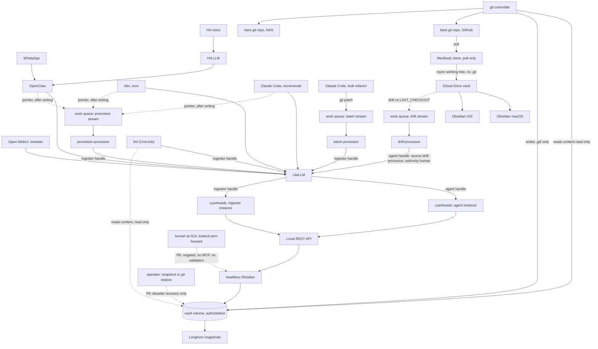

# BRAIN — Solution Design

**Markers:** `[C1]` [CANON-1](./CANON-1-designing-brain.md) (Designing Brain — vault organisation research) · `[C2]` [CANON-2](./CANON-2-mcp-research.md) (Obsidian MCP server selection research) · `[F]` [FINDINGS-v1](./FINDINGS-v1-source-review.md) (primary-source review) · `[U]` stated by you · `[D]` derived on top of those · `[GAP]` canon does not determine it · `[V]` load-bearing and unverifiable from the sources

This is the single, current statement of the design: what BRAIN is, why it's shaped this way, and what remains open. Sections 1–7 describe the design as it stands, in the present tense — they do not narrate how a previous attempt at design differed. Where a previous attempt at design was considered and rejected, that's noted briefly, once, at the point it's relevant; the full decision history lives in §8–10, which the main text points to rather than repeats.

---

## 0. In one paragraph

BRAIN is a git-backed Obsidian vault that a human reads and multiple AI agents write to. Exactly one process ever touches the vault's files: a headless, in-cluster copy of Obsidian, reached only through a permission-scoped MCP server. Every writer — WhatsApp-triggered OpenClaw, scheduled n8n jobs, Claude Code, a bulk-import pipeline, lint, a set of work-queue processors — is a client of that one door, never a second filesystem writer. The human is not a writer at all: they're the source that feeds requests in at the top, and the reader who consumes curated notes at the bottom. Content flows from a write-once immutable raw layer, through an agent-writable inbox, through a validating promotion gate, into curated areas the agents can only enter by having their draft admitted. The human reads on their phone (always fresh, works anywhere, via WhatsApp/OpenClaw) and, more richly but with more lag, natively in Obsidian on Mac and iOS (via a read-only replica synced through iCloud, Apple's own recommended path for the platform). One narrow, deliberate exception exists: a human can reach the actual cluster instance's GUI directly, bypassing every gate, for configuration and repair — because setting up Obsidian itself requires a GUI, and that's stated here plainly rather than left to be discovered later.

---

## 1. The write model

### 1.1 The core claim, stated with its exception

Karpathy's LLM Wiki pattern is *"by design multi write with zero human involvement… writes all come from machines"* `[U]`, built from three operations — **ingest, query, lint** — over an immutable raw layer, an LLM-owned wiki layer, and a schema file that governs both `[C1]`. BRAIN applies this literally: **the human is not a writer of content.** They are a source at the top of the funnel and a consumer at the bottom. Where the human wants to make an edit, that's a request, not a filesystem operation — it goes through an agent like anything else.

**The precise claim is: exactly one process writes the vault, and it has two entrances.** One is the MCP path — every routine write, from every client, validated at multiple points. The other is a human sitting at the headless Obsidian instance's own GUI, reachable only by port-forwarding from the operator's Mac — used for configuration and repair, and **carrying none of the MCP path's controls**: no validation, no `source:`/`authority:`/`trigger:` stamping, not even a record that a write happened until the nightly lint notices it. This is a deliberate, narrow, permanently-open exception, not an oversight (§3, Gate list; §8b G2 explains why it has to exist). It's stated here, at the top, because it qualifies the headline claim and shouldn't be discovered forty lines into a path table.

### 1.2 Enumerating writers

| Writer | Nature | Path to bytes |
| --- | --- | --- |
| OpenClaw (WhatsApp-triggered) `[U]` | machine | LiteLLM → MCP `[U, C2]` |
| Home Assistant voice `[U]` | not a distinct writer — HA's LLM hands off to OpenClaw | collapses into OpenClaw `[D]` |
| n8n daily organise `[U]` | machine | LiteLLM only, SSRF-allowlisted `[U]` |
| Claude Code — incremental work `[U]` | machine | LiteLLM → MCP `[U]` |
| Claude Code — bulk refactor `[U]` | machine | git patches onto the work queue's batch stream (§3) `[U]` |
| **Lint** `[C2 Stage 4]` | machine | MCP, on the ingestor handle `[D]` |
| **`promotion-processor`** `[U]` | machine | MCP, on the ingestor handle `[U]` |
| **`batch-processor`** `[U]` | machine | MCP, on the ingestor handle — never the filesystem `[U]` |
| **Headless Obsidian, in-cluster** `[C2]` | machine — the execution engine | direct filesystem, by definition |
| Obsidian on MacBook / iOS `[U]` | renderer plus capture surface, not a writer to the volume `[D]` | none directly; a device-side edit is captured onto the work queue's drift stream and handed to `drift-processor`, below (§1.5 R2) |
| **`drift-processor`** `[U]` | machine — dispatches captured device edits, nothing else | LiteLLM agent handle → MCP, scoped to `00-inbox/` exactly like OpenClaw; stamps `source: drift-processor`, `authority: human` (the content originated with a human even though this processor types it in), `trigger: event` (§5 Frontmatter) |
| The human, ordinarily `[U]` | not a writer | instructs one of the above |
| The human, at the headless GUI `[U]` | an ungated writer, by design and by exception | Obsidian directly — configuration and repair only (§8b G2) |

[CANON-1](./CANON-1-designing-brain.md)'s original `source:` enum was `human|openclaw|n8n|claude-code|home-assistant|import` `[C1]`. Two of those values never named a process at all — `human` and `import` name whose *claim* something is, not who typed it — and a third, `home-assistant`, names a channel that this table already shows collapses entirely into OpenClaw: Home Assistant never itself holds an MCP handle, so it can never be what `source:` mechanically records. §5 Frontmatter resolves this by splitting the field.

### 1.3 Every path to the authoritative bytes, and what gates it

The authoritative bytes are one directory on one volume in the cluster `[D]`. A writer is *gateable* iff every path from it to that directory crosses a control point. There are eleven named paths: six are closed or neutralised; P1 and P8 are the two live entrances named in §1.1; P1′ and P6′ are producers that feed into P1 rather than separate routes to bytes; P9 is a deliberate, rare, operator-initiated exception for disaster recovery, not part of ordinary operation.

| # | Path | Gated by | Status |
| --- | --- | --- | --- |
| P1 | client → LiteLLM (agent handle) → cyanheads MCP (agent instance) → Local REST API → Obsidian → fs | LiteLLM handle + tool filtering `[C2, F]`; `OBSIDIAN_WRITE_PATHS` on the agent instance `[C2, F]`; append/patch primitives `[C2]`; optimistic-concurrency `ifMatch` on modify/patch `[F]`; promotion validator `[C2 Stage 4]` | **gated, 4 points — the live door** |
| P1′ | batch producer → work queue (batch stream) → `batch-processor` → LiteLLM *ingestor* handle → ingestor cyanheads instance → REST API → Obsidian → fs | everything gating P1, plus: producer restricted to the Coder workspace by NATS account and subject permissions, not by network position (§2, §3 "Who may enqueue, and why") `[U]`; base-commit staleness check, granularity flagged for implementation (§8b G9) `[U]`; `05-raw/` create-only immutability check, enforced in `batch-processor` `[U]` | a producer feeding P1, not a second route to bytes `[D]` |
| P2 | client → Local REST API directly with bearer token | no path-scoped writes at this layer `[C2]` | gated only by network + secret isolation `[D]` |
| P3 | client → Local REST API's own built-in MCP endpoint | a second, unscoped MCP surface that **cannot be disabled** `[F]` | closed by NetworkPolicy alone `[D]` — the sole control on it (§8c V7) |
| P4 | **three things mount the volume**: headless Obsidian, read-write on vault content; lint, read-only on vault content, for its whole-vault checks; and the git committer, read-only on content and write-only on `.git/` `[U]` | nothing else mounts it — the invariant governs *mutation* of vault content, not reading it, and these are the only three processes with any access to it, each on a disjoint or read-only slice `[D]` | closed by policy: **exactly three mounts, scoped and disjoint** — generalises the same principle P7 already uses for `.obsidian/`. Three mounts with clearly disjoint rights is no weaker a claim than two |
| P5 | plugins inside the headless instance (Linter, Templater, Frontmatter Date Manager) `[C1]` | run *after* admission | closed by scheduling normalisation into the lint pass, not on save `[D]` (§6) |
| P6 | device Obsidian → iCloud vault copy → local edit | would be ungateable if returned | closed by not building a return path — the edit is captured onto the work queue's drift stream, not overwritten, and handed to P6′ (§1.5 R2) `[U]` |
| P6′ | `drift-processor`: work queue (drift stream) → LiteLLM (agent handle) → cyanheads (agent instance) → REST API → Obsidian → fs | everything gating P1, scoped to `00-inbox/` exactly like OpenClaw `[U]` | a producer feeding P1, not a second route to bytes `[D]` — named explicitly rather than left as an unspecified "AI channel" |
| P7 | any Obsidian instance writing `.obsidian/` `[F]` | ungateable in principle | closed by scoping it out of the content contract `[D]` |
| **P8** | **human at the headless Obsidian GUI → Obsidian → fs** | **nothing** — no MCP, no validation, no `source:`/`authority:`/`trigger:` stamping | **open by design.** Reachable only by `kubectl port-forward` from the operator's Mac; intended for configuration and repair; detected after the fact by the nightly lint `[U]` |
| **P9** | **operator-triggered Longhorn snapshot or git restore → volume, bypassing Obsidian entirely** | nothing at write time | **deliberate, rare, operator-initiated disaster recovery only** (Phase 7); not part of ordinary operation and not counted against the single-writer claim below, which describes routine operation `[U]` |

A previous attempt at design assumed two-way device sync, which would have made P6 genuinely ungateable. Removing that assumption doesn't mitigate the problem — it removes it: no device writes back, and in ordinary operation there is no second filesystem writer anywhere, batch work included. That's the largest simplification in this design, and it deletes an entire subsystem (conflict resolution, quarantine, a lock protocol). What's left in its place is the single deliberately-retained exception, P8 — kept because without it there is no sanctioned way to configure the vault at all (§8b G2) — plus P9, a disaster-recovery escape hatch exercised only outside ordinary operation.

**The single-writer property itself is enforced by the Deployment's shape, not by the storage layer.** RWX permits concurrent mounts by definition — that's the whole reason three processes can share the volume at all (§2) — so "exactly one process ever writes the vault's files" rests on there being exactly one Obsidian Deployment, one replica, `strategy: Recreate` rather than `RollingUpdate` (§2 item 2), plus Obsidian taking a moment to start once a pod is scheduled. `Recreate` narrows the window a rolling update would otherwise open on every deploy; it does not close it, and a live incident showed the difference is timing, not enforcement (§8c V14). Anything that causes rapid pod-template churn on this Deployment reopens the window regardless of what the storage layer permits, since RWX is what makes the three-mount model possible in the first place and can't be tightened without giving that model up.

### 1.4 What the devices must be

**Read-only replicas of content, plus a conversational write channel, plus a capture channel for anything typed on the device anyway** `[D]`.

*First-class* means full-fidelity **reading** — native rendering, Bases dashboards `[C1]`, Tasks queries `[C1]`, backlinks, graph, offline, instant search — not read-write peerage. That weaker requirement is what admits a dramatically simpler sync layer: one-way replication needs no conflict model, no vector clocks, no merge engine, no lock protocol.

Whether Obsidian has a setting that mechanically enforces read-only was never established either way `[V]` — no official page mentions one, and the forums weren't exhaustively searched, so this is absence of evidence rather than evidence of absence `[F]`. It no longer matters: "read-only" is enforced by not building a write-back path, not by the app refusing edits. A human *can* still type into the iOS or macOS app — those bytes now have somewhere to go: not back to the volume, but forward through the funnel, captured as drift and dispatched for proper re-entry (§1.5 R2). The fact was never found; the need for it was removed. That's a design change, not a research result.

### 1.5 The residue of the multi-writer requirement

Most of the multi-writer problem dissolves structurally: the raw layer is immutable `[C1]`, so write-once content has no concurrency semantics at all, and every remaining write funnels through one MCP into one effectively single-threaded Obsidian process `[C2 criterion 9]`. It doesn't dissolve entirely — three residues survive, each individually mechanised.

**R1 — Lost update on read-modify-write.** Process serialisation prevents *torn files*, not *logical clobbering*. [CANON-2](./CANON-2-mcp-research.md) calls its own serialisation *"an architectural side-effect, not a promised feature"* `[C2]`, and the source review found no guarantee either — the property must not be over-trusted `[F]`.

Three layers carry the load:

- **Append/patch over overwrite** `[C2]` — disjoint-section operations commute, making the majority of agent writes immune by construction `[D]`. This carries the bulk of the load.
- **Optimistic concurrency.** Local REST API **5.0.0** returns a content-hash `version` in the document map; passing it back as `ifMatch` on modify/patch makes a stale write fail `412 Precondition Failed` instead of applying silently `[F]`. Opt-in per request, and applied to modify/patch only — create and append have no prior version to assert against, so the extra round-trip would be unearned `[U]`. This is a new primitive under R1, additive to the commutativity argument, not a replacement for it.
- Every mutating cyanheads tool returns `previousSizeInBytes`/`currentSizeInBytes`, usable for clobber self-detection `[F]`. For whole-page regeneration specifically: sentinel markers `[C1]` plus a page-level lease `[C1]` held only by regeneration jobs.

**R2 — Device replica divergence.** A human types into Obsidian on the Mac or the phone; the next refresh would otherwise overwrite it.

*Mechanism:* refresh is capture-then-replace against a byte-exact baseline, and the capture is **dispatched, not quarantined** `[U]`. Before each refresh, **local-replicator** (§2 item 10) compares the device-facing copy against a second local checkout pinned at a `LAST_CHECKOUT` tag; for every path the comparison flags, the drifted file's *contents* — not just the fact that it changed — are published onto the work queue's drift stream before anything overwrites it. **`drift-processor`** then drains that stream and dispatches into the funnel for reconciliation. Full mechanism in §4 Plane B.

A previous attempt at design quarantined a divergent device file locally and asked the human to re-enter it by hand. That's replaced here for coherence with the write model — but replaced by dispatch through a *durable* queue, not by discarding the safety a local quarantine provided: `drift-processor` makes a stray device edit an **ingest event** — a source fed to an agent, exactly like a WhatsApp message, and stamped `source: drift-processor`, `authority: human` (the claim originated with a human, whatever process happened to type it in) — rather than a special-cased exception the write model has to accommodate.

**Dispatch is not automatic inclusion — the server classifies before deciding, and the device stays a dumb detector.** Found by accident during implementation, not by design review: a stray click at the headless GUI deleted `TODO.md`'s header, restored from git in seconds. **That incident is not itself a case this classifier catches — a GUI write can't reach it.** P8 writes land directly on the authoritative volume and flow *outward* (volume → git → Mac clone → iCloud, §4), so a GUI mishap arrives at the devices as ordinary upstream content, never as a diff against the `LAST_CHECKOUT` baseline, and never appears in the drift comparison this classifier runs on; per §1.3 P8, a GUI-side edit is caught only after the fact, by the nightly lint (Phase 6), not by this mechanism. What the incident actually exposed, correctly, is the general principle behind it: "submit everything the detector finds" was never a complete design for the writes `drift-processor` *does* see — something has to decide whether a piece of device-side drift is a human's intended edit or accidental damage before it's treated as a source-worthy ingest event. The device-side drifter keeps doing exactly what it did before: it submits every path the comparison flags, and makes no judgement, so it can never silently drop a real edit. Classification happens **server-side**, using heuristics decidable without guessing at intent: *location* — drift on a fixed-address contract file (`log.md`, `TODO.md`, `CLAUDE.md`, `AGENTS.md`, `_templates/`, `_ops/`) is presumed unintentional, since the folder map already tells us humans don't author there — **`00-index.md` is carved out of that list, deliberately**: §5 describes it as the hand-curated Home MOC, and the amendment adding the salience-audit checklist item there (§5 Salience and consolidation) gives it a second, deliberate reason for a human to hand-edit it, so drift on it classifies like an ordinary content note, not like the other root files. The carve-out is more consequential here than it would be elsewhere: `00-index.md` sits outside both MCP instances' write scopes (§3 Gate 2), so `drift-processor` and the P8 GUI are the *only* routes by which it can ever change at all — suppressing its drift route wouldn't be redundant with some other way in, it would close the only one. Drift on an ordinary content note is presumed intentional; *schema damage* — an edit that leaves a note failing validation (frontmatter no longer parsing, a required field gone, a lost heading) is presumed unintentional wherever it lands, on the grounds that a human intending an edit rarely intends to break the schema — the device-side analogue of the GUI incident: a slipped keystroke or a stray autocorrect in the Mac or iOS app dropping a required frontmatter field or a heading while editing a note that already exists; *shape* — whitespace-only changes, a single character inserted mid-word, a truncation with no compensating addition, read differently from authorship; *contract violation* — prose appearing in a note specified as queries-only (`TODO.md`) is a signal regardless of how plausible the prose reads. Classification is a **stage in the drift path, upstream of the common ingest pipeline** — not a call into the promotion validator. Those two answer different questions, and merging them was an error in an earlier draft of this paragraph: *did a human mean to do this* is only ever asked of drift, while *does this content meet the schema and provenance bar* is asked of everything and stays the promotion validator's sole job (Gate 5, §3). Sequencing them keeps one authority per question, which is the invariant that matters; "one authority total" was the wrong generalisation of it, and would have made `drift-processor` depend on a validator that does not exist until Phase 5. Once an edit survives classification it is dispatched with no further judgement — **the dispatcher is dumb** — and joins the same path an agent write takes, where the validator admits or quarantines it on content grounds exactly as it would any other ingest event.

**What the classifier is aimed at changed too, once the human write path was stated plainly.** The anticipated device-side failure, when this mechanism was designed, was a note born without frontmatter — a human hand-creating something at the keyboard. The owner has since stated they will not do that: every new note arrives through an agent, one way or another, and a human at a device only ever edits something that already exists. Frontmatter conformance is therefore largely preserved by construction on a drifted note, and the actual risk moves to an edited note whose `updated:` doesn't move, or a human edit landing on a note still stamped `authority: agent` from before the edit. That is exactly the shape the `trigger:`/`authority:` consistency lint check (§6) and the classification step above are built to catch, and it's what retroactively justifies splitting those two fields in the first place (§5 Frontmatter) rather than leaving one field to carry both jobs.

Two consequences worth stating on their own: there is exactly one device-side edit surface, not two — Mac and phone open the *same* iCloud copy, so one drift mechanism watching that one directory sees everything a human could do on either device. And the git clone's working tree carries no divergence signal, because nothing edits it; it's a replication source, not a vault anyone opens.

**R3 — Bulk work is too large to run tool-call-by-tool-call.** Bootstrap import and bulk refactors can't sensibly arrive as ordinary interactive agent traffic.

*Mechanism:* the work queue's batch stream — producers emit git patches, chunks queue, `batch-processor` applies them through the **same MCP path and the same controls as ordinary ingest** (§3). Because the processor writes through MCP rather than to the filesystem, bulk work isn't a second writer and not a second operating state; it's a different *feed into* the system rather than a lane *around* it `[U]`. A previous attempt at design handled this with an exclusive maintenance window — MCP quiesced, writes refused for the duration. That's no longer needed: "batch mode" is now nothing more than *which LiteLLM handle is enabled* `[D]`.

**Verdict:** the requirement changes shape rather than dissolving. It stops being "reconcile N concurrent writers" and becomes three narrow, individually-mechanised properties. No merge engine is required anywhere `[D]`, and the batch stream is specifically shaped so none creeps back in (§3, "Why stale patches are rejected rather than merged").

---

## 2. Architecture

**Cluster** (always on `[U]`):

1. **Vault volume** — Longhorn replicated PVC, provisioned **ReadWriteMany** (Longhorn's NFS-backed mode) `[U]`, the one authoritative copy. RWX is chosen deliberately: three processes mount it concurrently — headless Obsidian read-write, and lint and the git committer both read-only on content (§2 items 4–5) — and RWX lets them do so without requiring all three pods to be co-scheduled onto the same node, which a ReadWriteOnce volume would demand. Snapshots/backups provide the "nothing destroyed" floor. *One job: be the authoritative bytes.*
   - **The vault must never sit at the mount's root.** `OBSIDIAN_VAULT_DIR` points at a subdirectory of the mount (`/vault/brain`), never at `/vault` itself — a structural requirement now, not an incident-response fix. A mount root carries ext4's `lost+found`, root-owned mode `0700`, and Obsidian watches every directory in its vault rather than degrading around one it can't — so the vault fails to open outright (§8c V11).
   - **The volume is NFS, exported from a Longhorn share-manager pod, soft-mounted** (`softerr`, `timeo=600,retrans=5`): a write can fail outright under NFS trouble rather than hang, so the committer and lint must treat write failure as expected and retryable, not exceptional — relevant at the Phase 7 recovery drill (§8c V12).

2. **Headless Obsidian + Local REST API** `[C2 Stage 1]` — **the only process with read-write access to vault content, and the only process that ever mutates a markdown file.** Everything else in this list — lint, the three work-queue processors, every agent — *writes* exclusively through MCP into this one process; nothing else is a content writer even indirectly. Lint additionally reads the volume directly, which is a read-only mount, not a second writer (§1.3 P4).
   - **Base image: a purpose-built image, not `linuxserver/obsidian`.** [CANON-2](./CANON-2-mcp-research.md)'s Stage 1 recommendation — build from `linuxserver/obsidian` or `sytone/obsidian-remote`, with `coddingtonbear/obsidian-local-rest-api` "pre-installed and auto-trusted" — was checked directly against the actual Dockerfile and rootfs overlay and found false: `linuxserver/obsidian` downloads the Obsidian AppImage, extracts it, and stops — no plugins, no vault, no `.obsidian/` at build time, so there was never a REST API pre-installed there to inherit `[F]`; `sytone/obsidian-remote` is the same no-plugin pattern, roughly nine months stale at evaluation `[F]`. Its GUI also ships with passwordless `sudo` — root inside the container that holds the read-write mount of the authoritative vault `[U]` — an inheritance rejected outright rather than accepted with caveats. `shanehull/obsidian-remote` — a useful reference architecture, re-checked since it now publishes a pullable image (`ghcr.io/shanehull/obsidian-remote:v1.1.1`) rather than requiring a build from source `[F]` — was set aside on stronger grounds anyway: it exposes no GUI at all, so it can't satisfy P8 (§8b G2), and it ships its own MCP server, which would displace `cyanheads/obsidian-mcp-server` and forfeit the path-scoped write permissions the whole access model rests on.
   - **What's built instead:** Debian slim, multi-stage, digest-pinned `[U]` — Obsidian and the REST API plugin baked in at build time as a seed, Xvfb, `x11vnc` installed but dormant (below, §8b G2), a small CDP client for auto-trust. "Pre-installed" is real; "auto-trusted" needed more engineering than a file drop — Obsidian's Restricted Mode flag isn't stored in the vault or in any config file, it lives in the Electron renderer's `localStorage`, keyed per vault install `[F]`, so trust is established at boot by launching Obsidian with a remote-debugging port and calling the same runtime API the UI's own trust toggle calls, over Chrome DevTools Protocol.
   - **A human-usable GUI is required, not a convenience** — see §8b G2 and P8. It isn't inherited from a base image that ships one continuously: the image installs `x11vnc`, dormant, attached on demand to the same Xvfb display the running Obsidian process already owns, so reaching it costs no second process and no second image (§8b G2).
   - **Runtime posture: non-root throughout, not root-at-startup-then-drop.** Debian slim rather than the *arr-stack's s6-overlay convention: `tini` as PID 1, no supervisor, no `sudo`, uid 1000 from boot — there is no root-owned startup `chown`/`chmod` pass to accept the risk of or to later narrow with `hostUsers: false`, because the image never runs as root at all. `PUID`/`PGID` are absent for the same reason: there's no root-to-dropped-user handoff to align.
   - **`strategy: Recreate`, not `RollingUpdate`, on the Deployment.** A rolling update would run two Obsidian processes against the RWX volume mid-rollout, breaking the single-writer invariant on every deploy rather than only in a rare race. This is the actual mechanism behind "exactly one process ever writes the vault's files" (§1.3); its known limit is recorded at §8c V14.

3. **cyanheads/obsidian-mcp-server** `[C2 Stage 2]` — Streamable HTTP, `MCP_AUTH_MODE=jwt`, `OBSIDIAN_BASE_URL` pointed at the in-cluster REST API, digest-pinned rather than `latest` `[C2]`; image, digest and env-var names confirmed exactly as reported, no drift `[F]`. *One job: be the only scoped door into the vault.*
   - **Runs as two instances** `[U]`: an **agent instance** (narrow — `00-inbox/`, `40-journal/`, `_ops/agent/`, `log.md`) for every interactive writer and for `drift-processor`, which never writes anywhere but the inbox; and an **ingestor instance** (the wide scope — `00-inbox/`, `05-raw/` create, `10-areas/`, `20-projects/`, `40-journal/`, `90-archive/`, `_ops/`, `log.md`) shared by `promotion-processor`, `batch-processor` and lint. Handles and instances are separate axes — a LiteLLM *handle* decides who may call, a cyanheads *instance* decides where a write may land. Two handles onto one instance would leak that instance's path scope to whoever held the other handle, so each distinct scope needs its own instance, not merely its own handle `[D]`.
   - **A third instance is deferred, deliberately, and the cost of deferring it is real** `[D]`. `promotion-processor` never creates in `05-raw/` and never archives into `90-archive/`, so a **promotion instance** scoped to `00-inbox/` plus the curated homes would be strictly least-privilege, and the argument for it is exactly the argument that produced two instances rather than one: a distinct path scope needs its own instance, since LiteLLM's filtering is server-level and not path-scoped. **It is not built yet because each instance has a price that is paid in full at Phase 0 and again on every rotation** — its own Deployment, signing secret, pre-minted JWT, LiteLLM registration and secret-store entry. The five-secrets chain took several attempts to get right the first time, and a third instance adds a third of everything to that chain before `promotion-processor` exists to use it.
     Three accepted consequences, stated so none is mistaken for an oversight. **`promotion-processor` runs with more scope than it needs** — a compromised or misbehaving one could write raw material or archive a source. **Promotion contends with batch at the MCP layer, not only at Obsidian's event loop**: sharing the ingestor instance means a bulk run's traffic queues ahead of promotion inside the same server, which sharpens rather than softens the case for the backpressure in §3 keyed on promotion-stream depth. A separate instance would have isolated them one layer earlier. And **the enqueue surface exposed to interactive agents now fronts the widest handle in the system**: OpenClaw, n8n and Claude Code can all reach a processor sharing the ingestor instance (§3, "Who may enqueue, and why"), bounded only by `promotion-processor`'s own pointer-target check (§3) rather than by a narrower instance scope — exactly the excess width a dedicated promotion instance would have bounded structurally instead of by processor-internal logic.
     What earns the third instance is either of two things — the first `promotion-processor` incident where that extra width is implicated, or provisioning becoming cheap enough that a third instance stops being a multi-step manual chain. Revisit at Phase 5, when `promotion-processor` is actually built.

4. **Lint** — Flux CronJob `[C2 Stage 4]`. Previously one of three entrypoints on a single **vault worker**; the other two no longer belong to this component at all. **ingest/promote** is now `promotion-processor` (item 9) — notification-driven rather than scheduled, which makes promotion real time instead of waiting for the next nightly tick. **publish** — the NAS mirror — disappears outright: the git committer (item 5) now pushes there directly as a second remote, so there's no separate scheduled job populating it. What's left under this name is lint alone, on the same schedule and for the same reason it always ran nightly — "walk the whole vault" isn't a message anyone sends, so it was never going to become a queue consumer. **Reads the volume directly, read-only; writes only through MCP on the ingestor handle** `[D]` — the widest scope remains right for lint specifically, since its auto-fixes (§6) can land anywhere in the vault, not at a fixed set of destinations the way promotion's or batch's writes do. The read side matters specifically for lint: orphans, dangling links, contradictions, near-duplicates and schema conformance all need to see the whole vault, and routing every one of those reads through LiteLLM → cyanheads → the REST API → Obsidian's single event loop would compete with exactly the path §3 already describes as taking "hours, once" for a bulk import — running that nightly, over the same single-threaded event loop the write-absence pre-mortem signal (§9, risk 4) depends on being quiet, would make that signal harder to read, not easier. A read-only mount avoids that entirely, and doesn't touch the single-writer invariant, since reading isn't writing. Deterministic checks run in code; contradiction/stale-claim detection via LiteLLM `[U]`.

5. **Git committer** — a small process alongside lint, but distinct from it `[C1, D]`. Along with headless Obsidian and lint, this is one of the three things that ever mount the vault volume (§1.3 P4). Its access is deliberately narrower and disjoint from the others': it mounts vault content **read-only**, and mounts (or writes to) **`.git/` only**. It runs `git add` / `commit` / `push` against the working tree it can see; **it never creates, edits, or deletes a markdown file itself** — doing so would make it a second content writer and break the single-writer invariant. Runs on a schedule and around every batch run.

   **Pushes to two remotes: GitHub, and a bare repository on the NAS** `[U]`. The NAS copy used to be produced by the vault worker's separate `publish` entrypoint, rsyncing a working tree into an rsync/SMB share on its own schedule — a second job with its own failure mode, for a property the committer already buys more cheaply as a second `git push` target. What the NAS copy uniquely protects against — a plain-markdown copy readable with zero tooling, no third party, no cluster, no Longhorn — doesn't depend on *how* it gets there, only on it being a bare repo a human can `git clone` and `grep`. Deleting the separate publish job removes an entire scheduled component, not just a naming inconsistency: one fewer thing that can fail silently, one fewer schedule to reason about. This closes the loop stated in §4: `PVC → committer → GitHub → local-replicator → iCloud → devices`, with the NAS hanging off the committer as a second push target rather than a separate path with its own schedule.

   **The `core.fileMode = false` fix belongs here, on the actual grounds.** There is no root-`chmod` startup in this image (item 2, above) — that rationale is void. The real cause sits upstream of Obsidian entirely: the seed lands files at `0640` and directories at `0750` under `umask 0027`, specifically so a same-`fsGroup` sidecar can read and commit but never author (§7 Phase 1) — but the kubelet's `fsGroup` mechanism re-applies group permissions across the volume at mount time, independent of what wrote the files, re-loosening exactly the group-write bit the seed withheld. The Deployment sets `fsGroupChangePolicy: OnRootMismatch` so that recursion is skipped once the volume root already matches — which bounds the cost but does **not** retroactively re-tighten files an earlier mount already loosened, and the entrypoint only re-tightens one file (`data.json`, which holds the REST API key) rather than the volume broadly `[U]` (confirmed directly at the Phase 1 seed verification, §7). `core.fileMode = false` keeps that remount noise out of the committer's diffs; this setting is local to this repository and doesn't touch the Mac clone or the iCloud copy, which are different repositories entirely. *One job: produce history. Never a source of truth.*

6. **LiteLLM** `[U, C2]` — per-client virtual keys with `allowed_tools`/`disallowed_tools` `[C2 Stage 3]`; filtering is server/namespace-level with per-tool allow/deny lists, and confirmed **not** path-scoped `[F]`. *One job: decide which tools a client sees.* The same underlying MCP is registered twice on LiteLLM `[U]`, matching item 3's two cyanheads instances: an **agent handle** for every interactive/narrow client — OpenClaw, n8n, Claude Code incremental, Open WebUI, and now `drift-processor` — and an **ingestor handle** for lint, `promotion-processor` and `batch-processor`. Batch runs disable the agent handle and leave the ingestor handle live — the mechanism by which `batch-processor` keeps writing while everything else is shut out, which a single handle couldn't express. Because promotion now shares the ingestor handle, it stays live through a batch run too, on purpose: promotion and drift are real-time, human-paced traffic with no reason to pause for a bulk import (§3, "`batch-processor` needs a circuit breaker").

7. **Observability** `[U]` — validation rejections, quarantine depth, inbox depth `[C1 threshold >20]`, lint findings by class, replica lag, MCP error rate, REST API liveness `[C2 Stage 5]`, and, per work-queue stream (batch, promotion, drift): depth, ack rate, nack rate, dead-letter depth `[D]`. **Alerting is deliberately deferred; instrumentation is not.** The near-term deliverable is metrics collected and queryable, not notifications — for one operator with no team, an alert that fires on noise has negative value, and the plan is to gate alerting behind an AI-driven triage layer that can filter before anything pages anyone. This is asymmetric on purpose: a metric not collected now is lost, unrecoverably, while alerting on a metric that already exists is a config change, switchable at any time — so the metrics named above are worth getting right now even though nothing yet fires on them. Two findings sharpen why the *choice* of metric matters, not just whether one is collected: the readiness probe hits the REST API, a different code path from the renderer's own vault load, so it stayed green throughout a total vault-load failure (§8c V11) — liveness and "can actually open the vault" are not the same fact, and only one of them is currently observed. And a Gate 2 refusal (§3) returns **HTTP 200 with `isError: true`** inside the JSON-RPC envelope, not an HTTP error status, so no HTTP-level metric — request count, error rate, a status-code histogram — can observe the write gate working or failing at all; whatever eventually alerts on it will have to parse the envelope, not the transport. **Per-stream depth, ack and nack rates are not a workaround for that gap, they're a structurally better answer for exactly the traffic that goes through the queue:** unlike a gate refusal, a message that fails to ack is a queue-native fact, nothing to parse out of a JSON-RPC envelope — and it comes from infrastructure the design needs to run anyway, a better return than a purpose-built exporter for anything that goes through a lane.

8. **ExternalSecrets / Bitwarden** `[U]` — custody of the REST API bearer token (the P2 risk), MCP JWT key, git credentials, and one **NATS account credential per producer population** — the mechanism that actually carries enqueue authority once NATS has an ingress (below; §3 "Who may enqueue, and why"). One of those credentials never arrives this way at all: `local-replicator`'s, because ExternalSecrets materialises Kubernetes Secrets and `local-replicator` runs on a Mac, outside the cluster this mechanism reaches (item 10) — its custody is stated there, not here.

9. **The work queue** `[U]` — three NATS JetStream streams in the vault namespace, one per processor: a **batch stream**, drained by `batch-processor`; a **promotion stream**, drained by `promotion-processor`; and a **drift stream**, drained by `drift-processor`. Chosen over RabbitMQ on operational weight: a single small Go binary running as a single-replica Deployment with a volume, rather than this repo's first StatefulSet plus an Erlang runtime for the sake of a queue `[U]`. JetStream supplies ordered consumers, per-message acknowledgements, and a max-delivery threshold feeding a dead-letter path on each stream — the properties the design actually depends on; RabbitMQ's dead-letter exchange is the more first-class, better-trodden mechanism of the two, an accepted cost against the StatefulSet this avoids. **Each producer population gets its own NATS account, with subject permissions scoping it to the one stream it may publish to** — this, not the NetworkPolicy below, is what enforces §3's "Who may enqueue, and why" once the queue is reachable from off-cluster. Specified in §3.

**MacBook** (not cluster `[U]`):

10. **local-replicator** — a launchd job on the operator's Mac, not a Flux-managed workload. **The only component in this design that runs outside the cluster**: different packaging (a launchd plist, not a container image Flux reconciles), different deployment (installed by hand on one machine, not applied), different failure modes (a sleeping laptop or a silently-dead launchd job, not a pod restart), and watched by nothing — none of item 7's observability reaches a process the cluster never scheduled. Every other component in this document has a name and a home — vault volume, headless Obsidian, the MCP servers, lint, the work-queue processors, git committer, LiteLLM, observability, ExternalSecrets, the work queue — and an unnamed component gets improvised at implementation rather than designed, which is exactly why this one is named despite, and because of, being the odd one out. Named `local-replicator` rather than `vault-replicator`: everything else here is vault-*something*, so `vault-` would distinguish nothing; `local` names the actual discriminator — it's the piece that doesn't run in the cluster.

    *Five responsibilities, in order* (full mechanism at §4 Plane B):
    1. Compare the iCloud tree against a second local checkout pinned at `LAST_CHECKOUT` to enumerate drifted paths.
    2. **Capture** the contents of those paths.
    3. Pull the bare repo into the local cache clone (e.g. `~/.cache/obsidian-vault`).
    4. Publish into the iCloud vault directory — **only if step 2 succeeded** — with `.obsidian/` included only when absent at the destination.
    5. Advance the `LAST_CHECKOUT` tag to the revision just published.

    Step 2 is built at Phase 2 as a **stub with a real contract**: it captures, and throws the bytes away. Phase 5 changes only where they go — `/dev/null` becomes the work queue's drift stream, and `drift-processor` is added to drain it (§7 Phase 5) — not whether the step runs or where it sits in the ordering. The reason it's built this early: the hard part to retrofit is never the storage, it's the **ordering** — adding capture later wouldn't insert a step, it would invert step 4 from an unconditional overwrite into one contingent on a prior step succeeding, with a skip-and-retry path when it doesn't. That's a restructure of a working component, which is where bugs come from; building the ordering now and filling in the destination later means the skeleton never has to move.

    Capture exists so the read replica is **non-destructive**, not so a device becomes a place to author notes (§1.4) — the owner is explicit that editing becoming the draw is the design failing on its own terms, the way fifteen years of note apps did once their upkeep cost exceeded their value.

    **Credential custody, stated because nothing else in this design would say it.** `local-replicator` holds the NATS credential that lets it publish onto the drift stream (§2 item 9, §3 "Who may enqueue, and why") — the one producer credential item 8's custody chain never reaches, since ExternalSecrets materialises Kubernetes Secrets and this process runs on a machine the cluster doesn't schedule onto. It is minted once, by hand, the same manual step that creates any other producer's NATS account, and lands on the Mac as a `.creds` file `local-replicator` reads at startup — outside any secret manager this design uses elsewhere, because there is no secret manager on the Mac to use. Rotation is manual too, on no fixed schedule: replacing the file is the operator's own act, done when it's done. **No automation exists for either step, and none is proposed.** A single credential, on a single machine, for a single operator, is a manual-custody problem, not one that earns a pipeline — and if that stops being true, it changes here, not by omission.

**Namespace and network policy** `[U]`:

- Vault workloads get a new namespace inside the existing `apps-ai` module, separate from the `ai` namespace where LiteLLM runs.
- **Default-deny ingress in the vault namespace** — without it, every allow rule is decoration.
- **Only LiteLLM may speak MCP**, across namespaces, via `namespaceSelector` + `podSelector`.
- **Only the MCP may speak to headless Obsidian.** This rule is load-bearing, not defence in depth: the Local REST API's built-in MCP endpoint cannot be disabled `[F]`, so this NetworkPolicy is the sole control on it. Its failure would be an open door, not a hardening regression (§8c V7).
- **Enqueue authority follows message shape, not one flat allowlist** (§3, "Who may enqueue, and why") — **and it's carried by the NATS credential, not by network position.** A NetworkPolicy selects on pod and namespace; it cannot see which *stream* a client publishes to, and once NATS has an ingress (below), every off-cluster client looks identical to it — network position stops being sufficient authority the moment any client can reach NATS from outside the cluster. Only the Coder workspace's NATS credential may publish to the **batch stream** — unchanged in effect, now enforced where it actually has to be: it carries patches, and a patch confers the processor's own write scope on whoever enqueued it. `local-replicator`'s credential may publish to the **drift stream** and nothing else, by construction. OpenClaw's, n8n's and Claude Code's credentials may all publish to the **promotion stream** — it carries only a pointer to something already written, inherits nothing, and (§3) is only ever acted on if it names a path inside the enqueuer's own write scope. As defence in depth for in-cluster traffic, not as the control: NATS sits inside the vault namespace's own default-deny ingress (above), with an allow rule — `namespaceSelector` + `podSelector`, the same pattern as the MCP rule above — admitting the vault namespace's own three processors (`batch-processor`, `promotion-processor`, `drift-processor`, each reaching NATS only to drain its own stream) and the enqueuing pods for each in-cluster producer: the Coder workspace pod (Claude Code, bulk and incremental) for the batch and promotion streams, and OpenClaw and n8n for the promotion stream. It stops an unrelated in-cluster pod from reaching NATS at all; it has no notion of *stream*, so a pod admitted here isn't thereby confined to the subject it's supposed to use — that boundary belongs to the NATS credential alone (above). `local-replicator` reaches NATS through the ingress (§3, "NATS gets an ingress"), never through this rule, which describes in-cluster clients only.
- Network-policy testability **in CI** is out of scope for this design `[U]` — `kind` enforces no NetworkPolicy, so a CI test could only assert shape, which `kubeconform` already checks. That's a statement about CI, not about the live substrate: whether the target platform actually enforces NetworkPolicy at all is tested directly, outside CI, against the running cluster, because Gate 6 depends on it as a sole control with no fallback (§3 Gate 6, §8c V13, §9 risk 13).

**NAS** `[U]`: a bare git repository, pushed to directly by the git committer (item 5) as a second remote alongside GitHub — DESIGN previously contemplated a bare repo "and/or" a separate rsync/SMB publication point; only the bare-repo half is needed, since the committer already produces the history a second push target rides on. Its function is independence insurance — a second, plain-markdown copy readable with *"grep/sed/vim"* `[U]`, no Obsidian, no cluster, no service.

**Devices:** `local-replicator` (item 10, above) holds a pull-only git clone on the MacBook — not a vault anyone opens, but the source the iCloud copy is fed from. The vault the Mac and the phone both actually open lives in `iCloud Drive/Obsidian/<Vault Name>` `[F]`. See §4.

### Flow



### What must be up for what

| Capability | Requires |
| --- | --- |
| Any agent write | cluster only |
| Ingest / lint / promotion | cluster only |
| Bulk restructuring of the vault | cluster + the Coder workspace — i.e. a human started it `[U]` |
| Conversational read on any device, anywhere | cluster + internet + WhatsApp or Open WebUI `[U]` |
| Native Obsidian read on macOS or iOS | nothing (local iCloud copy, offline) |
| *Freshness* of either native copy | the Mac awake, plus cluster + network `[D]` |
| Disaster recovery | NAS + git, or Longhorn backups `[U]` |

No capability of the cluster, and no conversational capability, requires the MacBook or any device to be awake `[D]`. The one thing that does is content freshness on the devices: only the Mac can write its own iCloud Drive folder, and nothing in the cluster can push to iOS (§4).

---

## 3. The write path

### Gates, in order

**Gate 0 — Runner-level pre-write hook, detective not preventive.** A write-time hook that blocks bad writes before they land was the goal — but the specific hook available for this, Claude Code's `PostToolUse`, **does not block**: its own documentation states *"the tool already ran"*, and only `PreToolUse` can block. The very reference project this pattern was drawn from documents its own `PostToolUse` hook as non-blocking in its own configuration `[F]`. No equivalent hook exists at all for OpenClaw or n8n.

This isn't treated as a hard requirement, because Gate 5 (admission validation at promotion) is downstream and entirely unaffected: a bad Claude Code write lands in the agent zone and is caught before it can reach curated content — preventive control at the curated boundary, detective control inside the agent zone (§8a D5). The blocking property may be relocatable rather than lost — `PreToolUse` can block, and the proposed content is available at that hook point — revisited after implementation `[U]`.

**Gate 1 — LiteLLM handle, virtual key and tool scope** `[C2 Stage 3]`. `obsidian_execute_command` is on no agent key `[C2]`. `obsidian_delete_note` is likewise withheld from the agent key, but not by the MCP server: the underlying `obsidian-mcp-server` bundles delete together with six other write tools under one flag (`OBSIDIAN_READ_ONLY`), with no per-tool switch, so disabling it there would cost the agent every write tool it actually needs — the only server-side alternative would be forking the tool-definitions index. It's withheld one layer up instead, at this gate: LiteLLM's per-tool `disallowed_tools` on the agent MCP registration (`disallowed_tools: ["obsidian_delete_note"]`), confirmed workable in source at the deployed LiteLLM tag. This was a live gap before the fix landed, not a theoretical one — `tools/list` against the agent instance advertised `obsidian_delete_note` regardless, and a violation-injection test deleted a note through it (21 bytes to 0) to confirm.

The restriction is per-instance, deliberately, and delete is the tool where the agent instance genuinely differs from the other — every other write tool (create, append, patch, frontmatter) is needed on both. The MCP tool set has **no move or rename primitive**, so any relocation — moving a note out of `00-inbox/` into its curated home, archiving a rolled-up source into `90-archive/`, applying a slug correction — is necessarily write-to-new-path followed by delete-at-old-path, and only the ingestor instance does that. The ingestor instance owns both halves of it: ordinary promotion out of the inbox, `promotion-processor`'s job, and `90-archive/`, since roll-ups (§5 Salience and consolidation) can result in a source being archived, and that's `batch-processor`'s job. The agent instance has no legitimate use for delete at all, and it's also the instance exposed to untrusted input — WhatsApp captures, fetched web content — so withholding delete costs it nothing and removes exactly the tool prompt injection would want most. Where relocation happens, order is load-bearing and easy to get backwards: **write to the new path first, delete the source second, never the reverse** — a crash between the two then leaves a recoverable duplicate (lint already flags near-duplicates, §6) rather than data loss.

Two handles onto two instances (§2):

| Client | Handle | Tools |
| --- | --- | --- |
| n8n | agent | read/search + narrow frontmatter-status update + append to `log.md` only `[D — see §8a D1]` |
| OpenClaw | agent | read/search, create-in-inbox, append, patch, frontmatter, tags `[C2]` |
| Claude Code | agent | as OpenClaw, plus section/structural edits `[C2]` |
| Open WebUI | agent | read/search only `[D]` — human-facing chat, and the human isn't a writer |
| `drift-processor` | agent | create, append into `00-inbox/` only `[U]` — matches OpenClaw's own scope exactly; drift never needs more, since dispatch only ever lands a note back in the inbox for ordinary promotion to pick up |
| Lint | ingestor | read/search, create, patch, frontmatter, append, delete `[D]` — the widest reach remains right here: auto-fixes (§6) can land anywhere in the vault, not at a fixed set of destinations |
| `promotion-processor` | ingestor | read/search, create, patch, frontmatter, append, delete `[D]` — create and delete cover the write-to-new-path-then-delete relocation out of `00-inbox/` into `10-areas/` or `20-projects/`; also reaches `05-raw/` and `90-archive/` via the shared ingestor instance, scope it doesn't use (§2 item 3). Neither this gate nor Gate 2 restricts *which* pointer it acts on — that's enforced by the processor itself, refusing any pointer not under `00-inbox/` (§3, "The promotion stream carries a pointer, never content") |
| `batch-processor` | ingestor | read/search, create, patch, frontmatter, append, delete `[D]` — create covers `05-raw/` bulk import and the write-to-new-path half of archiving a rolled-up source; delete is the second half; no move primitive exists |

Batch runs disable the agent handle and leave the ingestor handle live; since `promotion-processor` now shares the ingestor handle, it stays live through a batch run too (§2 item 6).

**Gate 2 — Path scope at the MCP server** `[C2]`. On the agent instance, `OBSIDIAN_WRITE_PATHS` covers `00-inbox/`, `40-journal/`, `_ops/agent/`, `log.md` `[C2]`; `10-areas/finance/` and every curated area sit outside all agent write scope `[C2]`. The ingestor instance covers `10-areas/` and `20-projects/` — the curated homes promotion actually relocates notes into — `05-raw/` create and `90-archive/`; plus, inherited rather than newly granted, `00-inbox/` (the path promotion deletes from during relocation), `40-journal/` (lint's whole-vault auto-fixes reach daily notes as much as anywhere else), `_ops/` (where the promotion validator quarantines and lint writes its report) and `log.md` (the append-only log) — the widest scope in the system, shared by `promotion-processor`, `batch-processor` and lint `[U]`. A prior draft of this section listed only the curated homes plus `05-raw/` create and `90-archive/`: an earlier sentence read *"the ingestor instance covers all of that plus…"*, and flattening it into a list during the three-instance collapse (§2 item 3) dropped the inherited paths; corrected here against `mcp-obsidian-ingestor/deployment.yaml`'s actual `OBSIDIAN_WRITE_PATHS` `[U]`. `OBSIDIAN_WRITE_PATHS` is prefix-based with implicit recursion, not glob (`projects/` matches `projects/a.md` and `projects/sub/b.md`), and the path policy applies across all 14 tools, `obsidian_delete_note` included `[F]`.

LiteLLM decides which tools a client sees; `WRITE_PATHS` decides which folders a write can touch — two layers, because LiteLLM's filtering is confirmed not path-scoped `[F]`, so Gate 2 has to exist as a separate layer rather than folding into Gate 1.

A root-level file like `log.md` isn't a folder, but a bare filename is a valid, degenerate case of a prefix — it matches only itself, nothing beneath it — so `WRITE_PATHS` expresses n8n's narrow grant the same way it expresses everything else, without a special case for root-level targets.

**`WRITE_PATHS` is path-granular only — it does not gate what kind of write lands inside an allowed path.** Established directly against the agent instance's `tools/list`: it advertises `obsidian_write_note` (which takes an `overwrite` flag) with no server-side restriction distinguishing create from overwrite at a given path. That means `log.md`'s "append-only" and `05-raw/`'s "create-only" are, at *this* gate, conventions rather than capability boundaries — the design's own language elsewhere implies they're enforced here, and they aren't. This isn't a defect in what was built: Gate 1 (tool visibility) and the promotion validator (Gate 5) were always meant to be the decisive layers, and where a convention needed a real backstop, one exists elsewhere — `05-raw/`'s create-only is a separate immutability check enforced in `batch-processor`, not this gate (§3, "Who may enqueue, and why"). `log.md`'s append-only has no equivalent backstop anywhere in the design today: it survives only because the clients that could reach it with an overwrite-capable tool mostly don't have one in their Gate 1 scope, and until the git committer exists at Phase 2, an accidental overwrite has no recovery path at all.

**Gate 3 — Editing primitive.** Append/patch/prepend/section, anti-clobber by default `[C2]`. What actually holds R1 back is anti-clobber-by-default at the tool level — create fails against an existing path unless the caller explicitly asks for `overwrite: true` — not an absence of the capability: `obsidian_write_note`'s `overwrite` flag is a request-time parameter, and nothing at this gate or Gate 1 currently withholds it from the agent handle. A prior version of this document claimed whole-file overwrite was on no agent key; that overclaimed what's actually enforced, in the same way Gate 2's path scope does (above), and the correction is recorded here rather than silently fixed, since the actual control this design leans on is Gate 5, downstream, not this one. Modify and patch additionally pass `ifMatch` with the content-hash `version`, so a stale write fails `412` rather than applying silently `[F]`; create and append don't, having no prior version to assert against. Size deltas (`previousSizeInBytes`/`currentSizeInBytes`) on every mutating tool give cheap clobber self-detection `[F]`.

**Gate 4 — Serialisation at the Obsidian event loop** `[C2]`. Free, but an architectural side-effect only — no guarantee was found, and it's never cited as one `[F]`.

**Gate 5 — Admission validation at promotion** `[C2 Stage 4]`. The decisive gate.

**Gate 6 — Isolation for P2/P3/P4.** REST API is ClusterIP-only, no Ingress, NetworkPolicy admitting only the MCP pods `[D]`, under default-deny ingress in the vault namespace. Bearer token lives only in the MCP pods' secret `[U]`.

Its built-in MCP endpoint **cannot be disabled** `[F]`: no such setting exists in the plugin's settings interface, `/mcp/` registers unconditionally whenever the REST server is enabled, and the upstream issue requesting it be split into a separate plugin was closed the same day with no change — the endpoint is still bundled several releases later. Gate 6 always had two halves — disable the endpoint *and* network-isolate the REST service — and only the disable half turns out not to exist. The isolation half does the whole job on its own: combined with every client transiting LiteLLM, the endpoint is unreachable. This makes the MCP→Obsidian NetworkPolicy the *sole* control on that endpoint, not defence in depth (§8c V7) — which makes whether the target platform actually enforces NetworkPolicy at all load-bearing in a way it wouldn't be if this were defence in depth; that question was researched directly against the live cluster after the fact, established with moderate-to-high rather than full confidence (§8c V13, §9 risk 13).

**No gate — P8.** The GUI is not gated and isn't intended to be (§8b G2).

**Not a gate — P9.** Disaster-recovery restores are deliberately outside the gate system entirely: rare, operator-triggered, and exercised only at Phase 7, not part of ordinary operation (§1.3).

### The work queue

Three NATS JetStream streams (§2 item 9), one per processor, each carrying a different **message shape** — and that shape is what decides who may enqueue onto it ("Who may enqueue, and why", below). The batch stream carries almost all of the queue's mechanical complexity, because it's the one lane with an untrusted-enough producer population, an ordering requirement, and a staleness problem; it's covered first and in full. The promotion and drift streams are deliberately simpler, and are covered after it.

### The batch stream

**The shape** `[U]`:

- Producers don't edit the vault. A producer generates a git patch and enqueues it.
- A patch is split into chunks at logical points, from day one — not added later once patches grow.
- Chunk = one queue message = the transaction unit, not the batch. Atomicity is at the chunk, which is also the unit of redelivery.
- One stream, drained by a single processor, `batch-processor`.
- The processor runs each chunk through all the normal controls and transforms, as ordinary ingest.
- NATS JetStream (§2 item 9) supplies ordering, per-message acknowledgement, a dead-letter path, and a failed-message queue whose contents are the producer's problem.
- **Triggering:** when the stream exceeds a size threshold, or at least once a day whenever non-empty; both only within a permitted time window.
- **Batch running:** disable the agent-facing MCP handle via the LiteLLM API, process the stream, re-enable when finished. `promotion-processor` shares the ingestor handle with `batch-processor`, so it stays live throughout, not untouched by design so much as along for the ride (§2 item 6).

**Why patches.** A `.patch` is plain text: reviewable before it lands, replayable, diffable — consistent with the durability requirement everywhere else in the vault. More importantly, because the processor applies patches through the *same* ingest path with the *same* controls, bulk stops being a lane around the system and becomes a different feed into it. A previous attempt at design had bulk work write the volume directly inside an exclusive maintenance window — a genuine departure from "never a second filesystem writer." That departure is gone entirely, not just softened: there's no direct filesystem write anywhere in the system, in batch as much as normally, and "batch mode" reduces to a question of which LiteLLM handle is enabled `[D]`.

**Why stale patches are rejected rather than merged.** A patch is context-sensitive — if the vault moved between generation and application, `git apply` fails. The tempting fix is a 3-way merge, which would reintroduce exactly what this architecture deleted. Instead: **the patch records its base commit, and if the vault has moved, the chunk is rejected back to its producer to regenerate.** Staleness becomes the producer's problem, not the consumer's, and no merge engine ever appears. With batch running at most daily against current head, rejection is expected to be rare outside a multi-chunk bootstrap.

**Flagged, not settled: what "moved" is measured against.** As specified, this checks the patch's base commit against git HEAD — but git commits on a schedule (§2), not synchronously with every write, and the stream applying chunks in order will commit chunk 1 before chunk 2 is checked, so a large multi-chunk batch could find its later chunks stale against its own earlier ones, not just against unrelated writes. A plausible alternative is per-file content-hash comparison, reusing the same `version` primitive Gate 3 already uses for `ifMatch`, rather than repository HEAD — offered here as one path, not a prescription. Which granularity is right depends on the actual commit cadence and batch sizes, which are better judged at implementation than guessed at here; called out so it's recognized as a batch-mechanism question if it shows up, rather than mistaken for every chunk after the first simply failing (§8b G9).

**Why one batch stream, not prefix-sharded parallel streams.** A different question from why there are three streams at all (above): splitting by *job* — batch, promotion, drift — is a split by authority model and traffic shape, each with its own producer population and its own processor, covered below. Splitting *within* the batch stream by write-path prefix — one stream and processor per prefix, adjusted periodically — is a different proposal, considered and rejected, for four reasons: (1) cross-prefix operations break the disjointness sharding assumes — a rename requires rewriting wikilinks in arbitrary other notes, landing in every prefix at once, and renames are the ordinary case, not the exotic one; (2) sharding removes cross-stream ordering — "rename in X, then relink in Y" isn't expressible across independent streams; (3) the bootstrap gets no benefit — everything lands in the single-prefix, write-once `05-raw/`, which is already maximally parallelisable and needs no sharding to be so; (4) decisively, the processor tier isn't the bottleneck — there's one MCP and one headless Obsidian, so N processors would just queue behind the same single-threaded event loop. Dropping sharding also restores cross-chunk ordering "for free," so a rename-then-relink works as two chunks simply by enqueueing them in order.

**Why FIFO specifically — recorded because it will look over-conservative later.** Chunks are preferably but not reliably independent: a rename can't be split from its link rewrites, a note must exist before something links to it. FIFO lets a producer express a dependency by ordering, instead of requiring every chunk to be self-contained — a contract nobody could actually guarantee. It also keeps the staleness rule cheap: a single consumer applying in order means the vault advances linearly, so "is this patch's base still head?" has a clean answer. Out-of-order application makes that question messy, and the tempting fix for a messy answer is a merge engine. FIFO is not a performance choice; it's what keeps the other two decisions cheap.

**The throughput cost, and the escape hatch.** Because nothing writes the filesystem directly, the processor decomposes each chunk into per-file MCP calls rather than `git apply`. A several-thousand-document bootstrap becomes several thousand sequential round-trips through LiteLLM, cyanheads, the REST API and Obsidian's event loop. Accepted: hours, once, resumable per chunk, rate-limitable `[U]`. A special fast lane for this one-time cost was rejected as complexity that never earns itself back. An escape hatch exists that costs no architectural exception: because the import runs at Phase 3, before agent writes open at Phase 5, it's the sole writer *by circumstance* rather than by policy — provisioning the volume, not contending for it. Reach for that only after measuring, never in anticipation.

**`batch-processor` needs a circuit breaker, and fairness is the right frame, not just health** `[U]`. Every write, batch included, funnels through **one** headless Obsidian process with a single-threaded event loop (§1.5). This design already accepts that the bulk import takes "hours, once" and that the processor tier isn't the bottleneck — Obsidian is — so contention during a batch run isn't a risk to avoid, it's the steady state; the only question is whether it degrades gracefully or thrashes.

The obvious framing — throttle when the MCP looks overwhelmed — is incomplete. What an unthrottled batch actually costs is starving `promotion-processor` and `drift-processor`, the paths where a human is waiting for a note to appear, or a captured device edit sits queued behind thousands of import chunks. So the primary signal isn't MCP latency or error rate, it's **depth on the promotion stream**: direct evidence that real-time work is backing up. `batch-processor` yields when that depth is non-trivial, whether or not the MCP looks healthy — health-based throttling only reacts once the shared bottleneck is already saturated; fairness-based throttling reacts when someone is waiting. Latency and error signals still belong as the circuit breaker's second line, catching the case where Obsidian is degraded for reasons unrelated to load.

Backing off costs nothing but time, because the work sits in a durable stream: unacknowledged messages stay put and are redelivered, nothing is lost, no caller sees an error, and the batch simply takes longer — already the accepted cost of the import. What the circuit breaker must not do is retry eagerly and convert overload into collapse: exponential backoff with jitter, a cap on in-flight requests (likely one, given the single-threaded consumer behind it), and a dead-letter path for chunks that fail repeatedly rather than infinite redelivery. `promotion-processor` and `drift-processor` don't get their own throttling in return — their traffic is human-paced and low-volume — and that asymmetry is deliberate: the bulk path yields to the interactive ones, never the reverse.

**Deferred, but part of the design** `[U]` — three further mechanisms belonging here, not in the initial implementation: a maximum window duration; a watchdog that re-enables the agent handle regardless if `batch-processor` dies (without it, a crash silently stops every agent write indefinitely — far worse than a slow batch, §9 risk 4b); and a short drain after disabling the handle, since a call already in flight can still land after the switch is thrown.

**Whether headless Obsidian is quiesced during a batch — dissolved, not answered.** The concern: plugins that normalise content on change might act *after* validation has passed, during a batch. Once batch writes travel *through* MCP into Obsidian, quiescing Obsidian would break the write path entirely — so quiescing isn't available, and there's nothing to choose. The underlying concern also isn't batch-specific at all: Linter and Frontmatter Date Manager normalising content after validation is a permanent property of running them inside the writing instance, in ordinary operation as much as during a batch — addressed once, by scheduling normalisation into the lint pass rather than on-save (§6).

### The promotion and drift streams

**The promotion stream carries a pointer, never content — and `promotion-processor` only ever acts on a pointer into `00-inbox/`.** A message says only *"something landed at `00-inbox/foo.md`"* — no body, no destination. `promotion-processor` re-reads the note from the vault and decides where it goes, using the ingestor handle it shares with `batch-processor` and lint — but only after checking the pointer names a path under `00-inbox/`; a pointer naming anything else is refused outright, never promoted and never archived. That check is what makes the reconciling premise true rather than merely assumed: OpenClaw, n8n and Claude Code may all enqueue here, because a pointer confers nothing beyond what each could already do by writing to `00-inbox/` directly (below, "Who may enqueue, and why") — a claim that only holds once the processor is the one enforcing it. Without the check, a prompt-injected OpenClaw could enqueue a pointer naming `10-areas/finance/portfolio.md`, and `promotion-processor` would "promote" it with the widest handle in the system; a pointer naming `05-raw/` would bypass that layer's immutability rule too, since that check lives inside `batch-processor` only (below, "Who may enqueue, and why"). Draining is real-time, not scheduled — the entire point of splitting promotion out of the old, nightly vault worker (§2 item 4) — so a note OpenClaw writes is promoted on the processor's next tick, not the next calendar day.

**The drift stream carries content, but no destination.** A message is the captured contents of a drifted device path (§1.5 R2, §4 Plane B) — real bytes, not a pointer, because notes are kilobytes and the vault is markdown-only, so a captured edit fits in a message payload without needing a separate object store. There is exactly one producer, `local-replicator`, by construction. `drift-processor` classifies each message as intentional or not before deciding whether to dispatch it (§1.5 R2), then, for whatever survives, writes it into `00-inbox/` on the agent instance — the same destination every drift-carrying write has always had, so the message not naming one costs nothing.

**Reachability, for the drift stream specifically — settled, not merely mitigated.** NATS gets an ingress: reachable on the LAN at home, and over Tailscale when away, which puts the Mac back on the same network. With neither, drift sync pauses — captured edits accumulate on the Mac until connectivity returns. `PVC → human` keeps working throughout, because that direction arrives via GitHub rather than the cluster (§4) — the human-to-vault direction is the one this design has already called the exceptional path. **Reachability is not authority:** the ingress makes NATS *addressable* from the LAN and the Tailnet, which is exactly why enqueue authority can no longer rest on network position and has to be carried by the NATS credential instead (§2, "Enqueue authority follows message shape"; below, "Who may enqueue, and why").

### Who may enqueue, and why

Authority to enqueue is decided by **message shape**, not by one flat allowlist — a sharper version of the rule this design started with.

The original version read: *only the Coder workspace may enqueue; OpenClaw and n8n may not.* Correct for the batch stream, but over-general as a principle, because **the escalation risk comes from the processor's handle, not from queueing itself.** OpenClaw holds a narrow agent handle confined to `00-inbox/`; `batch-processor` holds the ingestor handle, the widest write scope in the system, by design — it has to be, since it's the one component left that imports raw material and archives sources. Let OpenClaw enqueue into a stream drained with the ingestor handle and it has that wider scope by the back door: a patch enqueued by OpenClaw would land with ingestor privileges, reaching paths OpenClaw's own MCP handle is explicitly forbidden from touching — a prompt-injected OpenClaw could restructure the vault.

**How this is actually enforced, stated as a principle because it generalises: network position is not an authority model once a client is off-cluster.** A NetworkPolicy can restrict which pods reach NATS at all, but it selects on pod and namespace — it has no notion of "stream," and it stops distinguishing clients entirely once traffic arrives through an ingress rather than from a labelled in-cluster pod (§2, "NATS gets an ingress"). Enforcing "only the Coder workspace may enqueue a patch" against a NetworkPolicy alone would have been correct only for as long as the batch stream had no ingress; the moment the queue is reachable from the LAN and the Tailnet for the drift stream's sake, that same reachability extends to every stream sharing the NATS deployment, and `local-replicator` — or anything else on the LAN or Tailnet — becomes indistinguishable from the Coder workspace to a control that only ever looked at where traffic came from. **Per-stream authority is therefore carried by the NATS credential**, not by network position: a distinct NATS account per producer population, with subject permissions restricting each account to the one stream (subject) it may publish to. The Coder workspace's credential permits publishing to the batch stream's subject and nothing else; `local-replicator`'s credential permits publishing to the drift stream's subject and nothing else; OpenClaw's, n8n's and Claude Code's credentials each permit publishing to the promotion stream's subject, alongside whatever else each already holds. This must exist before Phase 3 stands the batch stream up (§7 Phase 3) — it is not a hardening pass to add once the queue is live. NetworkPolicy remains as defence in depth for in-cluster traffic — the allow rules are stated at §2, "Namespace and network policy" — but it stops being the control.

**Restated by what a message carries:**

- **Patch-carrying** — the message specifies content *and* destination. The enqueuer effectively writes with the processor's own handle. **Restrict who may enqueue, by NATS credential.** This is the batch stream, and the restriction stays exactly as strict as it always was.
- **Pointer-carrying** — the message names only where something already landed, nothing more, **and the processor only acts on it if that path is inside the enqueuer's own write scope.** `promotion-processor` rejects any pointer not under `00-inbox/` before doing anything else (above, "The promotion stream carries a pointer, never content"); only under that constraint does re-reading from the vault and deciding the destination with its own handle confer nothing on the enqueuer. This is the promotion stream.
- **Content-carrying without a destination** — real bytes, but the destination is fixed by the processor, not the message. Grant the processor a narrow handle and the enqueuer again inherits nothing. This is the drift stream, whose sole producer is `local-replicator` by construction and by NATS credential.

**The batch stream: only the Coder workspace's NATS credential may publish to it. OpenClaw and n8n hold no credential for it — unchanged in effect.** Three ways to close the original hole were considered: the processor enforcing per-producer path scope on every target path (workable, but duplicates what path-scoping already does elsewhere); per-producer streams with distinct scope (rejected — reintroduces the multiple-stream sharding the analysis above already found not worth its cost); or restricting the producer set. **The decision stands exactly as it was: only the Coder workspace may enqueue a patch — now enforced by NATS account and subject permissions, not by network reachability.**

The consequence worth stating on its own, unchanged: no unattended agent can restructure the vault. OpenClaw and n8n write incrementally through their own scoped MCP handles and have no bulk stream at all. Anything structural — refactors, migrations, mass reorganisation, salience-driven consolidation — comes through Claude Code onto the batch stream, which means a human started it. The autonomous writers can *add* to the vault, and, through the promotion stream, now *announce* what they added sooner; only a supervised one can *reshape* it.

**The promotion stream: OpenClaw, n8n and Claude Code may all enqueue, and `promotion-processor` only ever acts on a pointer under `00-inbox/`.** This is the rule's generalisation, not a relaxation of it: a pointer confers the processor's handle on nobody *provided* the processor enforces that the pointer names a path the enqueuer could already write to — otherwise a pointer naming curated content or `05-raw/` would hand the enqueuer the ingestor handle's reach by the same back door the batch-stream rule was written to close. With that check in place, this is also what makes real-time promotion possible at all — the only alternatives were scheduled promotion (slow, the old vault worker's shape) or letting interactive agents enqueue into a wide-scoped stream with no such check (unsafe, exactly the hole the batch-stream rule closes).

**The drift stream: `local-replicator` is the sole producer, by construction and by NATS credential.** No allowlist question arises in principle — there is exactly one thing that ever writes to it — but with NATS reachable from the LAN and the Tailnet specifically to serve this stream, "by construction" now has to mean a credential scoped to nothing but the drift subject, not merely that no other client was ever told to publish here.

One residual check survives regardless of stream: `05-raw/` is immutable, and the bootstrap import writes into it. The rule is not a path rule but an **immutability rule** — create permitted, modify and delete refused. A plain prefix allowlist can't express "create yes, modify no" (path scope is per-folder, not per-operation), and neither can the MCP write gate more generally: `OBSIDIAN_WRITE_PATHS` gates *where* a call may write, never *what kind* of write it is, so this was never going to be enforced at Gate 2 (above). **`batch-processor` enforces it** — concretely, rejecting any patch whose target already exists under `05-raw/` before applying a chunk — because it is the only component positioned to: it writes `05-raw/` during the bulk import and reads `05-raw/` when building curated content from the pile, so both sides of the boundary are its own traffic. The promotion validator sees notes on their way *into* curated content, the wrong side of this particular boundary, since a modification to a raw note never reaches it; a separate raw-guard component would be a component whose entire job is a conditional `batch-processor` already has the context to evaluate. The Phase 3 acceptance test that exercises this (§7) is therefore testing `batch-processor`'s own logic, not an MCP-layer refusal — a code regression it guards against, not a misconfiguration, worth stating since the two are debugged very differently.

### Schema enforcement — the piece [CANON-2](./CANON-2-mcp-research.md) hands to the operator

[CANON-2](./CANON-2-mcp-research.md): *"Schema enforcement and concurrency safety are gaps you own, not gaps a server closes for you."* `[C2]` Its options, scored (a = epistemically coherent, b = ontologically coherent, c = feasible, d = lowest downside among the options, e = evidence of success via community existence):

| Option | a | b | c | d | e |
| --- | --- | --- | --- | --- | --- |
| (i) Validation proxy in front of MCP | 3 | 2 | 2 | 2 | 1 |
| (ii) Write-to-inbox + validate-and-promote worker | 4 | 5 | 5 | 4 | 3 |
| (iii) Prompt discipline only | 2 | 3 | 5 | 1 | 2 |
| **(iv) Hybrid: path-scope into the agent zone; block at promotion** ✅ | **5** | **5** | **5** | **5** | **3** |

**(a)** — honest that a proxy can't compute post-write file state for `patch`/`append` without applying them, so true in-flight blocking of arbitrary MCP calls isn't achievable; this option states that plainly (detective control inside the agent zone, preventive at the curated boundary) rather than overclaiming. **(b)** — one authority per concern: MCP owns folders, LiteLLM owns tools, the worker owns content shape. **(c)** — a CronJob and a JSON Schema, buildable in a weekend. **(d)** — versus (i), no reimplementation of the MCP wire protocol; versus (ii) alone, path-scoping makes "the agent zone" a real boundary; versus (iii), it's mechanical rather than a suggestion — *"prompt-level instructions are suggestions, not rules"* `[C1]`. **(e)** — weak, 3: a composition of individually-attested primitives, but the composition itself has no community attestation.

**Failure behaviour:** a note failing validation is **quarantined, never deleted** `[D]` — moved to `_ops/quarantine/` with a machine-readable reason, counted in Prometheus, included in the phone digest. Fail-loud, destroy-nothing.

**Authority, as a vault-wide rule, not a finance-specific one.** `authority: agent` never satisfies a requirement for an asserted claim, anywhere in the vault — the same fabricated number is exactly as wrong in a homelab note claiming a NIC does 10Gb, or a travel note claiming a visa fee, as it is in finance. Stating this only inside a finance overlay would make it arbitrary and gameable: identical agent-asserted content is policed in one folder and free to stand unchallenged everywhere else. What genuinely varies by domain isn't *whether* the rule applies, but how strictly provenance is demanded and how quickly a claim goes stale (§5 Overlays) — finance sits at the strict end of both, travel requires recency markers on perishable facts, homelab is loosest. That's a difference of degree on a shared axis, not a different rule.

This is enforced at two different strengths, deliberately: as a **hard block at promotion**, restricted to `10-areas/finance/`, where the check is mechanical (presence of `authority: import`, inline provenance, `confidence:` on the note) — genuinely a JSON-Schema-and-CronJob problem, not a content-understanding one. And as a **flag-only lint check everywhere else** (§6) — an unattributed, confidently-stated number outside finance gets surfaced for review, not blocked, because reliably detecting "this is an asserted numeric claim" in arbitrary prose is a judgment call, not a schema check, and promising to block it vault-wide would overclaim what Gate 5 can actually do.

**Finance overlay:** blocks any note under `10-areas/finance/` carrying a numeric claim without `authority: import`, without inline provenance `(as of 2026-07, source.com)`, or without `confidence:` `[C1]`. Agents may draft but not assert numbers `[C1]` — see §5 Frontmatter for what `authority:` actually records.

**`authority: human` does not satisfy this gate, and that is a correction, not an oversight.** The overlay originally read `authority: human|import`, on the reasoning that a human-attributed claim is as trustworthy as an imported one. It isn't, for a reason the three-field split (§5 Frontmatter) already states and this gate had quietly ignored: `authority:` is self-reported, not mechanically attributable, and the entire point of splitting it from `trigger:` was to make it *checkable* rather than *trusted* — a hard block built on the self-reported field contradicted that from the start. It surfaced as reachable, not merely theoretical, once `drift-processor` began stamping `authority: human` on every dispatched device edit (§1.5 R2): `local-replicator` is a launchd job on the Mac, reaching NATS over an ingress (§3, "NATS gets an ingress"), so a credential outside the cluster could mint the system's highest-trust provenance — and the one mechanical cross-check that exists, the `trigger:`/`authority:` consistency lint (§5, §6), is inert on this path, since drift is legitimately stamped `trigger: event`, not the `trigger: schedule` combination the lint flags. The drift path did not create the flaw; it made it reachable. The overlay now keys on `import` plus the two fields that actually evidence a number — inline provenance and `confidence:` — rather than on who claims to have typed it. `authority: human` stays in the enum, and stays useful: lint reads it, and §1.5's drift-classification heuristics use it (§5 Frontmatter). It simply no longer unlocks anything. **Accepted cost:** a human typing a figure directly, with no source to cite, can no longer place it in `10-areas/finance/` without inline provenance either — close to hypothetical, since the owner does not author at the keyboard (§1.4), and a hand-typed number with no source is exactly the case this guardrail exists to catch.

### Concurrency, restated as enforcement

Append/patch-only keys → most writes commute `[D]` · `ifMatch` on modify/patch → a stale read-modify-write fails `412` instead of clobbering `[F]` · sentinel markers `[C1]` → regeneration can't clobber human content · page-level lease `[C1]` → regeneration and bulk only · batch running → the only time the agent handle is off, and even then every write is still an MCP write `[D]` · non-destructive frontmatter passes: fill missing, never overwrite existing, log every change `[C1]`.

---

## 4. The read path

Neither canon document determines device-sync topology — [CANON-2](./CANON-2-mcp-research.md) states it explicitly, [CANON-1](./CANON-1-designing-brain.md) scopes its multi-writer guidance to *"content/organisation, not sync"* `[C1, C2]`. That's not a manufactured gap; it's out of scope in canon's own words, which is why closing it required a mechanism designed here rather than one recovered from a source.

### Plane A — conversational read (ships first, zero new components)

- **WhatsApp ↔ OpenClaw ↔ LiteLLM ↔ MCP ↔ vault** `[U, C2]` — Karpathy's **query** operation `[C1]` surfaced to a phone. Works away from home, Mac asleep, over cellular.
- **Open WebUI via Traefik** `[U]` — same content, browser UI, read-only key `[D]`.
- **OpenClaw scheduled jobs** `[U]` — daily digest, lint review, "what's due today."

For the todo engine specifically, this plane beats the Obsidian app because it pushes rather than waiting to be opened `[D]`, and it reads the authoritative volume live — always fresh, entirely independent of whether the Mac is awake. That's why it remains the **primary iOS surface** even though native iOS reading also works (below).

### Plane B — native Obsidian read

**The load-bearing fact of this whole arrangement: the iCloud directory holds the actual vault, for both macOS and iOS.** Obsidian on the Mac and Obsidian on the phone open the *same* vault, living at `iCloud Drive/Obsidian/<Vault Name>`, and Apple's own iCloud replication carries it between them. The Mac's git clone is not a vault anyone opens — it's purely the replication source that copy is fed from.

**Why iCloud, and not the alternatives.** Two facts from the primary-source review settled this `[F]`: iOS Obsidian cannot open a vault located outside its own app container — no source claims otherwise, and Obsidian's documentation lists Dropbox, Google Drive, OneDrive and Syncthing as explicitly unsupported on iOS. And iCloud is Obsidian's own free, first-party recommendation for iOS, with `iCloud Drive/Obsidian/<Vault Name>` as the specific supported location its app watches — not a third-party candidate on the same footing as SMB or rsync, but the vendor's own documented free path.

**Obsidian Sync — the paid first-party alternative — was considered and ruled out** `[U]`, for three reasons: it puts this design at the mercy of a corporation, with no recourse if the product gets worse or the company discontinues it; it costs money on an ongoing basis for something the rest of this architecture gets for free; and it hands vault content to a third party who may use it for purposes — advertising, model training, anything else — that aren't wanted here. iCloud is not exempt from the first and third concerns in the abstract, but it's already the platform the Mac and iPhone run on, costs nothing beyond what's already paid for, and — unlike a dedicated note-sync product — isn't a business built around monetising the content passing through it. A third-party community sync tool (`psimaker/vaultsync`, syncing into Obsidian's iOS sandbox via Syncthing) was also noted in the review `[F]` but not needed, since iCloud already closes the gap for free with no extra infrastructure.

**Transport into the Mac clone.** Pull-only git clone `[D]`:

| Transport | a | b | c | d | e |
| --- | --- | --- | --- | --- | --- |
| **git clone, pull-only** ✅ | 5 | 5 | 5 | 5 | 4 |
| rsync from NAS `[U]` | 4 | 3 | 5 | 3 | 4 |
| SMB/NFS network mount `[U]` | 3 | 2 | 4 | 2 | 2 |

Git wins on **(b)**: the vault already needs git for history `[C1]`, so replication rides an existing concern. On **(d)**: it works offline, transfers incrementally, and is the only option that supplies a reproducible, byte-exact baseline for divergence detection — a checkout pinned at a tag, which is exactly what R2 needs. SMB/NFS fails off-network and would likely make Obsidian's index thrash `[V]`; rsync alone gives no baseline and therefore no divergence detection.

**Git is not a merge authority here.** The volume is authoritative; git is a derived, append-only history `[D]`. The clone is downstream and never pushes. (A previous attempt at design recommended leaning on git as merge-authority-by-detect-and-escalate, which turned out, on inspection, to be circular — that recommendation was itself citing back that same previous attempt — so it's not treated as canon; §8a D2.) There are no concurrent writers here for git to reconcile; it records and distributes, nothing more.

**local-replicator's replication cycle (§2 item 10), in the order it runs** `[U]`:

1. **Before pulling**, compare the iCloud tree against a second local checkout pinned at the `LAST_CHECKOUT` tag — byte-identical to what was last placed there. `rsync -n -ai` between the two enumerates *which paths* drifted — it's a dry run, so it produces an enumeration, not file contents.
2. For every path the enumeration flags, **publish that file's actual contents onto the work queue's drift stream** — a cluster-side durable store, not the Mac, which is the machine whose loss already forfeits the baseline (§4, below) — before anything is allowed to overwrite it. This is the step that keeps the *text*, not just the fact that something changed. The queue is chosen over a separate object store for this specifically because notes are kilobytes and the vault is markdown-only, so a captured edit fits a message payload — one durability mechanism instead of two `[U]`.
3. `git pull` the clone.
4. **Only once step 2's capture has confirmed success for every drifted path**, rsync the bare file tree (no `.git`) into the iCloud vault directory. If any capture failed, that cycle's overwrite is skipped rather than risking the loss of an uncaptured edit; the next cycle retries.
5. **Only once step 4's publish has completed**, advance the `LAST_CHECKOUT` tag to the revision just published.

**`drift-processor`** drains the drift stream asynchronously, independent of this cycle's own step numbering — not from memory of step 1's enumeration — passing each captured edit through server-side classification (§1.5 R2) as a pipeline stage before dispatching whatever survives into the funnel for reconciliation. The dispatcher itself makes no judgement. `.obsidian/` is dropped here, server-side, rather than filtered on the device.

Checking drift *before* the pull matters because the pull brings new upstream content in, and the subsequent rsync writes that content over the iCloud copy; checking beforehand compares the iCloud copy against the exact baseline the human's edits were made from, so anything different is unambiguously a device-side edit. Checking after the pull would mix upstream change and human drift into one diff with no way to separate them. **The tag advances after a successful publish, not on pull**, because the tag's own definition (above) is content "byte-identical to what was last *placed there*" — if step 4's publish is skipped for a path because that path's capture failed, nothing was placed there, so advancing the tag regardless would make the next cycle compare against a baseline the iCloud copy was never actually brought to, reporting every subsequent upstream change on that path as human drift rather than as the skipped publish it actually is. A tag was preferred over maintaining a manifest of file hashes at publish time because it reuses machinery already present and can't drift from what was actually placed in iCloud.

The enumeration and the content-capture are deliberately two separate steps rather than one: `rsync -n -ai`'s dry-run output is only ever a list of paths, so a capture step has to exist regardless, and separating it makes explicit that the safety property depends on step 2 succeeding, not on step 1 having run.

**Why `.git` stays outside iCloud.** iCloud resolves conflicts by renaming, not merging. Applied to `.git/refs/heads/main` that produces `main 2`, which git can't parse (`fatal: bad object`). Separately, `fileproviderd` can silently revert POSIX operations after they complete, and with "Optimize Mac Storage" on, it evicts file contents and leaves dataless `.icloud` placeholder stubs that raw file I/O can deadlock against. Keeping only the working tree in iCloud removes the ref-corruption mechanism entirely — there's nothing there to mangle.

"Optimize Mac Storage" **off** eliminates the eviction/dataless-stub class of failure specifically — it's *"a partial mitigation at best, not a fix"* for the other two mechanisms `[U]`. The measures compose:

| Failure mechanism | Removed by |
| --- | --- |
| Dataless `.icloud` stubs / eviction | "Optimize Mac Storage" **off** |
| `.git` ref corruption (`main 2`) | `.git` **outside** iCloud |
| `fileproviderd` reverting POSIX writes | neither — residual |
| Content-file conflict renaming (`note 2.md`) | neither — but visible and non-destructive |

The residual is cheap because the Mac clone is pull-only: if iCloud reverts a write or renames a content file, the working tree simply disagrees with an authoritative upstream, and the repair is a re-checkout. Nothing is lost, because nothing originates there.

**Constraints** `[U]`: `--delete` runs only for paths whose capture succeeded *in that cycle* — not merely once the capture mechanism exists in general. Without `--delete` at all, upstream deletions never propagate and orphans accumulate; running it unconditionally would delete a note typed on the phone before its contents are safely stored elsewhere. Gating it per-path, per-cycle on the capture step is what keeps both properties true at once — orphans are tolerated only for paths whose capture hasn't yet succeeded. The rsync and the diff need the same exclude list — `.DS_Store`, `.obsidian/workspace.json`, `.obsidian/workspaces.json`, and `.icloud` stubs; Obsidian's own documentation names the two workspace files as ones to gitignore, *"because they update frequently based on current workspace state"* `[F]`, and without the exclusions every capture would report drift that isn't drift. Losing the Mac clone loses the baseline — the first capture after a rebuild would flag the entire vault as drifted; re-baselining is publish-then-tag, skipping one capture.

**The property this buys, and its cost.** iOS content freshness is gated on the Mac waking, because only the Mac can write its own iCloud Drive folder and nothing in the cluster can push to iOS `[D]`. This shape already applied to macOS; it now extends to iOS. Plane A is unaffected — always fresh, entirely Mac-independent — which is why it remains the primary iOS surface and native Obsidian on iOS is the richer, laggier one. local-replicator isn't "publishing to the phone": it writes into a directory that iCloud replicates, and Mac↔phone is Apple's problem, carried over the vendor's own supported path for iOS.

**Payload.** The whole vault tree is carried, minus `.git` and the exclude list. Because the vault is markdown-only (§5), the payload stays small, so replicating only a curated *subset* — one way this could have been shrunk by orders of magnitude — isn't needed `[D]`. Manual on-demand refresh versus continuous sync was also a live design lever; the shape settled on here (periodic, quiescence-triggered replication rather than continuous sync) is acceptable specifically because the payload is already small and Plane A absorbs the freshness-sensitive use case.

**Three residual questions, deliberately not researched** `[U]`: whether iCloud reliably propagates files written into its folder by an external process; whether Obsidian iOS is content with rsync-written files; and whether "Optimize Mac Storage" off is sufficient on its own. A source-review pass on these was proposed and declined, for four reasons: each is answerable by doing, in minutes, at implementation — rsync a file, look at the phone — and verification by doing beats verification by reading when the test is this cheap; the scheme is simple in Hickey's sense, not merely easy — `.git` and iCloud are unbraided, each piece does one job, and no piece needs to understand another's semantics, so failures are obvious and early rather than silent and late; the blast radius is already bounded — if the native path fails, iOS just degrades to Plane A; and researching trivialities of a less-important feature isn't where effort belongs. A negative answer changes a script, not the architecture.

### What the read path demands of everything else

Because replicas are one-way and lag, the vault must be **readable without any query engine** — plain markdown, plain YAML `[C2]`. Nothing in the vault may be a materialised cache of something computed elsewhere `[D]`, which is why `TODO.md` holds *queries*, never copied task rows.

---

## 5. The content layer

```
CLAUDE.md               schema file — the most important file in the repo   [C1]
AGENTS.md               plain text, one line: `@CLAUDE.md`                    [U]
00-index.md             hand-curated Home MOC                               [C1]
log.md                  append-only, ISO-dated                              [C1]
TODO.md                 Tasks query + Bases view — a view, not a domain     [C1]

00-inbox/                agent-writable capture, status: inbox              [C1]
05-raw/                  IMMUTABLE sources — write-once, never edited       [C1]
10-areas/                CURATED — outside all agent write scope            [C1, C2]
  tech/  homelab/  travel/  finance/
20-projects/             actionable, curated                                [D on C1 PARA]
40-journal/               daily notes, YYYY-MM-DD                           [C1]
90-archive/               archive is a first-class destination              [C1]
_templates/               one template per note type                       [C1]
_attachments/             fixed attachment folder — placeholder only        [C1, U]
_ops/
  agent/                  agent scratch — write-scoped                     [C2]
  quarantine/             failed-validation notes, never deleted            [D]
  lint/                   lint reports                                     [C1]
  audit/                  frontmatter-pass change log                      [C1]
```

**Ownership contract** — the thing [CANON-1](./CANON-1-designing-brain.md) says actually matters:

| Layer | Owner | Mutability |
| --- | --- | --- |
| `05-raw/` | ingest | write-once, immutable `[C1]` — no concurrency semantics at all; enforced in `batch-processor` as create-permitted / modify-and-delete-refused `[U]` |
| `00-inbox/`, `40-journal/`, `_ops/agent/` | agents | freely mutable, path-scoped `[C2]` |
| `10-areas/`, `20-projects/` | promotion validator | mutable only via the promotion gate `[D]` |
| `10-areas/finance/` | validator + finance overlay | strictest `[C1]` |
| `90-archive/` | lint | terminal `[C1]` |
| `.obsidian/` | each instance, locally | outside the content contract `[D]` |

This is, independently, close to a **four-tier versioning model** — raw, staging (the inbox), curated wiki, and the schema file that governs both — reported by other practitioners of this same pattern as the shape that scales `[F]`. It wasn't adopted because that report exists; it was arrived at from the ownership requirements directly, and the convergence is corroboration rather than justification.

### What enters the vault

**The vault receives markdown only** `[U]`. Video, podcasts, audio, PDFs and Word documents are preprocessed and converted to markdown before entering, and that preprocessing happens outside the vault boundary — in OpenClaw or n8n, out of scope for this design; it belongs to the systems that own the capture channel. Images are wanted but deferred past the first pass. Everything goes through the inbox after preprocessing.

This beats the alternatives considered — keeping binaries in an attachments folder, or storing originals by reference `[U]`: a markdown-only vault stays greppable, keeps binaries out of git history permanently, and keeps the iCloud payload small. It also keeps the ownership contract meaningful — a binary blob has no frontmatter, no `source:`, and nothing for the validator to admit or refuse `[D]`.

`_attachments/` keeps a committed placeholder and the Obsidian attachment-location setting is locked on day one, both being retroactively painful to change `[C1, U]` — the folder exists so nothing has to move later; nothing is put in it yet.

The two entry lanes differ `[U]`: ongoing capture is incremental MCP writes into `00-inbox/` by OpenClaw and n8n; the bootstrap pile is converted to markdown first, then Claude Code generates patches from the converted output and enqueues them onto the work queue's batch stream (§3).

### Frontmatter

[CANON-1](./CANON-1-designing-brain.md)'s block, verbatim, as the base `[C1]`:

```yaml
type: note            # required; note|source|entity|concept|project|task|decision|devlog|meeting|research|moc
title: "…"             # required; human-facing name — the filename is slug(title), see §5 Filenames
source: openclaw       # required; the process that performed the write — openclaw|n8n|claude-code|lint|batch-processor|drift-processor
authority: human       # required; whose claim this is — human|agent|import
trigger: human         # required; what caused this write — human|schedule|event
status: inbox          # required; inbox|processed|evergreen|archived
created: 2026-07-28
updated: 2026-07-28
reviewed:              # empty until a human vets it
tags: []               # lowercase
confidence: high       # required; high|medium|speculation
related: []            # associative, undirected wikilinks
refs: []               # required; directed wikilinks — this note depends on those; drives push-based staleness
consolidated:          # absent unless set — Date, written by the consolidation pass only; see §5 Salience and consolidation
salience:              # absent unless set — Number, integer 1–10; see §5 Salience and consolidation
```

Conventions, all `[C1]`: ISO dates everywhere; lowercase tags; one field = one type vault-wide; non-empty `type` on every note; **plural** `tags`/`aliases`/`cssclasses` per the 1.9.10 breaking change; declare property types on day one — now including `authority:`, `trigger:`, `refs:`, `consolidated:` and `salience:`, locked at Phase 1 alongside everything else (§7).

`type:`'s enum no longer includes `person`. **A person is an `entity`.** The alternative considered — a dedicated `person` type, and `entity` carrying a required, closed `person|org|tool|place` kind vocabulary — was removed, not merely left unfixed: `tags:` on an `entity` now behaves exactly as it does everywhere else in this vault, a free-form label list, with no required kind tag and no closed vocabulary. The mechanism was wrong whatever the values were — a required, exactly-one, closed-enum value living inside a free-form list is a rule nothing enforces. An agent can write zero or two kind tags and every structural check still passes; `obsidian_manage_tags` or a phone edit can silently drop the one that was there; querying by kind means scanning list membership instead of comparing a field. A dedicated `kind:` field would have fixed the mechanism and was rejected on a narrower ground: nothing in this design actually needs to query an entity by kind, and a field should exist to be queried, not to satisfy the schema's own appetite for completeness.

Overlays `[C1]`: strictness dials on two shared axes, not a different rule per domain (§3). Finance sits at the strict end of both — mandatory inline recency markers `(as of 2026-07, source.com)` and the tightest staleness cadence. Travel requires recency markers on perishable facts. **`10-areas/dining/` was added after this design's first pass, and takes travel's overlay, not homelab's** — a restaurant's hours, menu and prices are perishable in the same way a destination's are, so it sits at the "recency markers on perishable facts" strictness rather than the loose end; that's an overlay assignment, not merely a new folder. Homelab is loosest. `refs:` supports a computed dependency graph enabling push-based staleness, vault-wide.

Lint, `batch-processor` and `drift-processor` all write to the vault, and none of them are in [CANON-1](./CANON-1-designing-brain.md)'s original `source:` enum, which only ever expected `human|openclaw|n8n|claude-code|home-assistant|import` — a conflict that dissolves entirely once `source:` is redefined as a pure process field (below); there's nothing left to reconcile, and the deviation this used to require is retired (§8a D4).

**Why one field became three.** [CANON-1](./CANON-1-designing-brain.md)'s `source:` enum mixed two unrelated questions: four of its values (`openclaw`, `n8n`, `claude-code`, `home-assistant`) named a *process*, and two (`human`, `import`) named whose *claim* something was — and `home-assistant` didn't even belong there, since it's never mechanically the writer (§1.2). One field trying to answer two questions is exactly the kind of complecting this design otherwise refuses to accept anywhere else in the schema (§10's one-authority-per-concern audit), and it's why the previous, single-field account of "what `source:` records" had to work as hard as it did to reconcile a field with two jobs. Splitting it lets each field answer one question and be checked the way that question deserves:

- **`source:`** — the process that performed the write. Mechanically attributable: the MCP handle and virtual key identify the caller, so this is knowable, not asserted, and its enum now names only real writer processes.
- **`authority:`** — whose claim the content is. `human` where the content originated with the human — dictated, corrected verbatim, or typed on a device and captured as drift. `agent` where the agent produced the claim on its own initiative, however confidently phrased. `import` for material carried in from an outside document with its own provenance. Not mechanically derivable; it's stated, and trusted the way any self-reported field is — trusted, not privileged: no gate in the schema treats `authority: human` as sufficient by itself (§3 Finance overlay).
- **`trigger:`** — what caused this write to happen. `human` for a person asking, `schedule` for a cron firing, `event` for a data-driven condition being met (a queue threshold crossed, drift detected) rather than either of those. Mechanically attributable, same as `source:` — the invoking client already knows which of the three applies.

**Why `trigger:` earns a field of its own, not just documentation.** `authority:` is the one field of the three that can't be verified at write time — an agent stamping `authority: human` is trusted to distinguish transcribing from originating, the same way any self-reported field is. `trigger:` is what makes that trust checkable, because it's mechanically known rather than asserted: a note stamped `trigger: schedule` with `authority: human` is a contradiction — a cron job cannot be transcribing something a person just said — and that's detectable by the lint in a few lines (§6), as a general integrity check on the whole vault rather than a rule about any one domain. A static table in `CLAUDE.md` mapping each `source:` value to its allowed `trigger:` values would catch the same cases on paper, but this design has already rejected exactly that kind of unenforced convention everywhere else it came up (§3's schema-enforcement table scores "prompt discipline only" lowest of the options considered, for the same reason) — stamping the fact directly, at the one place it's already known for free, is cheaper and more robust than maintaining a lookup table that could quietly drift out of sync with the design. `trigger:` also answers "why does this note exist," independently useful for triage and archival policy.

**Why `promotion-processor` carries no `source:` value, and isn't missing one.** The enum (above) is `openclaw|n8n|claude-code|lint|batch-processor|drift-processor`; `promotion-processor` writes to the vault and appears in none of it. Read against the definition just given — "the process that performed the write" — that looks like an omission every note it touches would either violate the enum or violate the field's own definition. It isn't one, once the definition is read at the right grain: **a relocation does not rewrite `source:`.** Promotion moves a file — write to the new path, delete at the old one (§3 Gate 1) — without changing its content, and `source:` records the process that authored the *content*, not the process that most recently touched the file's bytes. A note promoted out of `00-inbox/` keeps whatever `source:` it already carried — `source: openclaw` stays `source: openclaw` after promotion — so `promotion-processor` never needs a value of its own, because it never authors. This reads consistently with the three-field split above: `source` is the authoring process, `authority` is whose claim it is, `trigger` is what caused the write; a relocation changes none of those, so none of those fields has anything to record about it. **Flagged as a judgement call, not compelled by canon or by the mechanics above:** the alternative — stamping `source: promotion-processor` and extending the enum — was rejected here on the grounds that it would misattribute authorship for a process that never originates content, but the owner may prefer it; recorded in the PR that introduces this resolution so it can be overridden deliberately rather than discovered as an inconsistency later.

Two precisions worth stating explicitly, because both are easy to get wrong in a month if they aren't: **review doesn't transfer authority** — a human setting `reviewed:` on an agent-authored note has checked the claim, but the claim is still the agent's, and `authority:` stays `agent`. And **`confidence:` and `authority:` are orthogonal, never merged** — `confidence:` is how sure the claim is; `authority:` is whose claim it is. A human can state something speculatively, and an agent can state something with total certainty; neither field can stand in for the other.

A brief comparison of the alternative considered and rejected:

| Option | a | b | c | d | e |
| --- | --- | --- | --- | --- | --- |
| Single overloaded `source:` field, human/import as claim-authority values mixed with process names | 3 | 2 | 5 | 3 | 3 |
| **Three fields: `source:` / `authority:` / `trigger:`** ✅ | **5** | **5** | **5** | **4** | **2** |

**(a)** — the single field forced a paragraph-long reconciliation to explain what four of its six values actually meant; the split needs no reconciliation, each value means exactly what its field name says. **(b)** — one field, one job, three times over, matching the discipline this design already applies everywhere else. **(c)** — both are equally cheap; this isn't a feasibility fork. **(d)** — the split costs two more required frontmatter fields; against that, it buys a mechanically-checkable integrity constraint on `authority:` — the field the vault-wide anti-slop rule depends on entirely, and the finance guardrail draws on more narrowly, since being corrected to require `authority: import` specifically rather than trust the self-reported `human` value (§3 Finance overlay). **(e)** — weaker for the split: this exact three-way separation isn't independently attested elsewhere, though each individual idea (mechanical process attribution, a stated-authority field, cross-checking an assertion against a mechanical fact) is a standard pattern on its own.

**`confidence:` lost its fourth value.** [CANON-1](./CANON-1-designing-brain.md)'s enum was `stated|high|medium|speculation`; `stated` is gone. It was never a confidence level — it meant *"this is what the source says,"* which is a claim about provenance, not about how sure anyone is, and provenance already has three fields of its own (above). Two established intelligence-tradecraft conventions draw exactly this line: NATO's Admiralty Code grades source reliability and information credibility on independent axes, because a verbatim quote from an unreliable source is well-provenanced but low-credibility; ICD 203 forbids combining a confidence-in-judgment term with a likelihood term in one expression, for the same reason. `confidence:` is now purely epistemic — `high|medium|speculation` — and "this is what the source says" is recorded in `authority: import`, or, where the source is quoted or cited inline within a note otherwise authored, in the sentence carrying the citation.

A float was considered for `confidence:` and rejected on evidence, not instinct — the schema rule that one field means one type vault-wide makes this a now-or-never decision. No Obsidian vault, plugin or documented markdown-KB schema using numeric confidence could be found; what exists is threat-intelligence tooling (MISP/CTI 0–100 scores) and LLM-agent skill templates, adjacent domains rather than this one. More decisively, LLM verbalised numeric confidence is badly calibrated — systematically overconfident, clustering on round numbers, and RLHF measurably degrades it relative to the base model's raw token probabilities — and where coarse-versus-fine has been tested directly, coarse does as well or better. A single-shot `0.83` from an agent likely carries no more real information than `high`; it only looks like it does. The enum stays a three-level enum, and no number is added until a scoring algorithm exists to define what the number would be calibrated against — a question nobody can answer yet.

### Salience and consolidation

Two optional fields, `consolidated:` (Date) and `salience:` (Number, integer 1–10), exist for an automated consolidation pass — a job, not yet built, that periodically folds notes into roll-ups and decides what surfaces upward. Both are absent from a note until something sets them; neither is ever written empty to hold a slot, for the same reason `confidence:` above is never left as a fabricated guess — an empty or defaulted value is indistinguishable from a real one that happens to be low, which defeats the point of leaving a note unscored.

**`consolidated:` stops infinite re-promotion**, and no amount of score-tuning substitutes for it: without it, the pass has no way to tell a note it has already folded from one it hasn't, so the same note is offered up again on every run. It is a **date, not a boolean** — comparing it against `updated:` makes a re-edited note eligible again automatically, whereas `consolidated: true` would strand a note permanently the moment it's ever folded once. It does not join the `status:` enum: `status:` is a single-valued lifecycle, and a note can be simultaneously `evergreen` and consolidated, so folding the two would force a choice between two facts that are both true. It is also distinct from `reviewed:` — different actors, both dates, never merged — though `reviewed:` is a legitimate input when the pass recomputes `salience:`.

**`salience:` is the one input the pass cannot derive from anything already stored** — the future query that would let it rank by relevance is unknown at write time. It's an admitted invention: no Obsidian core property, Bases convention, PARA/BASB, Zettelkasten, LYT, Johnny Decimal or the most-copied published vault defines anything like it, checked directly rather than assumed. Naming avoided `priority` (the most common ad-hoc field in the ecosystem, typed inconsistently across imported templates and carrying inverted polarity in both Hugo and Incremental Writing) and `weight` (the same polarity problem) for exactly that reason.

**Integer, 1–10, not a float and not an enum.** Rank-correlation against human judgement across candidate ranges: 1–5 stars scored .339, 1–5 float .413, **1–10 .428**, 1–100 .383 — the range chosen is simply where the evidence peaked. A float buys nothing on top of that: models emit integers even when asked for a decimal, so a float mostly creates ties. A coarser enum is worse than either, for a reason specific to this use — a fine scale can always be bucketed down at query time, but an ordering that was never captured can't be recovered afterward, and under "one field means one type, vault-wide" this is a now-or-never choice exactly like `confidence:`'s was. The rubric is anchored at both poles, the low end written out in as much detail as the high end, because the same round-number-clustering pattern shows up on rating scales generally: the distribution compresses into the top third of whatever range is offered unless the low end is given somewhere concrete to land. Values are **never thresholded on the absolute number** — the pass min-max normalises within whatever batch of candidates it's considering at roll-up time, which discards absolute calibration by construction and makes miscalibration harmless; the failure that actually matters is *discrimination* failure, everything landing 7–9 and the term going flat, which is exactly what the anchored rubric defends against. `salience:` is **recomputable, not write-once** — rewritten only when `updated:` has changed since the last score, to avoid pure git churn — and it is elicited in **its own model call, separate from `confidence:`**, because two ratings generated together anchor on each other.

**The strongest argument against it, kept rather than smoothed over.** Baker et al. (1968), studying over 1,400 Army field-intelligence reports rated on the Admiralty Code's two axes under explicit instructions to rate them independently, found 87% of ratings fell along the diagonal anyway — the axes were not actually used independently in practice. Applied here, that predicts `salience:` will end up correlated with `confidence:` rather than orthogonal to it, in which case the field costs a per-write model call and an ongoing maintenance burden for a column the vault already had. Separate-call elicitation (above) is the mitigation designed in now, while it's cheap; it is not assumed to be sufficient. **The audit that decides it: at roughly 200 notes, measure the correlation between `salience:` and `confidence:`. If they track, `salience:` is removed.** Recorded as a checklist item in `00-index.md` — not in `TODO.md`, which holds queries only (below) — so the decision happens rather than being remembered. Also worth stating plainly: no study anywhere validates LLM importance ratings for memory items against human judgement at all; the scale evidence transfers from IR relevance and summarisation quality, domains that have external ground truth, while "will this matter to this person later" has none at write time, and human inter-annotator agreement on the underlying construct is only moderate (κ=0.42) — a ceiling no model can exceed. Treated as a coarse ordering within one batch, it earns its place; treated as a measurement, it misleads.

### Filenames and the page-exists check

**One subject, one page, at one computed name.** `title:` is required, human-facing, free text; the filename stem is derived from it mechanically, by a `slug()` function — NFKC-normalise, collapse internal whitespace, lowercase, replace spaces with hyphens, delete anything outside `a-z0-9-`, collapse and trim hyphen runs — so that two agents naming the same subject cannot land on two different files. Deletion, not substitution, is the rule for stripped characters (`Node.js` → `nodejs`, not `node-js`; `C++` → `c`), matching how conventional slugs already read and avoiding the trailing-separator garbage substitution would produce.

Lowercase specifically is load-bearing, not a style choice: this vault is read on macOS and iOS, whose filesystems are case-insensitive, so a vault holding both `Backup.md` and `backup.md` isn't untidy, it's unrepresentable on the platforms it replicates to (§4) — and git on macOS sets `core.ignoreCase=true`, so a later attempt to fix casing doesn't even register as a rename without `git mv --force`. Deriving the filename lowercase from the start means the situation never arises. Obsidian's own wikilink resolution is case- and separator-insensitive — `[[Log]]`, `[[log]]` and `[[LOG]]` all resolve to the same note in the app — which is reader-side convenience in one client, not a property the filesystem, git or a second client shares; a link target is resolved from the index, never from what the UI happens to render.

**What the filename rule does and does not close.** It stops two agents producing two files from one title. It does nothing about a title genuinely being two different titles for the same subject — singular against plural, an acronym against its expansion, synonym phrasing — each of which produces two legitimately different `slug()` outputs and therefore two legitimate pages. The page-exists check (an index lookup before creating anything, covering the exact title, its singular/plural, its acronym and expansion, and likely aliases) and an `aliases:` entry on the one surviving page are the only defence against that residue; the filename rule is not a duplicate defence and shouldn't be read as one — a rename, when the naming discipline fails anyway, is structural and goes on the batch queue as a patch (§3), never something the lint performs itself.

### Tasks

The global todo is a view, not a domain `[C1]`. Tasks are Tasks-plugin checklist items in the note that owns the work, surfaced by `TODO.md` (a Tasks query plus a Bases view). No materialised task list is ever written — the checklist item is the only copy `[D]`.

**Syntax.** Both candidate syntaxes are confirmed to exist `[F]`: emoji (`📅 2023-04-16`) and Dataview inline (`[due:: 2023-04-16]`, `[priority:: high]`, `[repeat:: …]`, `[dependsOn:: …]`, `[onCompletion:: delete]`). The choice between them is deferred to implementation, where an agent researches common patterns, anti-patterns and tooling support before it's fixed and enforced vault-wide — a deferral by decision, not an open question, and settled there rather than later because changing it afterwards means rewriting every task in the vault.

A capability worth naming explicitly: **one task appearing in several places** — by tag, say, not only by path prefix — is already inherent to this architecture rather than a feature that has to be built. A task line lives once, in the note that owns the work, and *queries* surface it wherever wanted, by tag, due date, priority, path, or any combination. The specific tool is the Tasks plugin's query blocks; Bases can't query inline checkboxes, which is why both plugins are kept.

Triage → prioritise → surface `[D]`: n8n's daily organise reads inbox and due-state, proposes `status` transitions, and hands a ranked digest to OpenClaw, which pushes it over WhatsApp `[U]`. Promotion decisions are the validator's, not n8n's.

### `CLAUDE.md` (with `AGENTS.md` pointing to it)

*"The most important file in the repo… It transforms a generic LLM into a disciplined knowledge worker."* `[C1]` One file, one owner, read by every agent regardless of which filename convention it looks for. `AGENTS.md` is not a symlink — a filesystem symlink is one more thing that has to survive the iCloud/rsync replication path (§4), and whether iCloud carries a symlink at all, or whether rsync even preserves one as a link rather than following it, depends on flags nobody wants to depend on for the schema file. Instead, `AGENTS.md` is a plain-text file containing exactly one line, `@CLAUDE.md`, which several agent runners already resolve as a reference to the real file — plain text needs no special replication handling at all, and CLAUDE.md itself must contain: the ownership contract · the enumerable folder map with stable addresses `[C1]` · the frontmatter schema and every controlled vocabulary · per-domain overlays · the three operations and how each is invoked · the **page-exists check** (new page only for "a distinct entity/concept you'd link to from elsewhere," otherwise edit in place, enforced by the schema, not agent judgment) `[C1]` · wikilink discipline `[C1]` · sentinel-marker rules `[C1]` · anti-fabrication rules `[C1]` · and, derived beyond canon `[D]`: write only through MCP, only inside your zone; prefer append/patch; never touch `.obsidian/`; never write `05-raw/`; declare `source:` truthfully; and for anything bulk or structural, emit a patch onto the queue rather than writing note by note.

The schema file should have one owner, or a small council — open co-evolution invites exactly the drift this design is built to avoid `[F]`. For a single-operator vault this is trivially satisfied: the human is that owner.

### Plugins

A small set — large plugin counts cause slow startup and conflicts `[C1]`. Core: Properties, Bases, Templates, Daily Notes, Backlinks, Outgoing Links. Community: Tasks, Dataview, Templater, QuickAdd, Linter, Frontmatter Date Manager, one validation plugin `[C1]`. Kanban is excluded — a maintenance risk with post-1.9 breakage `[C1]`; use Bases board views instead.

---

## 6. The lint / maintenance loop

Drift is the single biggest failure mode at scale in the community pattern this design follows, and the lint pass is described there as not optional `[C1]`.

**Checks** `[C1, F]`: orphans · dangling links · contradictions · stale claims (via `reviewed:` age and `refs:` push-based staleness) · schema conformance, including that a note's filename stem still equals `slug(title)` (§5 Filenames) · near-duplicates · broken queries · inbox depth · finance provenance · `trigger:`/`authority:` consistency (e.g. `trigger: schedule` paired with `authority: human` is a contradiction — a cron job can't be transcribing something a person just said, §5 Frontmatter) — this is also, concretely, the check that catches a human device-edit landing on a note still stamped `authority: agent`, which is what the human-write-path is actually expected to produce now (§1.5 R2) · a banned-Unicode-character mechanical check, adopted from a concrete precedent in the reference project `[F]`. The nightly pass is also the only thing that sees a write made at the headless GUI (P8) `[U]`.

**Near-duplicate detection specifically.** The page-exists check in `CLAUDE.md` is agent judgment unless something backs it up mechanically. Deterministic filename slugs (§5 Filenames) close one specific slice of this — two agents can no longer produce two files from the same title — but do nothing about singular-versus-plural, an acronym against its expansion, or synonym phrasing, each of which produces two legitimately different titles and therefore two legitimate pages; a filename-conformance lint check only ever catches a slug that no longer matches its title, never two working titles for the same subject. A two-stage embedding-plus-LLM deduplication pipeline was reported by other practitioners of this pattern reaching very high precision on exactly this problem `[F]`; it's the concrete candidate technique for closing this residue if the naming discipline and the page-exists check together prove insufficient in practice — not adopted by default, since search-at-scale infrastructure isn't pre-built here either (§8b G6), but recorded so it isn't rediscovered from nothing when the pre-mortem's near-duplicate risk (§9, risk 6) actually fires.

**Auto-fix vs flag** — a lint bot may auto-fix mechanical breakage (dead links) but never content claims `[C1]`:

| Auto-fix (mechanical) | Flag only (judgment) |
| --- | --- |
| YAML key order, ISO dates, lowercase tags, banned-Unicode characters `[C1, F]` | Contradictions between notes `[C1]` |
| Insert *missing* required fields — never overwrite existing `[C1]` | Stale claims / expired recency markers `[C1]` |
| `updated:` stamping `[C1]` | Orphan disposition `[C1]` |
| Unambiguous dead-link repair `[C1]` | Near-duplicate merge `[C1]` |
| | Missing finance provenance `[C1]` |
| | `trigger:`/`authority:` contradiction (§5) — flagged, not auto-corrected, since which field is wrong is a judgment call |
| | Any promotion `[D]` |

**One-authority note:** the validator *admits*, the Linter *normalises*, at different times `[D]`. Normalisation is a lint-pass function, **not on-save** — otherwise a plugin could silently reshape frontmatter after the validator already approved it, giving frontmatter shape two owners. This is a permanent property of running Linter and Frontmatter Date Manager inside the writing instance, not a special case of any particular mode — it applies identically to ordinary agent traffic and to a batch run.

**Where output surfaces — the phone constraint.** Three tiers `[D]`:

1. `_ops/lint/YYYY-MM-DD.md` — full report, plus a one-line append to `log.md` `[C1]`.
2. **WhatsApp digest via OpenClaw** `[U]` — ranked, hard-capped at ~7 items, one line each. Replies (`approve 1,3` / `skip 2` / `explain 4`) flow back through OpenClaw → LiteLLM → MCP and apply the fix. The review loop closes with zero new components — the mandatory review gate becomes something that actually gets done, because it arrives where the human already is.
3. Grafana `[U]` — drift rate, quarantine depth, inbox depth. Alert when inbox is regularly >20 `[C1]`.

**Sampling:** 1–5% of agent output `[C1]`; for a personal vault, weekly inbox review plus the lint digest is the stated equivalent.

---

## 7. Sequencing

Every phase ends with **violation injection** — proving a control by making it fire, never by observing that nothing bad happened.

**Phase 0 — Substrate, no content.** Vault PVC, headless Obsidian + REST API, cyanheads MCP in both instances (agent- and ingestor-scoped), ingress, the vault namespace with its default-deny policy and NetworkPolicies, ExternalSecrets, probes `[C2 Stages 1–2, U]`. Register both handles with LiteLLM, issue keys `[C2 Stage 3]`. GUI reachable by `kubectl port-forward` from the Mac, no Ingress `[U]`.
*Inject:* hit the REST API from a non-MCP pod → refused (P2). Call the built-in MCP endpoint `/mcp/` from a non-MCP pod → refused by NetworkPolicy, since the endpoint itself can't be disabled (P3, §8c V7). Mount the PVC from any pod other than headless Obsidian, lint, or the git committer → blocked (P4). Call MCP without a key → refused. Reach the MCP from a pod outside LiteLLM → refused.

**Phase 1 — Content foundation, agents read-only.** `CLAUDE.md` first, with `AGENTS.md` reduced to a one-line plain-text pointer, `@CLAUDE.md` `[C1, U]`. Skeleton, `_templates/`, `00-index.md`, `log.md`, `TODO.md`, the empty `_attachments/` placeholder. Lock retroactively-painful settings at the GUI — new-note location, fixed attachment folder, daily-note format, template folder, property types including the new `authority:` and `trigger:` fields — locked now rather than retrofitted later, by the same retrofit-cost test §8b applies elsewhere: adding a required field once notes exist means backfilling every one of them, and `authority:` is the worst possible field to backfill, since the information needed to answer it correctly is gone by then `[C1, U]`; these are application settings, and the only alternative to the GUI is hand-crafting `.obsidian/*.json`, undocumented and easy to get subtly wrong on precisely the thing that must be right early `[U]`. All agent keys read-only `[C1]`.

The skeleton doesn't arrive by git, and this phase is where that has to be made explicit: there is no git-to-volume path anywhere in this design — the volume is authoritative, git is derived history flowing outward, the committer mounts content read-only, and the Mac clone is pull-only (§1.3) — so **the first layout is seeded manually, once, directly onto the volume.** This is provisioning, not contention, for the same reason the bulk import is (§3): it runs before any write scope opens, so it's the sole writer *by circumstance* rather than by policy. Mechanically: extracted from `git archive origin/main` — not a working tree, so `.git/` exclusion is structural rather than a flag that could be forgotten — directly into the already-read-write Obsidian pod, under `umask 0027` so files land group-**readable, never group-writable** (`0640`/`0750`), matching the mode discipline that lets a read-only sidecar mount read and commit without being able to author. Never via a delete-style sync: the entrypoint's own `.obsidian/` — holding the plugin install and the REST API key — already exists on the volume by the time the seed runs, and a `--delete` sync would destroy both. (Eight of the nine top-level content directories hold nothing but a `.gitkeep` at this point and are consequently invisible to `obsidian_list_notes` — Obsidian ignores dotfiles, so a directory containing only a hidden file reads as empty and is omitted, not reported empty. This is a display artefact, not a functional one: the folder map is `CLAUDE.md` §2's contract regardless of what `list_notes` shows, and a write into one of these directories still succeeds, confirmed directly by the Phase 5 path-gate injection test landing in `00-inbox/`, below.)

*Inject:* write attempt on a read-only key → refused.

**Phase 2 — macOS and iOS read replicas.** Git committer + bare repo + pull-only clone on the cluster side; **local-replicator** (§2 item 10) on the Mac side, running its full cycle — drift comparison against `LAST_CHECKOUT`, capture, cache-clone pull, conditional publish (working tree only, no `.git`) into `iCloud Drive/Obsidian/<Vault Name>`, tag advance; "Optimize Mac Storage" off; the shared exclude list. Open the same iCloud vault in Obsidian on the Mac and on the phone `[U]`.

**Capture is here, as a stub with a real contract — not absent.** The work queue's drift stream and `drift-processor` draining it are what's still not here; those land at Phase 5. What forces that split is ordering, not storage: retrofitting capture after the fact wouldn't insert a step into a working publish path, it would invert its control flow — publish stops being unconditional and becomes contingent on a prior step succeeding, with a skip-and-retry path when it doesn't (§2 item 10, §4). That's a restructure of a working component, which is where bugs come from, so the ordering is built now, once, with the destination stubbed to `/dev/null`; only where the captured bytes go changes at Phase 5, not whether the step runs or where it sits. Phase 2's actual payload is still the `PVC → human` direction the owner depends on — humans read on the devices, and edit there rarely — but it now ships non-destructive from day one, because the publish that used to be unconditional is already gated on capture succeeding. `human → PVC` — dispatching a captured edit back into the funnel — remains the exceptional path and still waits for Phase 5: dispatch is itself a write through the agent handle (§7 Phase 5), and Phase 2 opens no write keys. Building the drift stream's consumer here would still mean a stream accumulating edits nothing could dispatch — narrower now than before, but not yet avoided.

`.obsidian/` is excluded from the recurring publish whenever it is already present at the destination, and copied only when absent — so a device keeps its own configuration, and deleting the directory is the deliberate reset that re-seeds it from the baseline (§8a D3). The exclusion must not be paired with `--delete-excluded`, and the first copy has to be atomic: a partial initial sync that creates `.obsidian/` without finishing it would be skipped by every later run, leaving a half-configured vault that looks correct. This is also the earliest point a git working tree exists on the volume at all, which is why the `.obsidian/` baseline commit belongs here and not at the settings lock in Phase 1: the committer's first push captures `.obsidian/` as the device baseline — the settings just locked — with a forced add against an explicit excluding pathspec for `workspace.json`/`workspaces.json` (§8a D3), followed by `git update-index --skip-worktree` on every baselined file so the committer's own later runs stop re-staging it.
*Inject:* delete a curated note on the volume, run the cycle → the deletion is recorded as history in git and the pull-only clone converges, proving the committer produces history rather than mutating content. Change a setting in `.obsidian/` on the device, run the cycle → the device's configuration survives untouched, proving the publish does not overwrite it. Force local-replicator's capture step to fail for a drifted path, run the cycle → the conditional publish (§2 item 10, step 4) skips that path rather than overwriting it, and the next cycle retries — proving the ordering the stub exists to prove, not merely that the stub runs. The three residual iCloud questions of §4 are answered here, by doing.

**Phase 3 — Bulk import, through the work queue's batch stream.** Stand up the work queue's infrastructure and, specifically, the **batch stream** with `batch-processor` and the Coder-workspace-only NATS credential gating it (§2 item 9, §3 "Who may enqueue, and why") — that credential has to exist before this phase opens the stream, not be added once it's already reachable. **The promotion and drift streams are not created here.** Each is stood up at Phase 5, together with the processor that drains it and the NATS credential that scopes who may publish to it (below), so neither stream is ever reachable by an interactive agent with no consumer and no credential control behind it. The scattered pile is converted to markdown outside the vault boundary; Claude Code generates patches from the converted output and enqueues them; the pile lands in `05-raw/`, immutable, unvalidated `[D]`. Deliberate: validating 8,000 imported documents would either fail 8,000 times or force schema-laxity that poisons the baseline. Raw is immutable and exempt; curated content is built *from* it incrementally, preserving the "validate on 100–200 notes" target against a bootstrap importing thousands `[C1]`.
*Inject:* fire an OpenClaw write while the agent handle is disabled → refused. Enqueue a chunk whose base commit is no longer head → rejected back to the producer, not merged. Enqueue a patch that modifies an existing `05-raw/` file → refused by `batch-processor`'s immutability check. Kill `batch-processor` mid-run → chunks redeliver; the agent handle comes back once the watchdog is built. **The subject-permission test that actually distinguishes this from a NetworkPolicy-only implementation waits for Phase 5** (below): it needs a second, legitimately-held credential pointed at the wrong subject, and the earliest one that exists is `local-replicator`'s. OpenClaw and n8n hold no NATS credential of any kind yet — the promotion stream that would grant them one doesn't open until Phase 5 — so an attempt from either here would be refused twice over, by NetworkPolicy and by simply having no credential, and would exercise neither the permission model this phase needs tested.

**Phase 4 — Definition of done, at 100–200 curated notes** `[C1]`. Zero schema errors; all views render non-empty; inbox empties end-to-end once; lint produces a reviewable report acted on; `TODO.md` surfaces the right tasks; a sample is factually grounded with finance provenance; round-trip test passes.
*Inject:* the round-trip test *is* the injection — edit a `<!-- @user -->` block, force regeneration, confirm survival `[C1]`.

**Phase 5 — Open writes, gated; the promotion stream, which real-time promotion needs; and the drift stream, which needs open writes.** Write keys on the agent handle, path-scoped `[C2]`, promotion validator live, `ifMatch` wired on modify/patch `[F]`, Claude Code hook installed as a detective control (Gate 0).

**The promotion stream and `promotion-processor` stand up here too** (§2 item 3, §3 "The promotion and drift streams") — the only phase assignment they get, in place of the aside that used to be their sole mention (§2 item 3). OpenClaw's, n8n's and Claude Code's promotion-stream NATS credentials go live alongside the stream itself, and `promotion-processor`'s pointer-under-`00-inbox/` check (§3, "Who may enqueue, and why") is live from the moment it starts draining — not something added once the stream has already been reachable for two phases.

The work queue's drift stream and `drift-processor` draining it land here rather than at Phase 2 (§1.5 R2, §7 Phase 2) — narrower than it once was, now that local-replicator's capture step itself already exists, ordering included, from Phase 2 (§2 item 10). What Phase 5 actually delivers is the destination and the consumer: dispatch is a write through the agent handle, and this is the phase that opens one, so local-replicator's stub target stops being `/dev/null` and becomes the drift stream, and `drift-processor` starts draining it, on a NATS credential scoped to nothing but that stream's subject. The device-side detector stays dumb — it submits every path the comparison flags, including `.obsidian/`, and makes no judgement, so it can never silently drop a real edit. The server drops `.obsidian/` drift and classifies the rest. Keeping that policy server-side is deliberate: changing it later is a server change, with no device deployment and no fleet running divergent filter logic. The cost is that discarded `.obsidian/` changes transit the drift stream before being dropped, which is cheap.
*Inject:* agent key writes to `10-areas/finance/` → refused by `WRITE_PATHS`. n8n key calls delete → tool absent. Note missing `type` → quarantined. Finance note with unsourced number → quarantined. Two agents patch one file concurrently → no torn file, any lost update detected. Re-send a modify with a stale `version` → `412 Precondition Failed`. Write a note stamped `trigger: schedule` with `authority: human` → flagged by the nightly lint as inconsistent — the entire return on splitting the field, proved by making it fire rather than assumed. Enqueue a pointer naming `10-areas/finance/portfolio.md` (outside `00-inbox/`) onto the promotion stream → refused by `promotion-processor`'s pointer-target check, never promoted or archived with the ingestor handle. Publish to the **batch** stream's subject using `local-replicator`'s own legitimate drift credential → refused by NATS subject permissions — no attacker, no compromise, just a credential legitimately held pointed at a subject it must not reach, and the only test in this plan that distinguishes the correct implementation from a NetworkPolicy-only one, since OpenClaw and n8n are in-cluster pods a NetworkPolicy-only implementation would refuse anyway, for a reason unrelated to the control being tested (§7 Phase 3). Publish to the promotion stream using the drift credential, or to the drift stream using a promotion-scoped credential → refused by NATS subject permissions — the same check, repeated across every remaining pair now that all three streams and their credentials are live.

**Phase 6 — Lint on a schedule, digest to WhatsApp.**
*Inject:* plant an orphan, a dangling link, a contradiction and a stale claim → all four appear; the mechanical two auto-fixed, the content two flagged only. Make an edit at the GUI (P8) → it appears in the nightly report, unstamped and unvalidated, exactly as designed.

**Phase 7 — Recovery drill.**
*Inject:* delete a curated note. Restore from Longhorn snapshot (P9). Then from git (P9). Then wedge the Electron process and confirm the probe restarts it `[C2 Stage 5]`. Then: force rapid pod-template churn on the Obsidian Deployment and confirm no second container ever starts before the first is torn down — proving the single-writer invariant's known limit (§8c V14) rather than assuming `Recreate` alone closes it.

**Phase 8 — Hardening and deferred mechanisms.** Attempt `hostUsers: false` over the Longhorn PVC; if idmapped mounts aren't available, adopt the downloader apps' posture and accept the risk for now `[U]`. Add the batch window's maximum duration, `batch-processor`'s watchdog, and the post-disable drain `[U]`. Native iOS reading isn't waiting on this phase — it lands at Phase 2, and Plane A carries iOS from Phase 0 regardless.

---

## 8. Registers

These sections are the decision trail — how each choice was reached, what it costs, and what depends on it. The main text above states the current design; this is why it's shaped that way.

### 8a. Deviations from canon

Scored a–e as in §3's schema table.

**D1 — n8n receives a narrow write scope, not read-only.** [CANON-2](./CANON-2-mcp-research.md) says *"n8n → read/search tools only"* `[C2]`; n8n's daily organise workflow requires writes `[U]`. Resolved in the user's favour: n8n gets `status` frontmatter updates and appends to `log.md` — nothing else, no queue access, and specifically no write path to `TODO.md`, which by design holds only queries and is never appended to by anything (§4, §5 Tasks). **a5 · b4 · c5 · d4 · e2.**

**D2 — git re-derived as history + one-way transport, explicitly not merge authority.** [CANON-2](./CANON-2-mcp-research.md)'s *"lean on git as merge authority"* recommendation turned out to be citing back a previous attempt at design, making it circular; not treated as canon. Re-derived, git's role is history plus replication plus, on the Mac, the byte-exact baseline for divergence detection (§4). It reconciles nothing, because there are no concurrent writers to reconcile. **a5 · b5** (volume authoritative, git derived — one authority) **· c5 · d5 · e4.**

**D3 — `.obsidian/` is a seed baseline, not continuously replicated.** Canon says commit it so the vault opens configured on any device `[C1]`; naively replicated across multiple instances, that makes several processes fight over workspace state. Obsidian's own documentation names `.obsidian/workspace.json` and `.obsidian/workspaces.json` specifically as files to gitignore *"because they update frequently based on current workspace state"* `[F]` — commit once as a baseline, exclude ongoing per-instance state. The same two files anchor the exclude list shared by the rsync and the drift comparison (§4).

**What "seed baseline" actually means, corrected once implementation forced precision.** The purpose is narrower than an earlier reading of this deviation assumed: the committed `.obsidian/` exists only to get the Mac and iOS clients set up quickly, with a common config compatible with the minimum plugin and feature set the cluster instance supports. It is committed **once and then frozen** — the committer does not keep tracking it. Accepted consequence, stated plainly rather than left to be discovered: a setting changed later at the cluster GUI does **not** reach devices; re-bootstrapping is a deliberate act, not something that happens on its own. That's the safer direction anyway, since the cluster instance's own config breaking would take the whole platform down, and device-side changes can't return regardless — the Mac clone is pull-only and iCloud is downstream of it — so this is worth recording as an invariant rather than relying on it staying true by accident.

**`.gitignore` alone does not enforce that freeze, and this was found empirically, not reasoned out in advance.** Git only consults ignore rules for *untracked* files; once the bootstrap commit has captured a file, a later change to that same file is still staged by `git add -A` regardless of what `.gitignore` says — the ignore entry is silently inert for exactly the files it was added to protect. The actual mechanism is `git update-index --skip-worktree` on each baselined file, run on the committer's own working tree — a **per-clone act, not a repo-level guarantee**, so a fresh clone of the committer does not inherit it and this is a provisioning step, not a property of the tree. A second-order consequence of widening the ignore from the two workspace files individually to `.obsidian/` generally: the forced add that creates the bootstrap commit would recapture `workspace.json`/`workspaces.json` unless it carries its own explicit excluding pathspec, since a broad `.gitignore` entry stops naming them one by one.

**The procedure spans two phases, not one sitting.** The GUI settings-lock work happens at Phase 1; the forced add, the `skip-worktree` calls, and confirming a later settings touch doesn't restage anything are committer-*provisioning* steps that cannot run before the committer exists, at Phase 2 (§7). **a5 · b5 · c5 · d5 · e3.**

**D4 — retired.** Previously: *"`source:` enum extended for the lint worker. Canon's enum has no value for it, but it writes; omitting would force it to lie."* This deviation existed only because `source:` was conflated with claim-authority. Once §5 splits the field, `source:` becomes a pure process enum that already includes `lint`, `batch-processor` and `drift-processor` alongside canon's original four — there's nothing left to deviate from.

**D5 — Preventive at the curated boundary, detective inside the agent zone.** Canon wants blocking hooks `[C1]`; the specific hook available, `PostToolUse`, doesn't block — *"the tool already ran"* — and only `PreToolUse` can, in Claude Code's runner only, with no equivalent for OpenClaw or n8n `[F]`. States plainly that in-flight blocking of arbitrary MCP calls isn't achievable, rather than claiming it. **a5 · b5 · c5 · d4 · e3.**

**D6 — Device Obsidian instances are renderers, not peers.** An interpretation of "first-class" as full-fidelity *reading*, grounded in the funnel model. The highest-cost deviation if wrong — if free authorship in iOS Obsidian is actually wanted, the write model changes shape. It's materially softer than a strict interpretation, though: a device edit isn't prevented or discarded, it's captured and re-enters as an ingest event (§1.5 R2), so the deviation is about *where* an edit is admitted, not *whether* a human may type. Unamended by the headless GUI, whose claim it doesn't touch — the GUI is the cluster instance itself, not a device. **a4** (honest that it's an interpretation, and that whether Obsidian can enforce read-only was never established `[F]` — though nothing now depends on it) **· b5 · c5 · d5** (deletes an entire subsystem and the two-way-sync seam with it) **· e2** (no attestation for read-replica Obsidian at this scale — a genuine weak point).

**D7 — Bulk operations are not a deviation.** This used to be one: bulk work writing the volume directly in an exclusive window, departing from *"never a second filesystem writer."* It's eliminated, not softened — producers emit patches, a single processor applies them through the ingestor MCP handle, so every byte still arrives via the one headless Obsidian process. There's no direct filesystem write anywhere in the system, in batch as much as normally; "batch mode" reduces to which handle is enabled. The remaining cost is throughput, not architecture (§3).

**D8 — Bulk import lands in immutable raw, exempt from validation.** Reconciles the bootstrap with the "validate on 100–200 notes" target `[C1]`. Immutability is enforced as an operation rule in `batch-processor` — create permitted, modify and delete refused — because a path allowlist can't express that. **a5 · b5 · c5 · d5 · e4.**

**D9 — Bases primary, Dataview minimised.** Canon partially conflicts here: [CANON-1](./CANON-1-designing-brain.md) calls them complementary `[C1]`; [CANON-2](./CANON-2-mcp-research.md) reports Dataview *"effectively dormant since v0.5.70, April 2025"* with Bases as *"the recommended successor"* `[C2]`. Resolution: Bases for dashboards, Dataview only for inline queries, every Dataview use removable without data loss. **a5 · b4 · c5 · d4 · e3.**

### 8b. GAPs

Most of these are absences by design — places where a previous, more complicated attempt at design was simplified away — not holes to be filled as a backlog; G6 is the clearest case, where filling it would be a regression. The test applied for settling something now rather than later was retrofit cost, not importance: four items met it (task format — rewriting every task later; optimistic concurrency — touching every write call site later; non-markdown handling — it bites at Phase 3 and touches four things at once; the GUI decision — left undecided, it gets used by default, the worse outcome). Everything else either resolved on evidence, is cheap to change later, or is answerable by doing at implementation.

**G1 — iOS vault replication mechanism. Closed.** Canon explicitly disclaims device-sync topology, so this was never an accidental hole. It closed on two source-review findings — iOS Obsidian can't open a vault outside its own container, and iCloud is Obsidian's own free first-party recommendation `[F]` — plus the mechanism built on them (§4). Three residual questions are deliberately unresearched (§4); the gap remains contained regardless, since Plane A carries iOS reading whether or not the native path works.

**G2 — Does the headless Obsidian image expose a human-usable GUI? Closed: yes, but not by inheriting one from a base image.** Neither base image [CANON-2](./CANON-2-mcp-research.md) recommended is in use — `linuxserver/obsidian` and `shanehull/obsidian-remote` were both evaluated and rejected (§2 item 2) — so there is no Selkies/KasmVNC desktop-streaming stack to inherit a GUI from. The image instead installs `x11vnc`, dormant, attached on demand to the same Xvfb display the running Obsidian process already owns: one image, one Deployment, one Obsidian process, so a human reaching the GUI never risks a second process mounting the volume read-write — the single-writer invariant this whole design rests on stays untouched by the GUI's existence.

The commitment to headless was explicitly conditional on *some* working GUI path existing, not on a specific base image supplying it. Headless wasn't wanted for its own sake, and wasn't going to be bought at the price of depending on a single-maintainer, build-from-source project, or of losing properties a purpose-built image can guarantee that a stock one can't. The condition had real teeth because it gated the entire MCP layer, not just an image choice: headless Obsidian is the substrate the whole REST-bridge stack stands on (no headless Obsidian, no REST API; no REST API, no cyanheads); losing cyanheads means losing path-scoped writes, the one property Gate 2 rests on entirely; and the named fallback, `bitbonsai/mcpvault`, is filesystem-native but stdio-only, with no path-scoping and a documented, still-open concurrent-write race `[C2]` — taking it would mean bolting on an HTTP shim and rebuilding the path boundary by hand. The dormant-VNC approach closes the condition at no cost to any of that: the GUI attaches to a display Obsidian already owns rather than requiring a second desktop-streaming stack, so headless proceeds with nothing traded away — just not by way of the base image canon named.

Why the GUI has to exist at all: Phase 1 requires locking retroactively-painful application settings — property types, attachment folder, daily-note format, template folder — and the only alternative to using the GUI for that is hand-crafting `.obsidian/*.json`, undocumented and easy to get subtly wrong on precisely the thing that must be right early. Without it there's no sanctioned way to configure the vault at all.

How it's reached: **by `kubectl port-forward` from the MacBook, no Ingress.** Ingress behind SSO was considered only on the mistaken belief that kubectl authentication was unavailable — that applies to the Coder workspace, not the operator's own laptop, from which port-forward works fine. Port-forward wins on having no standing exposed surface, no SSO wiring, and requiring a deliberate act from one specific machine.

That it's a bypass is stated plainly rather than glossed: a human typing at the GUI writes through Obsidian directly, with no MCP, no validation, no `source:`/`authority:`/`trigger:` stamping, and the nightly lint is the only thing that ever sees it. Tolerable for occasional configuration and repair; corrosive as a habit — and the difference between those two is documentation plus discipline, a weaker control than anything else in this design. This is the eighth path in §1.3's table (P8), and the invariant it qualifies is restated at the top of §1.1 rather than left to be found here.

**G3 — Where the bare git remote lives. Closed: the private `ppat/obsidian-vault` repo on GitHub.** The cluster is FluxCD GitOps `[U]`, so a cluster-reachable git remote necessarily exists `[D]` — whether personal vault content belongs there was the open policy question, not a technical one. Decided in favour of GitHub: the repo already exists, is already private, requires no new infrastructure, and the Mac clone pulls from it directly. The NAS keeps a plain-markdown mirror as independence insurance — a second remote the git committer pushes to directly (§2 item 5) — so no single service is load-bearing for recovery. A bare repo on the Synology alone was considered and rejected — new infrastructure to stand up and maintain, and it would gate iOS freshness on the Mac being on-network or on Tailscale rather than merely awake (§2, "What must be up for what").

**A tension this raises and does not fully resolve.** §4 rejects the paid first-party sync product partly on the grounds of handing vault content to a third party who might use it for advertising or model training — and the tree pushed to this GitHub remote includes the finance area. Either that reasoning extends to GitHub too, or it's narrower than written; this document doesn't adjudicate which, and the decision was made with the tension stated rather than resolved. **Stated fallback if it bites:** make the NAS primary and GitHub secondary, or exclude the finance overlay from the pushed tree.

**G4 — Exact Tasks inline field syntax. Deferred by decision, not open.** Both syntaxes are confirmed to exist `[F]`; what remains is an implementation-time research pass on patterns, anti-patterns and tooling support, after which the choice is fixed and enforced vault-wide (§5). This awaits research, not information.

**G5 — Non-markdown bootstrap ingestion. Closed: markdown only.** Conversion happens outside the vault boundary, in OpenClaw or n8n, out of scope for this design; images are wanted but deferred past the first pass (§5). Settled now because it bites at Phase 3 and touches four things at once: `05-raw/` immutability, `_attachments/`, permanent git history size, and the iCloud payload.

**G6 — Search at scale. Deliberately not built.** The threshold: when a flat `index.md` stops fitting in context, add hybrid search (BM25 plus local embeddings) `[C1]`. The technique is named, no implementation exists, and it's instructed not to be pre-built. Filling this now would be a regression, not progress — it's an absence by design. Revisit when hit. The two-stage embedding-plus-LLM dedup technique noted in §6 is a related but distinct candidate, aimed at near-duplicate detection rather than retrieval — also not pre-built, for the same reason.

**G7 — Whether OpenClaw can render an actionable review digest. Left for later, answerable by doing.** Tested at Phase 6; on failure, the loop degrades to reading the report in Obsidian on the Mac.

**G8 — Whether Longhorn snapshot granularity supports file-level restore at the needed cadence. Left for later, answerable by doing.**

**G9 — What batch staleness should be measured against. Flagged deliberately, not settled.** As specified (§3), a chunk's base commit is compared against git HEAD. Because git commits on a schedule rather than synchronously with every write, and a FIFO batch applies chunks in commit order, a large multi-chunk batch risks invalidating its own later chunks against its own earlier ones, not just against unrelated writes. A plausible alternative is per-file content-hash comparison, reusing Gate 3's `ifMatch`/`version` primitive, instead of repository HEAD — offered as one path, not a prescription. Left to implementation, once the actual commit cadence and batch sizes are in front of it; called out here so it's recognised as a batch-mechanism question if it surfaces, rather than mistaken for every chunk after the first simply failing.

**Minor correction, non-load-bearing:** the primary-source review found that a candidate MCP server considered and set aside (`StevenStavrakis/obsidian-mcp`) was reported as "last updated 2026-02-19," but GitHub's own `pushed_at` shows 2025-06-23 — a year staler than reported `[F]`. Doesn't change the decision (it was already set aside on featureset grounds, not recency), recorded so the discrepancy isn't rediscovered.

### 8c. Load-bearing facts and their standing

Each entry: the claim, what rests on it, where it now stands.

**V1 — Obsidian continuously writes per-instance state into `.obsidian/`.** *Standing: established, with the files named* `[F]` — Obsidian's own documentation names `.obsidian/workspace.json` and `.obsidian/workspaces.json` specifically. *Downstream:* D3 rests on the vendor's documentation now rather than an assumption, and the same finding supplied the two concrete exclude-list entries used in §4.

**V2 — Obsidian has a read-only vault mode.** *Standing: not resolved factually, and moot* `[F]`. No official page mentions such a setting; unresolved rather than answered. It stopped mattering because diff-and-dispatch (§1.5 R2) turns a device edit into an ingest event rather than something to prevent — nothing depends on the app refusing anything. The fact was never found; the need for it was removed, a design change rather than a research result.

**V3 — Obsidian iOS cannot open a vault from an external Files provider or network share.** *Standing: established true* `[F]`. No source claims it can; Obsidian's documentation recommends only Obsidian Sync and iCloud for iOS. *Downstream:* this killed the cheapest imaginable close for G1 (an SMB share off the existing NAS) and supplied the other close instead — iCloud, the vendor's own free recommended path.

**V4 — Obsidian's single event loop actually serialises REST writes.** *Standing: partially resolved* `[F]`. Still an architectural side-effect, not a promised feature — no guarantee found. What changed: Local REST API 5.0.0 (published after canon, so missed by it) adds `ifMatch`/`version` optimistic concurrency, additive to R1 rather than a replacement for it.

**V5 — Exact Tasks inline field syntax.** *Standing: resolved* — both syntaxes confirmed to exist `[F]`. Converted an unknown into a choice, deferred by decision to implementation (§5, §8b G4).

**V6 — cyanheads image, digest and env-var names as reported.** *Standing: confirmed exactly, no drift* `[F]`. Re-verification at deploy time still applies to future drift. Three additions the original comparison didn't carry: `WRITE_PATHS` is prefix-based with implicit recursion, not glob; the path policy applies across all 14 tools, delete included; every mutating tool returns size deltas usable for clobber self-detection.

**V7 — The Local REST API's built-in MCP endpoint can be disabled.** *Standing: established false* `[F]`. No such setting exists; `/mcp/` registers unconditionally whenever the server is enabled; the upstream issue requesting a split was closed the same day with no change. *Assessment:* disabling it had been a nice-to-have from the start, not a load-bearing control — the endpoint is blockable by network policy, and all clients transit LiteLLM anyway. Severity fell rather than rose. *Downstream:* the MCP→Obsidian NetworkPolicy is promoted from defence-in-depth to the sole control on that endpoint (§2, §3 Gate 6).

**V8 — LiteLLM proxies a Streamable-HTTP MCP server as assumed.** *Standing: confirmed exactly, no drift* `[F]` — protocol version `2025-11-25` from v1.80.18. One structural confirmation: filtering is server/namespace-level with per-tool allow/deny lists, and is not path-scoped — precisely why Gate 2 has to exist as a separate layer.

**V9 — Claude Code's blocking hook is available in the runner.** *Standing: false for the hook originally named* `[F]`. `PostToolUse` can't block — *"the tool already ran"* — only `PreToolUse` can, and only in Claude Code's runner. *Assessment:* not a hard requirement, since Gate 5 downstream is unaffected (D5 had already anticipated the asymmetry). *Left open:* the blocking property may be relocated to `PreToolUse` rather than lost; revisited after implementation.

**V10 — Electron/Chromium at ~300–500 MB is acceptable in-cluster indefinitely.** *Standing: figures confirmed verbatim; acceptability deliberately left for later* `[F]`. A judgment, not a source claim — nothing decided. The named fallback remains `bitbonsai/mcpvault`, at the cost of path-scoping and HTTP transport. Separately corrected: `shanehull/obsidian-remote` now publishes a pullable image, which doesn't change its own rejection (§2 item 2) — it was set aside for exposing no GUI and shipping a competing MCP server, not for requiring a build from source.

**V11 — the vault volume can be mounted and used directly as the vault root.** *Standing: established false.* At the first GUI session, Obsidian's renderer failed outright with `EACCES: permission denied, watch '/vault/lost+found'`: `/vault` was the volume mount root, ext4 had created `lost+found` there, `root:root` mode `0700`, and Obsidian establishes a file watcher on every directory in its vault rather than degrading around one it can't watch. *Downstream:* `OBSIDIAN_VAULT_DIR` now points at a subdirectory of the mount (§2 item 1), done while only the Obsidian Deployment mounted the volume — the cheapest this fix will ever be, since lint's and the committer's mounts arrive at Phases 2–3. *Severity note, because it changes what the fact means:* the pod stayed `1/1 Ready` throughout, and the REST API kept serving reads correctly — readiness probes hit the REST API, a different code path from the renderer's own vault load (§2 item 7), so a probe passing is not evidence the app can open its own data. Deleting `lost+found` is not a fix, either: uid 1000 *can* `rmdir` it, since directory write permission rather than ownership governs unlinking, but the CSI mounter's `fsck` preen run recreates it on the next volume attach — an unlink buys one session, not a resolution.

**V12 — the RWX vault volume's backing filesystem and its behaviour under contention.** *Standing: confirmed.* `/vault` mounts `nfs4`, exported from a Longhorn share-manager pod, soft-mounted (`softerr`, `timeo=600,retrans=5`). *Downstream:* soft-mount semantics mean I/O returns an error rather than hanging in D-state when the server is unreachable — better than a wedged pod, but it means the committer and lint must treat a write failure as expected and retryable, not exceptional, which matters concretely at the Phase 7 recovery drill. Separately: inotify over NFS only observes writes made through the local client, which would ordinarily be a real gap for a filesystem with more than one writer — except the single-writer invariant (§1) already guarantees there is no cross-client write to miss, so this is a dependency the design gets for free rather than one anyone engineered for; anything that ever breaks that invariant also silently breaks indexing. This also resolves the risk, carried since §2 was first drafted, that the RWX storage class's first general-purpose consumer doing Electron's index-heavy inotify work over NFS was unproven here: the manual seed (§7 Phase 1) was indexed correctly by `list_notes`, proving same-client writes generate events; cross-client behaviour remains formally unproven but is now structurally irrelevant.

**V13 — the target platform enforces NetworkPolicy, which Gate 6 depends on as a sole control.** *Standing: moderate-to-high confidence, not full — and this is a downgrade from how it would read on config evidence alone.* Neither the clusters repo (no NetworkPolicy resources, doesn't track k3s server arguments) nor CI (kind implements no NetworkPolicy at all) could answer this, so it was researched directly against the live cluster, read-only. The strongest evidence: every node's `k3s.io/node-args` annotation — k3s's own literal argv, not a parsed log line — is identical across all four control-plane nodes and lacks `--disable-network-policy`, the only flag that turns off k3s's embedded kube-router-derived controller. CNI is flannel in `wireguard-native` mode with no Calico/Cilium CRDs present, ruling out a replacement CNI silently owning enforcement instead; six live NetworkPolicy objects correctly select real running pods. *What keeps this from being "established," full stop:* the controller **skips silently if `ipset` is unavailable on a node**, leaving policies that exist and enforce nothing, indistinguishable from "enforced" through the API alone — and that check was never run. Only a packet settles it: a throwaway default-deny-plus-one-allow-rule test between labelled and unlabelled pods, with the positive case proving the negative means something. *Downstream:* Gate 6 (§3) and V7 both depend on this holding; there is no fallback if it doesn't (§9 risk 13).

**V14 — the single-writer invariant is guaranteed by the Deployment's shape (§1.3, §2 item 2), and that guarantee has a known, observed limit.** *Standing: true by timing in the one incident observed, not by enforcement.* During a live pod-template flap on a different change (`clusters#799`), a second Obsidian pod was scheduled on a different node, and `AttachVolume.Attach` **succeeded** for it two seconds after that pod had already been marked for deletion — RWX permits multi-attach by definition, so nothing in the platform refused it. No violation actually occurred, because the second container never started (no `Pulled`/`Created`/`Started` events for it) — no process ever opened a file. *Downstream:* "exactly one process ever writes" is not guaranteed by the storage layer; it's guaranteed by there being exactly one Deployment, one replica, `strategy: Recreate`, and Obsidian taking a moment to start, and it cannot be tightened further without giving up the three-mount RWX model that makes the design possible at all (§1.3). Anything causing rapid pod-template churn on this Deployment reopens the window. This is also the argument for extending the Phase 7 recovery drill to cover "vault written by two processes," not only "volume lost."

---

## 9. Pre-mortem — twelve months on

**1. The native iOS path proves unreliable or the Mac rarely wakes; iOS content goes stale; consumption stops; the vault becomes a write-only landfill.** *(high × high)* The mechanism is built and G1 is closed, but freshness on the phone is gated on the Mac waking, and any of the three unresearched iCloud questions could come back negative. **Signal:** WhatsApp query volume declines month over month; digest replies stop; iCloud copy age grows. **Mitigation:** treat Plane A as the primary iOS experience regardless of native reading — it's always fresh and Mac-independent — and invest in digest quality rather than the native path; measure query volume as a first-class health metric. A negative answer here changes a script, not the architecture.

**2. Drift wins — the lint digest goes unread.** The community pattern's #1 failure at scale. **Signal:** digest reply rate falls; `reviewed:` age distribution shifts right. **Mitigation:** hard-cap at ~7 items; rank by damage not recency; alert on *unreviewed finding age*, not finding count.

**3. Editing continues in the iCloud vault, the drift-capture queue fills, the gate gets routed around.** D6 failing in practice — there's one device-side edit surface, not two, so this shows up in one place. **Signal:** drift captures non-empty two weeks running. **Mitigation:** treat as a *requirements* signal, not a discipline problem — if it persists, D6 is wrong and the write model must be revisited. This is exactly why D6 carries the burden of proof.

**3b. The GUI stops being for configuration and repair and becomes how editing actually happens.** P8 is ungated by design, and the only controls on it are documentation and discipline — weaker than anything else here. **Signal:** notes appearing in the nightly lint with no `source:`/`authority:`/`trigger:` and no validation record, more than occasionally. **Mitigation:** the nightly lint is the detector; treat a rising count as evidence the write model is wrong for how the vault is actually used, not as a discipline failure.

**4. Headless Obsidian wedges; writes fail quietly for a week.** Electron is a moving part that can wedge `[C2]`. It now also stalls all three work-queue processors, since every one of them writes through it. **Signal:** MCP error rate, probe failures, zero-write intervals, per-stream queue depth climbing. **Mitigation:** probes and Flux restarts `[C2]`; alert on *absence* of writes, not just errors — silence is the dangerous state.

**4b. `batch-processor` dies with the agent handle disabled, and every agent write stops indefinitely.** Far worse than a slow batch. **Mitigation:** the watchdog that re-enables the agent handle regardless (§3, deferred mechanisms) — build it before the batch stream runs unattended.

**5. Slop dilution — notes read cleanly and say the wrong thing.** Ungated agents fail quietly `[C1]`. **Mitigation:** enforce the finance overlay mechanically from Phase 5, not later; maintain the sample.

**6. Near-duplicate page explosion.** The page-exists check is agent judgment unless enforced. **Signal:** page count grows faster than distinct concepts. **Mitigation:** tighten canonical naming before adding more agents; the two-stage dedup technique noted in §6 is the fallback if naming discipline alone proves insufficient.

**7. Bulk import poisons the schema baseline.** Mitigated by D8, but returns if anyone validates or promotes raw en masse. **Signal:** a promotion batch larger than a triage session. **Mitigation:** rate-limit promotions; make promotion inherently incremental.

**8. An upgrade breaks Bases/Dataview in the headless image; views silently empty.** **Signal:** a Bases view returning zero rows where it previously returned many. **Mitigation:** pin the image; keep plugins at 8–12; canary upgrades in the headless instance before devices.

**9. Image-maintenance burden falls off.** cyanheads ships frequently `[C2]`. **Mitigation:** Flux + digest pinning; alert on image *age*, not availability of a new version.

**10. LiteLLM key sprawl — a key gets over-scoped and curated content is damaged.** **Mitigation:** `WRITE_PATHS` is the backstop precisely because tool scope will eventually be misconfigured; alert on the *attempt*. The batch stream is the second over-scope surface (a patch applied from it lands with ingestor privileges, the widest in the system); its backstop is the single-producer NATS credential plus the `05-raw/` immutability check, alerted the same way. The promotion stream doesn't confer a wider handle on its enqueuer merely by accepting a message, but it isn't risk-free by construction the way the drift stream is: its safety rests on `promotion-processor` actually enforcing that a pointer names a path under `00-inbox/` before acting on it (§3, "Who may enqueue, and why") — alert on a pointer refused for naming anywhere else, since a rising count is exactly the prompt-injection attempt that check exists to catch. The drift stream carries no analogous risk at all: `local-replicator` is its sole producer, by construction and by NATS credential, so there's nothing to alert on there.

**11. Query cost/latency drives a retreat to manual search.** **Mitigation:** the stated threshold — add hybrid retrieval when `index.md` stops fitting `[C1]`; don't pre-build.

**12. LLM-written finance notes are never trusted, and the strictest domain is abandoned first.** A works-correctly-but-abandoned mode. **Signal:** finance note count flat while other domains grow. **Mitigation:** agents draft but never assert numbers `[C1]`; lean into agents doing retrieval and structure in finance, leaving assertion to `authority: import` — a human-asserted figure now clears the same bar as everything else, on inline provenance and `confidence:`, not on the `authority:` value alone (§3 Finance overlay).

**13. NetworkPolicy enforcement on the underlying platform turns out to be off, and the Local REST API's undisableable built-in MCP endpoint (P3) becomes reachable outside the one sanctioned door.** Gate 6 depends on NetworkPolicy as a *sole* control, not defence in depth, precisely because the endpoint itself can't be turned off (§3, §8c V7). Config-level evidence gathered directly against the live cluster reads as enforced with moderate-to-high confidence, not full — the specific way the controller fails is silent, leaving live policy objects that enforce nothing (§8c V13). **Signal:** none from inside the system — an unenforced policy is indistinguishable from an enforced one through the Kubernetes API, so passive monitoring cannot surface this; only a deliberate packet-level test can. **Mitigation:** confirm `ipset` availability on the nodes, then run the definitive default-deny-plus-allow two-pod test, before the substrate is considered signed off. **There is no fallback if it comes back negative** — the design has none for the undisableable endpoint, and this is the one item on this list where the mitigation is "test before relying on it" rather than "watch for the symptom."

---

## 10. Self-check

**Named-external-dependency audit.** Everything named traces to [CANON-1](./CANON-1-designing-brain.md) (Obsidian and its named plugins, Karpathy's LLM Wiki, `obsidian-second-brain`, OKF, git, JSON Schema, BM25/embeddings, Bun), [CANON-2](./CANON-2-mcp-research.md) (cyanheads, Local REST API, shanehull/linuxserver/sytone images, mcpvault, jlevere, LiteLLM MCP Gateway, Xvfb/Electron, CronJob/Ingress/sidecar), [FINDINGS-v1](./FINDINGS-v1-source-review.md)'s primary sources (iCloud as Obsidian's own documented iOS path; Selkies/KasmVNC as what the recommended bases already ship), or the operator directly (Kubernetes/k3s, Flux, Longhorn, Traefik, cert-manager, external-dns, ExternalSecrets, Bitwarden, Prometheus/Grafana/Loki, Synology, NFS/SMB/rsync, s6-overlay, NATS JetStream, OpenClaw, n8n, Open WebUI, Claude Code and the Coder workspace, Home Assistant, WhatsApp, MacBook, iOS).

**What the audit caught** — candidates reached for and removed, and one that came back on different grounds:

- a named sync product for the iOS read path → replaced by G1, which then closed on iCloud — named not because a product was reached for, but because it's the vendor's own free, documented recommendation, established by primary-source review. That distinction is the whole point of the audit: it's named as canon-equivalent fact, not as a chosen dependency.
- a named git-hosting product for the remote → replaced by G3; git itself stays because [CANON-1](./CANON-1-designing-brain.md) names it, but no server product does.
- a named embedding/vector store → replaced by G6.
- a document-conversion tool for the import → replaced by G5, which then closed by putting conversion *outside* the vault boundary in OpenClaw or n8n — no conversion tool is named.
- Obsidian Sync itself was reached for as the obvious first-party answer and removed on deliberate grounds — vendor lock-in, ongoing cost, and data exposure to a third party (§4) — not on capability grounds.
- The queue is the one genuinely new named dependency. DESIGN originally named it as an either/or with the choice deferred (NATS or RabbitMQ), on the grounds that the design depends on FIFO, acks and a dead-letter queue rather than on either specific product; it's since settled on **NATS JetStream** (§2 item 9), decided early to unblock the batch-stream code, on operational weight — a single small Go binary as a single-replica Deployment, rather than this repo's first StatefulSet plus an Erlang runtime for RabbitMQ.

**One-authority-per-concern audit.** Candidate collisions, all resolved:

| Concern | Candidates | Resolution |
| --- | --- | --- |
| Authoritative bytes | volume vs git | **Volume.** Git is derived history |
| Frontmatter shape | validator vs Linter vs Date Manager | **Validator admits; Linter normalises** in the lint pass only — never on save |
| Access control: who may call | LiteLLM handles | **Two handles** — agent, ingestor |
| Access control: where a write lands | cyanheads instances | **Two instances.** Handles and instances are separate axes; two handles onto one instance would leak that instance's path scope |
| Tools vs paths | LiteLLM vs cyanheads | Different concerns; LiteLLM's filtering is confirmed not path-scoped `[F]` |
| The MCP surface | cyanheads vs REST API's built-in MCP | **Real collision.** The built-in can't be disabled `[F]`; NetworkPolicy is the sole control (§8c V7) |
| The writing Obsidian | in-cluster vs macOS vs iOS | **In-cluster only.** Devices render and capture |
| Volume mount access | headless Obsidian vs lint vs git committer vs everything else | **Exactly three mounts, disjoint or read-only.** Obsidian: read-write on content. Lint: read-only on content, for its whole-vault checks. Committer: read-only on content, write-only on `.git/`. Nothing else mounts it (§1.3 P4) |
| How bulk work reaches bytes | `git apply` on the volume vs MCP calls | **MCP calls only.** No direct filesystem writer exists, in batch or otherwise |
| Who may enqueue | all clients vs restricted, by message shape | **Patch-carrying (batch stream): the Coder workspace's NATS credential only** — else it's a path around per-client path scoping. **Pointer-carrying (promotion stream): any narrow-scoped writer, provided the pointer names a path inside their own scope** — `promotion-processor` enforces that a pointer names a path under `00-inbox/` before acting on it, so a pointer naming anywhere else is refused and there's no scope to leak |
| Promotion decisions | n8n vs validator | **n8n proposes; validator admits** |
| The task list | `TODO.md` vs checklists | **The checklist item is the only copy** |
| The device-side vault | Mac clone vs iCloud copy | **The iCloud copy is the vault** both Apple devices open; the clone is only the replication source, and holds the divergence baseline |
| History | git vs `log.md` vs `_ops/audit/` | Different granularities, each mandated separately `[C1]` |

**Components deleted rather than added.** This design removed: any conflict-resolution/merge subsystem, including the 3-way merge that stale patches would otherwise invite; any two-way device sync, and the ungateable seam that came with it; any lock protocol for ordinary writes (leases survive for regeneration only); any human-vs-agent collision-avoidance layer; the *human-facing* local quarantine — a previous attempt at design's answer, asking a person to manually re-enter a divergent file — replaced by dispatch into the ordinary funnel; the exclusive maintenance mode, and the second operating state it implied; the prefix-sharded queue set, proposed and never built; a dedicated object store for drift capture, considered and folded into the work queue's drift stream instead — one durability mechanism rather than two; and the vault worker's separate `publish` entrypoint, folded into the git committer as a second push target (§2 item 5). A durable, cluster-side capture point still exists — the drift stream (§3, §4) — it was never deleted, only relocated off the device and off the human's plate, feeding the dispatch mechanism rather than being something anyone interacts with by hand. What was *retained* rather than deleted is a single declared ungated entrance, P8, plus a rare disaster-recovery exception, P9 — kept because configuring the vault and recovering from loss both require something outside the ordinary gates, and both are named at the top of this document rather than left to be found here.
